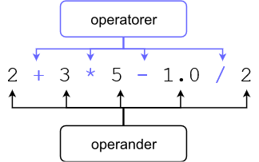

<text-box variant='learningObjectives' name='Lärandemål'>

Efter den här delen

* kan du använda dig av variabler i olika slags räkneoperationer
* kan du hantera siffor i indata från användare
* kan du konvertera värden till olika grundläggande datatyper.

</text-box>

I de tidigare delarna har du sett exempel med enkla räkneoperationer. Följande tabell listar de mest allmänna operatorerna som kan användas för att räkna i Python:

| Operator | Betydelse                       | Exempel    | Resultat |
|:--------:|---------------------------------|------------|----------|
| `+`      | Addition                        | `2 + 4`    |`6`       |
| `-`      | Subtraktion                     | `10 - 2.5` |`7.5`     |
| `*`      | Multiplikation                  | `-2 * 123` |`-246`    |
| `/`      | Division (resultat som flyttal) | `9 / 2`    |`4.5`     |
| `//`     | Division (resultat som heltal)  | `9 // 2`   |`4`       |
| `%`      | Rest                            | `9 % 2`    |`1`       |
| `**`     | Potens                          | `2 ** 3`   |`8`       |

Ordningen för operationerna är bekant från matematiken: potensuttryck räknas först, sedan multiplikation och division, till sist addition och subtraktion. Ordningen kan ändras genom att använda parenteser.

Till exempel denna kodsnutt…

```python
print(2 + 3 * 3)
print((2 + 3) * 3)
```

…resulterar i följande utskrift:

<sample-output>

11
15

</sample-output>

## Operand, operator och datatyper

En räkneoperation består oftast av operander och operatorer:



Datatypen hos en operand bestämmer i regel datatypen hos resultatet: om två heltal adderas är resultatet också ett heltal. Om ett flyttal subtraheras från ett annat flyttal är resultatet ett flyttal. Vidare kan man notera att om en av operanderna är ett flyttal, kommer resultatet att vara ett flyttal oavsett de andra operanderna.

Division med operatorn `/` är ett undantag. Dess resultat är ett flyttal även om operanderna är heltal. Till exempel kommer operationen `1 / 5` att ge flyttalet `0.2`. Observera att Python använder punkt som decimaltecken, inte decimalkomma som vanligtvis används på svenska.

Exempel:

```python
langd = 172.5
vikt = 68.55

# viktindex beräknas genom att dividera vikten med kvadratroten av längden
# längden anges i meter
bmi = vikt / (langd / 100) ** 2

print(f"Viktindexet är {bmi}")
```

Programmets utskrift ser ut så här:

<sample-output>

Viktindexet är 23.037177063642087

</sample-output>

Märk att Python också har operatorn `//`, för division med heltal som resultat. Om operanderna är heltal, kommer resultatet också att vara ett heltal. Resultatet rundas ner till närmaste heltal. Exempelvis detta program…

```python
x = 3
y = 2

print(f"/-operatorn {x/y}")
print(f"//-operatorn {x//y}")
```

…skriver ut följande:

<sample-output>

/-operatorn 1.5
//-operatorn 1

</sample-output>

## Nummer som indata

Vi har redan använt oss av `input`-funktionen för att läsa in strängar som användaren matat in. Samma funktion kan också användas för att läsa in nummer, men då måste strängen som funktionen returnerar först konverteras till någon av de datatyper som representerar ett nummer i programkoden. I den förra delen konverterade vi heltal till strängar med `str`-funktionen. Nu gäller samma princip, men vi ska använda en annan funktion eftersom vi gör konverteringen åt motsatt håll.

En sträng kan konverteras till ett heltal med funktionen `int`. Det följande programmet frågar användarens födelseår och sparar det i variabeln `indata_strang`. Programmet skapar därefter variabeln `ar` som innehåller året konverterat till heltal. Efter det går det att räkna `2021 - ar`, med hjälp av det värde användaren angett.

```python
indata = input("Vilket är ditt födelseår? ")
ar = int(indata)
print(f"Din ålder i slutet av 2020: {2020 - ar}" )
```

<sample-output>

Vilket är ditt födelseår? **1995**
Din ålder i slutet av 2020: 25

</sample-output>

Allt som oftast behöver man inte skapa två separata variabler (som ovan) för att läsa en siffra från användaren. Istället kan användarens text läsas in och konverteras till heltal samtidigt:

```python
ar = int(input("Vilket är ditt födelseår? "))
print(f"Din ålder i slutet av 2020: {2020 - ar}" )
```

En sträng kan också konverteras till flyttal. Det sker med funktionen `float`. Det här programmet frågar användaren om hennes eller hans längd och vikt, och använder svaren för att räkna ut BMI:

```python
langd = float(input("Ange längd: "))
vikt = float(input("Ange vikt: "))

langd = langd / 100
bmi = vikt / langd ** 2

print(f"Viktindexet är {bmi}")
```

Här är ett exempel på en utskrift från programmet:

<sample-output>

Ange längd: **163**
Ange vikt: **74.45**
Viktindexet är 28.02137829801649

</sample-output>

<in-browser-programming-exercise name="Siffra gånger fem" tmcname="osa01-13_x_ganger_fem">

Skapa ett program som frågar efter ett tal från användaren. Programmet ska skriva ut talet multiplicerat med fem.

Så här ska programmet fungera:

<sample-output>

Ge ett tal: **3**
När 3 multipliceras med 5, får vi 15

</sample-output>

</in-browser-programming-exercise>

<in-browser-programming-exercise name="Namn och ålder" tmcname="osa01-14_namn_alder">

Skapa ett program som frågar efter användarens namn samt födelseår. Programmet ska därefter skriva ut ett meddelande enligt följande exempel:

<sample-output>

Ange namn: **Sandro Syntetisk**
Ange födelseår: **1990**
Hej Sandro Syntetisk, du är 30 år i slutet av 2020

</sample-output>

</in-browser-programming-exercise>

## Att använda variabler

Låt oss kika på ett program som räknar summan av tre siffror som användaren anger:

```python
siffra1 = int(input("Siffra ett: "))
siffra2 = int(input("Siffra två: "))
siffra3 = int(input("Siffra tre: "))

summa = siffra1 + siffra2 + siffra3
print(f"Summan av siffrorna: {summa}")
```

Här har vi ett exempel på när vi kör programmet:

<sample-output>

Siffra ett: **5**
Siffra två: **21**
Siffra tre: **7**
Summan av siffrorna: 33

</sample-output>

Programmet använder fyra variabler, men i det här fallet skulle det faktiskt räcka med två variabler:

```python
summa = 0

nummer = int(input("Siffra ett: "))
summa = summa + nummer

nummer = int(input("Siffra två: "))
summa = summa + nummer

nummer = int(input("Siffta tre: "))
summa = summa + nummer

print(f"Summan av siffrorna: {summa}")
```

Nu läses alla siffor som användaren ges in i en och samma variabel, `nummer`. Värdet på variabeln `summa` ökas med värdet på variabeln nummer varje gång användaren skriver in ett nytt nummer.

Vi tar en lite närmare titt på instruktionen:

```python
summa = summa + nummer
```

Här adderas värdena i variablerna `summa` och `nummer` ihop – för att lagras i variabeln summa. Till exempel om värdet på `summa` är `3` och värdet på `nummer` är `2`, kommer värdet på summa att vara `5` efter att instruktionen körts.

Att öka på värdet hos en variabel är en vanlig operation. Därför finns det en liten genväg till förfogande. Den här notationen fungerar i praktiken som instruktionen ovan:

```python
summa += nummer
```

Det här tillåter oss skriva programmet lite mer koncist:

```python
summa = 0

nummer = int(input("Siffra ett: "))
summa += nummer

nummer = int(input("Siffra två: "))
summa += nummer

nummer = int(input("Siffta tre: "))
summa += nummer

print(f"Summan av siffrorna: {summa}")
```

Egentligen behöver vi inte alls variabeln `nummer`. Vi kan också behandla siffrorna som användaren anger på följande sätt:

```python
summa = 0

summa += int(input("Siffra ett: "))
summa += int(input("Siffra två: "))
summa += int(input("Siffra tre: "))

print(f"Summan av siffrorna: {summa}")
```

I praktiken beror antalet variabler som behövs på situationen. Om man behöver minnas enskilda värden som användaren anger, är det inte möjligt att "återanvända" samma variabel för att läsa in olika värden. Här är ett exempel på en sådan situation:

```python
siffra1 = int(input("Siffra ett: "))
siffra2 = int(input("Siffra två: "))

print(f"{siffra1} + {siffra2} = {siffra1+siffra2}")
```

<sample-output>

Siffra ett: **2**
Siffra två: **3**
2 + 3 = 5

</sample-output>

Å andra sidan så har programmet inte en namngiven variabel där summan av de två angivna värdena skulle lagras.

Att "återanvända" en variabel lönar sig bara då när det finns ett tillfälligt behov att lagra värden av samma typ och orsak – till exempel då man summar ihop siffror.

I följande exempel används variabeln `data` för att lagra användarens namn och därefter dess ålder. Det finns absolut ingen logik i det!

```python
data = input("Vad är ditt namn? ")
print("Hej " + data + "!")

data = int(input("Vad är din ålder? "))
# programmet fortsätter...
```

En bättre idé vore att använda skilda variabler med namn som tydligt beskriver deras funktion:

```python
nimi = input("Vad är ditt namn? ")
print("Hej " + nimi + "!")

alder = int(input("Vad är din ålder? "))
# programmet fortsätter...
```

<in-browser-programming-exercise name="Dygn i sekunder" tmcname="osa01-15_dygn_i_sekunder">

Skapa ett program som frågar användaren om ett antal dagar. Programmet ska därefter räkna ut hur långa dessa dagar tillsammans är mätt i sekunder.

Programmet ska fungera så här:

<sample-output>

Hur många dygns längd ska räknas i sekunder? **1**
86400

</sample-output>

Ett annat exempel:

<sample-output>

Hur många dygns längd ska räknas i sekunder? **7**
604800

</sample-output>

</in-browser-programming-exercise>


<in-browser-programming-exercise name="Fixa programmet: Produkten av talen" tmcname="osa01-20_produkten_av_talen">

Det här programmet borde fråga efter tre tal från användaren och räkna talens produkt. Det finns dessvärre fel i programmet. Korrigera dem, så att programmet fungerar på önskat sätt.

Här är ett exempel på hur programmet borde fungera:

<sample-output>

Ange tal 1: **2**
Ange tal 2: **3**
Ange tal 3: **5**
Produkten av talen är 30

</sample-output>

</in-browser-programming-exercise>

<in-browser-programming-exercise name="Talens summa och produkt" tmcname="osa01-16_summa_produkt">

Skapa ett program som ber användaren att ge två siffror. Programmet ska räkna summan och produkten av dessa tal.

Så här ska programmet fungera:

<sample-output>

Siffra 1: **3**
Siffra 2: **7**
Siffrornas summa 10
Produkten av siffrorna 21

</sample-output>

</in-browser-programming-exercise>


<in-browser-programming-exercise name="Summa och medeltal" tmcname="osa01-17_summa_medeltal">

Skapa ett program som ber användaren att ange fyra siffror. Programmet ska räkna summan och medeltalet av dessa siffror.

Så här ska programmet fungera:

<sample-output>

Siffra 1: **2**
Siffra 2: **1**
Siffra 3: **6**
Siffra 4: **7**
Summan av siffrorna är 16 ja medeltalet är 4.0

</sample-output>

</in-browser-programming-exercise>


<in-browser-programming-exercise name="Matkostnader" tmcname="osa01-19_matkostnader">

Skapa ett program som uppskattar användarens genomsnittliga matkostnader.

Programmet frågar hur många gånger i veckan användaren besöker Unicafe och vad hon betalar för sin lunch där. Dessutom frågas också övriga matkostnader på veckonivå.

Baserat på den här informationen räknar programmet de genomsnittliga matkostnaderna under en vecka samt en dag.

Så här ska programmet fungera:

<sample-output>

Hur många gånger i veckan äter du på Unicafe? **4**
Vad kostar Unicafe-lunchen? **2.5**
Hur mycket spenderar då på övriga matinköp under veckan? **28.5**

Genomsnittliga matkostnader:
Under en dag 5.5 euro
Under en vecka 38.5 euro

</sample-output>

</in-browser-programming-exercise>

<in-browser-programming-exercise name="Gruppindelning" tmcname="osa01-18_gruppindelning">

Gör ett program som frågar efter antalet studerande under en kurs samt storleken på en grupp. Programmet ska räkna hur många grupper bildas. En av grupperna kan vid behov ha färre medlemmar än den önskade gruppstorleken.

<sample-output>

Hur många studerande? **8**
Vad är gruppstorleken? **4**
Antalet grupper: 2

</sample-output>

<sample-output>

Hur många studerande? **11**
Vad är gruppstorleken? **3**
Antalet grupper: 4

</sample-output>

Tips: Använd dig av operatorn för heltalsdivision `//`

Tips 2: Om du inte hittar på en lösning kan du bekanta dig med if-satser, som presenteras i nästa del. De förenklar uppgiften avsevärt.

</in-browser-programming-exercise>

Kertauskysely tämän osan asioihin liittyen:

<quiz id="3fd3df29-665e-5280-9fcf-f0e002316918"></quiz>
