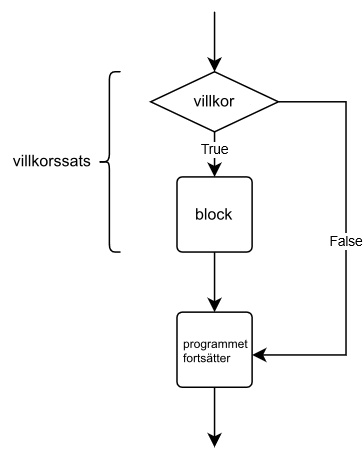

<text-box variant='learningObjectives' name='Lärandemål'>

Efter den här delen

* kan du använda dig av en enkel if-sats när du programmerar
* vet du vad ett Boolean-värde är
* kan du uttrycka villkor med hjälp av jämförelseoperatorer.

</text-box>

Hittills har vi skapat program där koden körts rad för rad från början till slut. Istället för att köra varje kodrad när programmet är igång är det ofta nyttigt att ha delar i programmet som endast körs i vissa situationer.

Till exempel följande program verifierar att användaren är tillräckligt gammal:

```python
alder = int(input("Vad är din ålder? "))

if alder > 17:
    print("Du är myndig!")
    print("Här får du alltså GTA 6.")

print("Nästa kund!")
```

När användaren är över 17 år, borde det se ut så här när programmet körs:

<sample-output>

Vad är din ålder? **18**
Du är myndig!
Här får du alltså GTA 6.
Nästa kund!

</sample-output>

Däremot, om användaren är 17 eller yngre, ser utskriften ut så här:

<sample-output>

Vad är din ålder? **16**
Nästa kund!

</sample-output>

Dessa exempel visar hur ett värde som getts till programmet påverkar vilka delar av koden som körs. Programmet innehåller en if-sats med kod som körs enbart då ett definierat villkor uppfylls.



I en if-sats följs nyckelordet `if` med ett villkor som till exempel kan vara en jämförelse av två värden. Koden som följer körs endast då villkoret uppfylls.

Notera kolontecknet. Om det saknas…

```python
alder = 10

# kaksoispiste unohtui seuraavan rivin lopusta
if alder > 17
    print("Du är myndig.")
```

…orsakas ett fel när programmet körs:

<sample-output>
<pre>
File "ohjelma.py", line 3
  if alder > 17
              ^
SyntaxError: invalid syntax
</pre>
</sample-output>

## Jämförelseoperatorer

Det är vanligt att man vill jämföra två värden sinsemellan. Här följer en tabell över de vanligaste jämförelseoperatorerna i Python:

| Operator | Betydelse                | Exempel  |
|:--------:|--------------------------|----------|
| `==`     | Är lika med              | `a == b` |
| `!=`     | Är inte lika             | `a != b` |
| `>`      | Större än                | `a > b`  |
| `>=`     | Större än eller lika med | `a >= b` |
| `<`      | Mindre än                | `a < b`  |
| `<=`     | Mindre än eller lika med | `a <= b` |

Vi tar nu en titt på ett program som skriver ut olika saker baserat på det värde som användaren anger. Här har vi if-satser som kan uppfyllas då värdet är negativt, positivt eller lika med noll:

```python
siffra = int(input("Ge ett tal: "))

if siffra < 0:
    print("Talet är negativt.")

if siffra > 0:
    print("Talet är positivt.")

if siffra == 0:
    print("Talet är noll.")
```

Här har vi tre exempel med olika indata:

<sample-output>

Ge ett tal: **15**
Talet är positivt.

</sample-output>

<sample-output>

Ge ett tal: **-18**
Talet är negativt.

</sample-output>

<sample-output>

Ge ett tal: **0**
Talet är noll.

</sample-output>

## Indentering

Python känner igen att en kodsnutt hör till en if-sats då varje rad är indenterad på samma sätt. Det här betyder att det finns mellanrum i början av varje kodrad som hör till if-satsen. Mellanrummet ska vara det samma för varje rad.

Exempelvis:

````python
losenord = input("Ange lösenord: ")

if losenord == "katt":
    print("Du visste lösenordet!")
    print("Du måste alltså vara den riktiga användaren...")
    print("...eller så är du en hacker.")

print("Programmet avslutades. Tack och hej!")
````

Du kan använda Tab-tangenten för att lägga till mellanrum där det behövs.


Dessutom kan flera texteditorer automatiskt indentera den följande raden när Enter-tangenten trycks efter ett kolon. Du får bort indenteringen genom att använda Backspace-tangenten i början av en rad.


<small><center>
Näppäimistökuvien alkuperä:
 <a href="https://pixabay.com/users/Clker-Free-Vector-Images-3736/?utm_source=link-attribution&amp;utm_medium=referral&amp;utm_campaign=image&amp;utm_content=311803">Clker-Free-Vector-Images</a> from <a href="https://pixabay.com/?utm_source=link-attribution&amp;utm_medium=referral&amp;utm_campaign=image&amp;utm_content=311803">Pixabay</a>
</center></small>

<in-browser-programming-exercise name="Orwell" tmcname="osa01-21_orwell">

Skapa ett program som frågar efter ett heltal från användaren och skriver ut texten "Orwell" om siffran är 1984. Annars skrivs inget ut.

<sample-output>

Ge ett tal: **2020**

</sample-output>

<sample-output>

Ge ett tal: **1984**
Orwell

</sample-output>

</in-browser-programming-exercise>

<in-browser-programming-exercise name="Absolutbelopp" tmcname="osa01-22_absolutbelopp">

Skapa ett program som ber efter ett heltal av användaren. Om siffran är mindre än noll, skriver programmet ut siffran multiplicerat med talet -1. I övriga fall skrivs den siffran användaren angett ut. Nedan finns några exempel på hur programmet ska fungera.

<sample-output>

Ge ett tal: **-7**
Siffrans absolutbelopp är 7

</sample-output>

<sample-output>

Ge ett tal: **1**
Siffrans absolutbelopp är 1

</sample-output>

<sample-output>

Ge ett tal: **-99**
Siffrans absolutbelopp är 99

</sample-output>

</in-browser-programming-exercise>


<in-browser-programming-exercise name="Soppa. Eller inte." tmcname="osa01-23_soppa">

Skapa ett program som först frågar efter användarens förnamn. Om namnet inte är "Jerry", fortsätter programmet med att fråga antalet sopportioner och berättar sedan priset för "hela soppan". En portion kostar 5,90.

Två exempel:

<sample-output>

Vad heter du: **Kramer**
Hur många sopportioner: **2**
Slutsumma 11.8
Nästa!

</sample-output>

<sample-output>

Vad heter du: **Jerry**
Nästa!

</sample-output>

</in-browser-programming-exercise>


<in-browser-programming-exercise name="Storleksklass" tmcname="osa01-24_storleksklass">

Skapa ett program som frågar efter ett heltal från användaren. Programmet ska sedan berätta i vilken storleksklass siffran är, enligt följande exempel:

<sample-output>

Ge ett tal: **950**
Siffran är mindre än 1000
Tackar!

</sample-output>

<sample-output>

Ge ett tal: **59**
Siffran är mindre än 1000
Siffran är mindre än 100
Tackar!

</sample-output>

<sample-output>

Ge ett tal: **2**
Siffran är mindre än 1000
Siffran är mindre än 100
Siffran är mindre än 10
Tackar!

</sample-output>

<sample-output>

Ge ett tal: **1123**
Tackar!

</sample-output>


</in-browser-programming-exercise>


## Boolean-värden och -uttryck

Alla villkor i en if-sats resulterar i ett sanningsvärde, det vill säga sant eller falskt. Till exempel villkoret `a < 5` är sant då `a` är mindre än fem och falskt då `a` är fem eller större.

Denna typ av värden kallas alltså Boolean-värden (efter matematikern George Boole). I Python representerar datatypen `bool` ett sanningsvärde. Variabler av typen `bool` kan endast ha ett av följande värden: `True` (sant) och `False` (falskt).

En kodsnutt som resulterar i något av de ovan nämnda värdena kallas Boolean-uttryck. Ett villkor i en if-sats är alltid ett Boolean-uttryck och kan i flera situationer användas som synonym för ordet villkor.

Resultatet av ett Boolean-uttryck kan lagras i en variabel på samma sätt som vilken som helst annan numerisk räkneoperation:

```python
a = 3
villkor = a < 5
print(villkor)
if villkor:
    print("a är mindre än 5")
```

<sample-output>

True
a är mindre än 5

</sample-output>

Pythons nyckelord `True` och `False` kan också användas direkt som sådana. I det följande exemplet körs `print`-instruktionen alltid, eftersom värdet på villkoret är `True`:

```python
villkor = True
if villkor:
    print("Vi når hit alltid")
```

<sample-output>

Vi når hit alltid

</sample-output>

Man kan tycka att det inte i ovanstående exempel verkar vara en så nyttig funktion. Senare under kursens lopp ska vi se på situationer där vi kan ha mera nytta av Boolean-variabler.

<in-browser-programming-exercise name="Räknare" tmcname="osa01-25_raknare">

Skapa ett program som först ber användaren ange två siffror och därefter ett kommando. Om kommandot är summa, produkt eller differens, ska programmet utföra den nämnda räkneoperationen. I övriga fall skriver inte programmet ut något.

Exempel:

<sample-output>

Tal 1: **10**
Tal 2: **17**
Kommando: **summa**

10 + 17 = 27

</sample-output>

<sample-output>

Tal 1: **4**
Tal 2: **6**
Kommando: **produkt**

4 * 6 = 24

</sample-output>

<sample-output>

Tal 1: **4**
Tal 2: **6**
Kommando: **differens**

4 - 6 = -2

</sample-output>

</in-browser-programming-exercise>

<in-browser-programming-exercise name="Temperaturer" tmcname="osa01-26_temperaturer">

Skapa ett program som ber användaren ange en temperatur i Farenheit. Programmet ska skriva ut den här temperaturen i Celcius. Om temperaturen mätt i Celcius är under noll ska programmet också skriva ut texten "Kallt!".

Du kan söka på nätet efter den korrekta formeln för att konvertera temperaturer i Farenheit till Celcius.

Exempel:

<sample-output>

Ange temperatur (i Farenheit): **101**
101 grader Farenheit on 38.333333333333336 grader Celcius

Ange temperatur (i Farenheit): **21**
21 grader Farenheit on -6.111111111111111 grader Celcius
Kallt!

</sample-output>

</in-browser-programming-exercise>

<in-browser-programming-exercise name="Lön" tmcname="osa01-27_lon">

Skapa ett program som frågar efter timlön, antal arbetstimmar samt veckodag. Programmet skriver ut lönen som räknas med formeln timlön * arbetstimmar. På söndag är timlönen fördubblad.

<sample-output>

Timlön: **8.5**
Arbetstimmar: **3**
Veckodag: **maanantai**
Lön 25.5 euro

</sample-output>

<sample-output>

Timlön: **12.5**
Arbetstimmar: **10**
Veckodag: **sunnuntai**
Lön 250.0 euro

</sample-output>

</in-browser-programming-exercise>

<in-browser-programming-exercise name="Fixa programmet: Ränta" tmcname="osa01-28_ranta">

Det här programmet räknar antalet bonuspoäng som ska adderas till ett bonuskort i slutet av året, enligt följande formel:

* bonuspoäng < 100: ränta 10 % extra poäng
* övriga fall: ränta 15 % extra poäng

Så här fungerar programmet:

<sample-output>

Hur många poäng? **55**
Du fick 10 % i bonus
Du har nu 60.5 poäng

</sample-output>

Ohjelma toimii kuitenkin jollain syötteillä oudosti:

<sample-output>

Hur många poäng? **95**
Du fick 10 % i bonus
Du fick 15 % i bonus
Du har nu 120.175 poäng

</sample-output>

Korrigera programmet så att man endast får 10 % eller 15 % bonus – inte både och.

</in-browser-programming-exercise>

<in-browser-programming-exercise name="Morgondagens klädsel" tmcname="osa01-29_kladsel">

Gör ett program som frågar användaren om morgondagens väderprognos. Programmet rekommenderar därefter klädsel enligt vädret.

Rekommendationen beror på om temperaturen är över fem, tio eller 20 grader samt om det regnar.

Så här ska programmet fungera:

<sample-output>

Berätta väderprognosen för imorgon:
Temperatur: **21**
Regnar det (ja/nej): **nej**
Ta på dig byxor och t-skjorta

</sample-output>

<sample-output>

Berätta väderprognosen för imorgon:
Temperatur: **11**
Regnar det (ja/nej): **nej**
Ta på dig byxor och t-skjorta
Ta på dig också en långärmad tröja

</sample-output>

<sample-output>

Berätta väderprognosen för imorgon:
Temperatur: **7**
Regnar det (ja/nej): **nej**
Ta på dig byxor och t-skjorta
Ta på dig också en långärmad tröja
Klä på dig en jacka

</sample-output>

<sample-output>

Berätta väderprognosen för imorgon:
Temperatur: **3**
Regnar det (ja/nej): **ja**
Ta på dig byxor och t-skjorta
Ta på dig också en långärmad tröja
Klä på dig en jacka
En varm jacka rekommenderas
Vantar rekommenderas också
Kom ihåg paraplyet!

</sample-output>

</in-browser-programming-exercise>

<in-browser-programming-exercise name="Andra gradens ekvation" tmcname="osa01-30_andra_gradens_ekvation">

Modulen `math` i Python har funktionen `sqrt` som kan användas för att räkna kvadratroten för ett tal. Så här fungerar funktionen:

```python
from math import sqrt

print(sqrt(9))
```

Programmet skriver ut:

<sample-output>

3.0

</sample-output>

Gör ett program som räknar resultatet för andra gradens ekvation ax² + bx + c. Till programmet ges värdena a, b och c, och därefter beräknas lösningen med följande formel:

x = (-b ± sqrt(b² - 4ac)) / (2a)

Du kan anta att ekvationen har två rötter, varvid formeln ovan fungerar.

Exempel:

<sample-output>

Ge a: **1**
Ge b: **2**
Ge c: **-8**

Rötterna är 2.0 och -4.0

</sample-output>

</in-browser-programming-exercise>

Kertauskysely tämän osan asioihin liittyen:

<quiz id="6a20ae0e-38b3-5fb3-93c4-ebd70162fbb6"></quiz>

Vänligen svara på en kort enkät om materialet i den här veckans modul. Du får ett poäng när du fyllt i enkäten.

<quiz id="63e241aa-f451-5dd6-b06e-a363703cdc6c"></quiz>
