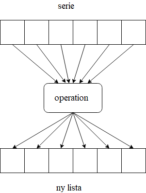

<text-box variant='learningObjectives' name='Inlärningsmål'>

Efter den här delen

- Vet du vad en listbyggare (list comprehension) är
- Kommer du att kunna använda listbyggare för att skapa nya listor

</text-box>

En av de situationer där programmering är som mest kraftfull är vid bearbetning av sekvenser av objekt och händelser. Datorer är bra på att upprepa saker. I de tidigare delarna av det här materialet har vi till exempel itererat strängar, listor och ordlistor på olika sätt.

Låt oss anta att vi har en lista med heltal och att vi skulle behöva samma lista med objekt i strängformat. Ett traditionellt sätt att utföra uppgiften skulle kunna se ut så här:

```python
talen = [1, 2, 3, 6, 5, 4, 7]

strangar = []
for tal in talen:
    strangar.append(str(tal))
```

## Listbyggare

Det finns också ett mer "pythonskt" sätt att generera listor från befintliga listor. Dessa kallas listbyggare.

Tanken är att på en enda rad få plats med både beskrivningen av vad som ska göras med varje objekt i listan och tilldelningen av resultatet till en ny lista.

I exemplet ovan var operationen som utfördes på varje objekt i listan mycket enkel: varje heltal omvandlades till en sträng. Låt oss se hur detta skulle se ut implementerat med en listbyggare:

```python
talen = [1, 2, 3, 6, 5, 4, 7]
strangar = [str(tal) for tal in talen]
```

Den andra raden ovan innehåller många av samma element som den mer traditionella iterativa metoden, men syntaxen är annorlunda. Ett sätt att generalisera en listbyggare skulle kunna vara

`[<uttryck> for <föremål> in <serie>]`

Hakparenteserna runt listbyggaren signalerar till Python att resultatet ska vara en ny lista. En efter en bearbetas varje objekt i den ursprungliga listan och resultatet lagras i den nya listan, precis som i det iterativa tillvägagångssättet ovan. Som resultat har vi en ny lista med exakt lika många objekt som i originalet, och alla objekt har behandlats på ett identiskt sätt.

(OBS: originalen till bilderna i denna del saknas tillfälligt, vilket är anledningen till att det finns en del finskt vokabulär i illustrationerna i denna del. Vi arbetar på att åtgärda detta).



Listbyggare kan också hantera mycket mer komplicerade operationer. Vi kan utföra beräkningar, till exempel multiplicera de ursprungliga objekten med tio:

```python
talen = list(range(1,10))
print(talen)

talen_multiplicerade = [tal * 10 for tal in talen]
print(talen_multiplicerade)
```

<sample-output>

[1, 2, 3, 4, 5, 6, 7, 8, 9]
[10, 20, 30, 40, 50, 60, 70, 80, 90]

</sample-output>

Faktum är att uttrycket i listbyggaren kan vara vilket Python-uttryck som helst. Du kan till och med anropa funktioner som du själv har definierat:

```python
def fakultet(n: int):
    """ Funktionen räknar fakulteten n! för positiva heltal """
    k = 1
    while n >= 2:
        k *= n
        n -= 1
    return k

if __name__ == "__main__":
    lista = [5, 2, 4, 3, 0]
    fakulteter = [fakultet(tal) for tal in lista]
    print(fakulteter)
```

<sample-output>

[120, 2, 24, 6, 1]

</sample-output>

Med den mer välbekanta `for`-loopen skulle samma process kunna uttryckas så här:

```python

def fakultet(n: int):
    """ Funktionen räknar fakulteten n! för positiva heltal """
    k = 1
    while n >= 2:
        k *= n
        n -= 1
    return k

if __name__ == "__main__":
    lista = [5, 2, 4, 3, 0]
    fakulteter = []
    for tal in lista:
        fakulteter.append(fakultet(tal))
    print(fakulteter)

```

Med hjälp av listbyggare kan vi uttrycka samma funktionalitet på ett mer konsekvent sätt, vanligtvis utan att förlora något av läsbarheten.

Vi kan också returnera en listbyggare direkt från en funktion. Om vi behövde en funktion för att producera fakultettal för listor med tal, skulle vi kunna göra det på ett mycket kortfattat sätt:

```python
def fakulteter(talen: list):
    return [fakultet(tal) for tal in talen]
```

<programming-exercise name='Kvadratrötter' tmcname='osa11-01_kvadratrotter'>

Skriv en funktion med namnet `kvadratrot(nummer: list)` som tar en lista med heltal som sitt argument. Funktionen ska returnera en ny lista som innehåller kvadratrötterna av de ursprungliga heltalen.

Modulen [math](https://docs.python.org/3/library/math.html) från Pythons standardbibliotek innehåller en lämplig funktion för att räkna ut kvadratrötter.

Funktionen bör använda en listbyggare. Funktionen får vara högst två rader lång, inklusive rubrikraden som börjar med nyckelordet `def`.

Funktionen ska fungera enligt följande:

```python
rader = kvadratrot([1,2,3,4])
for rad in rader:
    print(rad)
```

<sample-output>

1.0
1.4142135623730951
1.7320508075688772
2.0

</sample-output>

</programming-exercise>

<programming-exercise name='Stjärnrader' tmcname='osa11-02_stjarnrader'>

Skapa funktionen `stjarnrader(nummer: list)` som tar en lista med heltal som sitt argument. Funktionen ska returnera en ny lista som innehåller rader med stjärnor. Längden på varje rad ska motsvara heltalet på samma index i den ursprungliga listan. Funktionen bör använda en listbyggare för att uppnå detta.

Funktionen får vara högst två rader lång, inklusive rubrikraden som börjar med nyckelordet `def`.

Funktionen ska fungera på följande sätt:

```python
rader = stjarnrader([1,2,3,4])
for rad in rader:
    print(rad)

print()

rader = stjarnrader([4, 3, 2, 1, 10])
for rad in rader:
    print(rad)
```

<sample-output>

<pre>
*
**
***
****

****
***
**
*
**********
</pre>

</sample-output>

</programming-exercise>

<programming-exercise name='Bäst provresultat' tmcname='osa11-03_bast_provresultat'>

I uppgiftsbotten finns färdigt en klassdefinition för `Provresultat`, som har följane offentliga attribut:

* namn
* vitsord1
* vitsord2
* vitsord3

Skapa en funktion med namnet `bast_resultat(resultat: list)` som tar en lista med Provresultat-objekt som sitt argument.

Funktionen ska returnera en ny lista som endast innehåller det bästa resultatet från varje Provresultat-objekt. Funktionen bör använda en listbyggare för att uppnå detta.

Funktionen får maximalt omfatta två rader kod, inklusive den rubrikrad som börjar med nyckelordet `def`.

Funktionen ska fungera på följande sätt:

```python
resultat1 = Provresultat("Peter",5,3,4)
resultat2 = Provresultat("Pernilla",3,4,1)
resultat3 = Provresultat("Paulus",2,1,3)
prestationer = [resultat1, resultat2, resultat3]
print(bast_resultat(prestationer))
```

<sample-output>

[5, 4, 3]

</sample-output>

</programming-exercise>

<programming-exercise name='Längder' tmcname='osa11-04_langder'>

Skapa en funktion med namnet `langder(listor: list)` som tar en lista innehållande listor med heltal som argument. Funktionen ska returnera en ny lista som innehåller längderna på listorna i argumentlistan.

Funktionen bör använda en listbyggare för att uppnå detta.

Funktionen får maximalt omfatta två rader kod, inklusive den rubrikrad som börjar med nyckelordet `def`.

Funktionen ska fungera på följande sätt:

```python
listat = [[1,2,3,4,5], [324, -1, 31, 7],[]]
print(langder(listat))
```

<sample-output>

[5, 4, 0]

</sample-output>

</programming-exercise>


## Att filtrera föremål

I exemplen ovan var alla våra listor lika långa före och efter en listbyggaroperation. I varje fall användes alla föremål i den ursprungliga listan som grund för den nya listan. Men ibland behöver vi bara några av de ursprungliga föremålen. Hur kan detta åstadkommas?

En listbyggare kan också innehålla ett villkor, så att vi kan kontrollera objekten mot villkoret och bara välja ut dem som matchar. Den allmänna syntaxen är enligt följande:

`[<uttryck> for <föremål> in <serie> if <boolskt uttryck>]`

Satsen ovan är i övrigt identisk med den allmänna form som introducerades i början av detta avsnitt, men nu finns det en if-sats i slutet. Endast de objekt från den ursprungliga listan för vilka det booleska uttrycket är sant används som grund för den nya listan.

I exemplet nedan väljer vi alla jämna objekt från den ursprungliga listan som bas för den nya listan. I själva verket bearbetas inte dessa objekt ytterligare på något sätt, utan de tilldelas den nya listan som de är:

```python
lista = [1, 1, 2, 3, 4, 6, 4, 5, 7, 10, 12, 3]

jamna = [foremal for foremal in lista if foremal % 2 == 0]
print(jamna)
```

<sample-output>

[2, 4, 6, 4, 10, 12]

</sample-output>

Uttrycket i listbyggaren ovan är bara ett enkelt `foremal`, vilket innebär att inga operationer ska utföras på föremålen i listan. Uttrycket kan vara vilket Python-uttryck som helst, precis som i de tidigare exemplen. Följande listbyggare tar till exempel alla jämna föremål i en lista, multiplicerar varje föremål med tio och lagrar resultatet i en ny lista:

```python
lista = [1, 1, 2, 3, 4, 6, 4, 5, 7, 10, 12, 3]

jamna = [foremal * 10 for foremal in lista if foremal % 2 == 0]
print(jamna)
```

<sample-output>

[20, 40, 60, 40, 100, 120]

</sample-output>

När du stöter på mer och mer komplicerade listbyggare kan det vara bra att försöka läsa villkoret först. Föremålen bearbetas ändå bara om de klarar testet, så det är ofta vettigt att först ta reda på vilka objekt som klarar filtreringssteget. Ibland skulle uttrycket i en listbyggare inte ens vara möjligt för alla föremål i den ursprungliga listan.

Till exempel är fakultettal bara definierat för icke-negativa heltal. Om vi inte kan vara säkra på att en lista bara innehåller värden på noll eller högre, måste innehållet filtreras innan det skickas vidare till den fakultetfunktion som vi skapade tidigare:

```python
def fakultet(n: int):
    """ Funktionen räknar fakulteten n! för positiva heltal """
    k = 1
    while n >= 2:
        k *= n
        n -= 1
    return k

if __name__ == "__main__":
    lista = [-2, 3, -1, 4, -10, 5, 1]
    fakulteter = [fakultet(tal) for tal in lista if tal > 0]
    print(fakulteter)
```

<sample-output>

[6, 24, 120, 1]

</sample-output>

Som vi såg i vårt allra första exempel på list comprehension, där heltal omvandlades till strängar, behöver föremålen i den nya listan inte vara av samma typ som föremålen i den ursprungliga listan. Om vi fortsätter från fakultetexemplet ovan kan vi skapa en tupel från varje originella föremål och dess bearbetade motsvarighet och lagra dessa i en lista, vilket kombinerar allt vi har lärt oss hittills i en enda listbyggare:

```python

def fakultet(n: int):
    """ Funktionen räknar fakulteten n! för positiva heltal """
    k = 1
    while n >= 2:
        k *= n
        n -= 1
    return k

if __name__ == "__main__":
    lista = [-2, 3, 2, 1, 4, -10, 5, 1, 6]
    fakulteter = [(tal, fakultet(tal)) for tal in lista if tal > 0 and tal % 2 == 0]
    print(fakulteter)

```

<sample-output>

[(2, 2), (4, 24), (6, 720)]

</sample-output>

Om vi plockar isär exemplet ovan har vi det booleska uttrycket `n > 0 and n % 2 == 0`. Detta innebär att endast föremål som är både positiva och delbara med två accepteras för vidare bearbetning från den ursprungliga listan.

Dessa positiva, jämna tal bearbetas sedan i tur och ordning till formatet `(n, fakultet(n))`. Detta är en tupel, där det första objektet är själva talet och det andra objektet är resultatet som returneras av fakultetfunktionen.

<programming-exercise name='Ta bort mindre' tmcname='osa11-05_ta_bort_mindre'>

Skapa en funktion med namnet `ta_bort_mindre(tal: list, grans: int)` som tar en lista med heltal och ett gränsvärde (också i heltalsformat) som sina argument.

Funktionen bör använda en list comprehension för att producera en ny lista utan de värden som är mindre än gränsvärdet.

Funktionen får maximalt omfatta två rader kod, inklusive den rubrikrad som börjar med nyckelordet `def`.

Funktionen ska fungera på följande sätt:

```python
talen = [1,65, 32, -6, 9, 11]
print(ta_bort_mindre(talen, 10))

print(ta_bort_mindre([-4, 7, 8, -100], 0))
```

<sample-output>

[65, 32, 11]
[7, 8]

</sample-output>

</programming-exercise>

<programming-exercise name='Börjar med vokal' tmcname='osa11-06_borjar_med_vokal'>

Skapa en funktion med namnet `borjar_med_vokal(ord: list)` som tar en lista med strängar som sitt argument.

Funktionen ska använda en list comprehension teknik för att skapa och returnera en ny lista som endast innehåller de ord från den ursprungliga listan som börjar med en vokal (a, e, i, o, u, y, å, ä, ö). Både små och stora bokstäver bör accepteras.

Funktionen får maximalt omfatta två rader kod, inklusive den rubrikrad som börjar med nyckelordet `def`.

Funktionen ska fungera på följande sätt:

```python
ord_lista = ["automobil","moped","Enhörning","katt","Hund","ÄPPEL","appelsin"]
for vok in borjar_med_vokal(ord_lista):
    print(vok)
```

<sample-output>

automobil
Enhörning
ÄPPEL
appelsin

</sample-output>

</programming-exercise>

## Alternativ exekvering med list comprehension

Ofta när vi har en villkorlig sats inkluderar vi också en else-gren. Eftersom vi kan använda villkor i listbyggare är else-grenen också tillgänglig med listbyggare. Den allmänna syntaxen för villkoret som används med listbyggare ser ut så här:

`<uttryck 1> if <villkor> else <uttryck 2>`

Vi stötte på dessa enradiga villkor, eller ternära operatorer, redan i [modul 7](https://rage.github.io/ohjelmointi-24-sv/osa-7/6-funktionaliteter-python). Uttrycket ovan utvärderas till antingen `uttryck 1` eller `uttryck 2`, beroende på om villkoret är sant eller falskt.

Som en uppfräschning av ämnet kan vi säga att om vi behöver skriva ut det större av två tal och vi bara vill använda en enda utskriftssats, kan vi få plats med allt på en enda rad:

```python
tal1 = int(input("Ange tal 1:"))
tal2 = int(input("Ange tal 2:"))
print (tal1 if tal1 > tal2 else tal2)
```

Genom att kombinera den ternära operatorssyntaxen med en listbyggare får man följande allmänna struktur:

`[<uttryck 1> if <villkor> else <uttryck 2> for <föremål> in <serie>]`

Det här kan se lite förvirrande ut, eftersom den villkorliga strukturen nu kommer före den faktiska listbyggaren. Det är bara så här syntaxen har definierats, åtminstone för tillfället. Om det också finns en `else`-gren kommer villkoret först. Om det bara finns ett `if`, kommer det sist. Du kan prova att byta ut dem och se vad som händer.

Att inkludera en else-operator innebär att vi återigen kommer att bearbeta varje objekt från den ursprungliga listan. Beroende på om villkoret är sant eller falskt utförs antingen `uttryck 1` eller `uttryck 2` på varje objekt i listan.

I följande exempel kontrolleras om föremåleni en lista är noll eller högre. Alla sådana föremål accepteras som de är, men alla negativa föremål negeras, så att tecknet ändras från negativt till positivt. Resultatet är en lista som innehåller de absoluta värdena för föremålen i den ursprungliga listan.

```python

talen = [1, -3, 45, -110, 2, 9, -11]
absolut_varde = [tal if tal >= 0 else -tal for tal in talen]
print(absolut_varde)

```

<sample-output>

[1, 3, 45, 110, 2, 9, 11]

</sample-output>

Vi upprepar vad som händer ovan: om villkoret `nummer >= 0` är sant, genomgår föremålet uttrycket `nummer`, och resultatet är själva föremålet. Om villkoret är falskt genomgår föremålet uttrycket `–nummer`, så att det får ett positivt värde.

I följande exempel har vi funktionen `strang_langder` som tar en lista som sitt argument och returnerar en annan lista med längderna på alla strängar i den ursprungliga listan. Den här funktionen är dock okej med listföremål av alla typer. Om föremålet är en sträng beräknar den dess längd. Om objektet är något annat infogar den -1 i listan som den returnerar.

```python

def strang_langder(lista: list):
    """ Funktionen returnerar längden på strängarna i en ny lista """
    return [len(foremal) if type(foremal) == str else -1 for foremal in lista]

if __name__ == "__main__":
    testlista = ["hej", 3, True, "hejsan", -123.344, "hejsansvejsan", 2, False]
    langder = strang_langder(testlista)
    print(langder)

```

<sample-output>

[3, -1, -1, 6, -1, 13, -1, -1]

</sample-output>


<programming-exercise name='Lotterinummer' tmcname='osa11-07_lotterinummer'>

## LotteriNummer matchade

Skapa en klass med namnet `LotteriNummer` som tar veckonumret (ett heltalsvärde) och en lista med sju heltal som sina konstruktorsargument. Listan ska innehålla de korrekta lotterinumren för den givna veckan.

Skapa också en metod med namnet `antalet_traffar(nummer: list)` som tar en lista med heltal som sitt argument. Metoden returnerar antalet korrekta inlägg i parameterlistan.

Metoden bör använda en listbyggare för att uppnå detta. Funktionen får maximalt omfatta två rader kod, inklusive den rubrikrad som börjar med nyckelordet `def`.

Funktionen ska fungera på följande sätt:

```python
ratta = LotteriNummer(5, [1,2,3,4,5,6,7])
egen_rad = [1,4,7,11,13,19,24]

print(ratta.antalet_traffar(egen_rad))
```

<sample-output>

3

</sample-output>

## LotteriNummer matchade på plats

Skapa en metod med namnet `traffar_pa_plats(nummer)` som tar en lista med sju heltal som sitt argument och returnerar en ny lista med sju heltal. Den nya listan innehåller endast de inlägg från den ursprungliga listan som matchar veckans korrekta nummer. Dessa måste ligga kvar på samma index som de gjorde i den ursprungliga listan. Resten av indexen bör fyllas med värdena `-1`.

Funktionen bör använda en listbyggare för att uppnå detta. Funktionen får maximalt omfatta två rader kod, inklusive den rubrikrad som börjar med nyckelordet `def`.

Funktionen ska fungera på följande sätt:

```python
ratta = LotteriNummer(8, [1,2,3,10,20,30,33])
egen_rad = [1,4,7,10,11,20,30]

print(ratta.traffar_pa_plats(egen_rad))
```

<sample-output>

[1, -1, -1, 10, -1, 20, 30]

</sample-output>

</programming-exercises>
