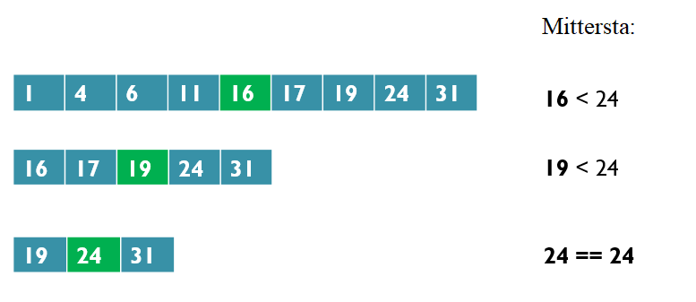

<text-box variant='learningObjectives' name='Inlärningsmål'>

Efter den här delen

- Vet du vad rekursion innebär
- Kommer du att kunna skriva en enkel rekursiv funktion

</text-box>

Som vi har sett många gånger tidigare kan funktioner anropa andra funktioner. Till exempel:

```python
def tervehdi(nimi : str):
    print("Moikka,", nimi)

def tervehdi_monesti(nimi : str, kerrat : int):
    for i in range(kerrat):
        tervehdi(nimi)
```

En funktion kan också anropa sig själv, men vi som programmerare måste vara försiktiga när vi gör det. Det är lätt att hamna i en oändlig loop av funktionsanrop, precis som vi hamnade i en oändlig loop av upprepningar med `while`-loopar om vi utelämnade lämpliga brytvillkor. Så om man försöker anropa en `hello`-funktion med följande definition

```python
def tervehdi(nimi : str):
    print("Moikka,", nimi)
    tervehdi(nimi)
```

skulle skapa ett nytt sort av fel:

<sample-output>

RecursionError: maximum recursion depth exceeded

</sample-output>

## Vad betyder rekursion?

Den rekursion som nämns i felet ovan innebär att man definierar något i termer av sig självt. I programmeringssammanhang handlar det oftast om en funktion som anropar sig själv. För att detta ska fungera utan att orsaka oändliga loopar måste de argument som skickas till funktionen ändras varje gång, så att de nästlade funktionsanropen slutar vid något skede. Grundprincipen här är densamma som i `while`-loopar: det måste alltid finnas ett stoppvillkor av något slag, och det villkoret måste utlösas vid någon tidpunkt i exekveringen.

Låt oss ta en titt på en enkel funktion som lägger till nollor i en lista så länge det finns färre än 10 objekt i listan. Den här gången använder vi dock inte en loop. Om villkoret ännu inte är uppfyllt anropar funktionen sig själv

```python
def tayta_lista(luvut: list):
    """ Lisää listaan alkoita jos sen pituus on alle 10 """
    if len(luvut) < 10:
        luvut.append(0)
        # Kutsutaan uudestaaan
        tayta_lista(luvut)


if __name__ == "__main__":
    testi = [1,2,3,4]
    tayta_lista(testi)
    print(testi)
```

<sample-output>

[1, 2, 3, 4, 0, 0, 0, 0, 0, 0]

</sample-output>

Denna funktionalitet kunde lika väl bli uppnådd genom en vanlig `while`-loop:

```python

def tayta_lista(luvut: list):
    """ Lisää listaan alkoita jos sen pituus on alle 10 """
    while len(luvut) < 10:
        luvut.append(0)

if __name__ == "__main__":
    testi = [1,2,3,4]
    tayta_lista(testi)
    print(testi)

```

Det mer traditionella iterativa tillvägagångssättet ger ett kortare program som förmodligen också är lättare att förstå. Med den rekursiva versionen är det inte lika tydligt att vi under hela processen arbetar med exakt samma lista. Så är det dock och därför fungerar den rekursiva funktionen lika bra.

<text-box variant="hint" name="Iterativ eller rekursiv?">

Inom datavetenskapsteori skiljer man ofta mellan iterativa och rekursiva algoritmer, så det är bäst att bekanta sig med dessa termer redan från början. Iterativa lösningar är sådana som baseras på sekventiell bearbetning av objekt, ofta med hjälp av loopar. Hittills har vi behandlat iterativa metoder ganska exklusivt. Rekursiv, å andra sidan, avser en metod där funktionen anropar sig själv med förändrade parametervärden.

I princip borde det vara möjligt att lösa alla problem med antingen iterativa eller rekursiva metoder. I praktiken är det dock oftast så att den ena eller den andra metoden är klart bättre lämpad för varje problem. Förmågan att avgöra vilken som är bäst kommer till stor del med övning.

</text-box>

<programming-exercise name='Suurempia lukuja' tmcname='osa11-13_listaan_lukuja'>

Kirjoita _rekursiivinen funktio_ `listaan_lukuja(luvut: list)`, joka lisää listaan lukuja niin kauan, kunnes listan pituus on viidellä jaollinen. Jokainen listaan lisättävä luku on aina yhden suurempi kuin listan viimeinen luku.

Funktion pitää kutsua itseään rekursiivisesti.

Esimerkki funktion kutsusta:

```python
luvut = [1,3,4,5,10,11]
listaan_lukuja(luvut)
print(luvut)
```

<sample-output>

[1, 3, 4, 5, 10, 11, 12, 13, 14, 15]

</sample-output>

</programming-exercise>

## Rekursion och returvärden

Rekursiva funktioner kan också ha returvärden. I de senaste avsnitten har vi arbetat med faktorialtal, så låt oss skriva en rekursiv faktorialfunktion:

```python

def kertoma(n: int):
    """ Funktio laskee positiivisen luvun n kertoman n!, eli n * (n-1) ... * 2 * 1 """
    if n < 2:
        # Lukujen 0 ja 1 kertoma on 1
        return 1

    # Kutsuu funktiota uudestaan
    return n * kertoma(n - 1)

if __name__ == "__main__":
    # Testataan
    for i in range(1, 7):
        print(f"Luvun {i} kertoma on {kertoma(i)}")

```

<sample-output>

Luvun 1 kertoma on 1
Luvun 2 kertoma on 2
Luvun 3 kertoma on 6
Luvun 4 kertoma on 24
Luvun 5 kertoma on 120
Luvun 6 kertoma on 720

</sample-output>

Om parametern för den rekursiva faktoriella funktionen är 0 eller 1, returnerar funktionen 1, eftersom det är så faktoriell operation definieras. I alla andra fall returnerar funktionen värdet `n * faktorial(n - 1)`, vilket är värdet av dess parameter n multiplicerat med returvärdet av funktionsanropet `faktorial(n - 1)`.

Det avgörande här är att funktionsdefinitionen innehåller ett stoppvillkor. Om detta uppfylls avslutas rekursionen. I det här fallet är villkoret `n < 2`. Vi vet att det kommer att nås så småningom, eftersom det värde som skickas som argument till funktionen minskas med ett på varje nivå i rekursionen.

[Visualiseringsverktyget](http://www.pythontutor.com/visualize.html#mode=edit) kan vara till stor hjälp när det gäller att förstå rekursiva program.

Exemplet ovan skulle kanske bli lite tydligare om vi använde oss av hjälpvariabler:

```python
def kertoma(n: int):
    if n < 2:
        return 1

    edellisen_luvun_kertoma = kertoma(n - 1)
    luvun_n_kertoma = n * edellisen_luvun_kertoma
    return luvun_n_kertoma

kertoma(5)
```

Ta en titt på hur[visualiseringsverktyget](http://www.pythontutor.com/visualize.html#code=def%20kertoma%28n%3A%20int%29%3A%0A%20%20%20%20if%20n%20%3C%202%3A%0A%20%20%20%20%20%20%20%20return%201%0A%0A%20%20%20%20edellisen_luvun_kertoma%20%3D%20kertoma%28n%20-%201%29%0A%20%20%20%20luvun_n_kertoma%20%3D%20n%20*%20edellisen_luvun_kertoma%0A%20%20%20%20return%20luvun_n_kertoma%0A%20%20%20%20%0Akertoma%285%29&cumulative=false&curInstr=5&heapPrimitives=nevernest&mode=display&origin=opt-frontend.js&py=3&rawInputLstJSON=%5B%5D&textReferences=false) visar hur rekursionen fortskrider.

Visualiseringsverktyget har en liten finess i hur det hanterar anropsstacken, eftersom den verkar "växa" nedåt. Vanligtvis avbildas anropsstaplar som just staplar, där de nya anropen placeras överst. I visualiseringsverktyget är det aktiva funktionsanropet det skuggade blocket längst ner, som har sina egna kopior av de variabler som syns.

När den rekursiva faktorfunktionen anropas byggs anropsstapeln upp tills den gräns som utgörs av `n < 2` nås. Då återkommer det sista funktionsanropet i stacken med ett värde - det är `1`, eftersom `n` nu är mindre än 2. Detta återkomstvärde skickas till det föregående funktionsanropet i stacken, där det används för att beräkna det funktionsanropets återkomstvärde, och så vidare tillbaka ut ur stacken.

Returvärdet för varje funktionsanrop lagras i hjälpvariabeln `faktorial_nu`. Gå igenom visualiseringen noggrant tills du förstår vad som händer i varje steg, och var särskilt uppmärksam på det värde som returneras i varje steg.


Låt oss ta en titt på ett annat vanligt rekursivt exempel: Fibonacci-talen. I en Fibonacci-sekvens är varje tal summan av de två föregående talen. De två första talen definieras här som 1 och 1, och sekvensen börjar då så här: 1, 1, 2, 3, 5, 8, 13, 21, 34.

```python
def fibonacci(n: int):
    """ Funktio palauttaa n:nen luvun Fibonaccin sarjasta (1, 1, 2, 3, 5, 8 jne.); n > 0"""

    if n <= 2:
        # Kaksi ekaa lukua ovat ykkösiä
        return 1

    # Muuten luku saadaan laskemalla kaksi edellistä yhteen
    return fibonacci(n - 1) + fibonacci(n - 2)

# Testataan, että toimii
if __name__ == "__main__":
    for i in range(1, 11):
        print(f"Fibonaccin {i}. luku on {fibonacci(i)}")
```

<sample-output>

Fibonaccin 1. luku on 1
Fibonaccin 2. luku on 1
Fibonaccin 3. luku on 2
Fibonaccin 4. luku on 3
Fibonaccin 5. luku on 5
Fibonaccin 6. luku on 8
Fibonaccin 7. luku on 13
Fibonaccin 8. luku on 21
Fibonaccin 9. luku on 34
Fibonaccin 10. luku on 55

</sample-output>

Den här gången är stoppvillkoret att parametern är mindre än eller lika med 2, eftersom hela sekvensen definieras från de två första siffrorna och framåt, och vi definierade de två första siffrorna som lika med 1.

Hur fungerar då den här funktionen i praktiken?

Om funktionen anropas med 1 eller 2 som argument returnerar den 1, vilket dikteras av villkoret `n <= 2`.

Om argumentet är 3 eller större returnerar funktionen värdet av `fibonacci(n - 1) + fibonacci(n - 2)`. Om argumentet är exakt 3 är detta värde lika med `fibonacci(2) + fibonacci(1)`, och vi vet redan resultatet av båda dessa från föregående steg. `1 + 1` är lika med 2, som alltså är det tredje talet i Fibonacci-sekvensen.

Om argumentet är 4 är returvärdet `fibonacci(3) + fibonacci(2)`, som vi nu vet är `2 + 1`, vilket är lika med 3.

Om argumentet är 5 är returvärdet `fibonacci(4) + fibonacci(3)`, vilket vi nu vet är `3 + 2`, vilket är lika med 5.

Och så vidare, och så vidare.

Vi kan i varje steg verifiera att funktionen ger rätt resultat, vilket ofta är tillräckligt i grundläggande programmeringsuppgifter. Den formella verifierbarheten av algoritmer är ett ämne för mer avancerade kurser, till exempel Data Structures and Algorithms.

<programming-exercise name='Rekursiivinen summa' tmcname='osa11-14_rekursiivinen_summa'>

Tee rekursiivinen funktio `summa(luku: int)` summan `1 + 2 + ... + luku` laskemiseen. Funktion runko on seuraava:

```python
def summa(luku: int):
    # kun luku on 1, ei ole muita summattavia...
    if luku <= 1:
        return luku

    # täydennä koodi...
```

Muutama käyttöesimerkki:

```python
tulos = summa(3)
print(tulos)

print(summa(5))
print(summa(10))
```

<sample-output>

6
15
55

</sample-output>

</programming-exercise>

<programming-exercise name='Sulut tasapainossa' tmcname='osa11-15_sulut_tasapainossa'>

Tehtäväpohjassa on valmiina funktio `sulut_tasapainossa`, joka tarkastaa, onko sen parametrina olevassa merkkijonossa sulut tasapainossa, eli onko jokaista "aukeavaa" sulkumerkkiä ( kohti on oma "sulkeutuva" sulkumerkki ), ja että sulut eivät mene ristiin.

```python
def sulut_tasapainossa(merkkijono: str):
    if len(merkkijono) == 0:
        return True
    if not (merkkijono[0] == '(' and merkkijono[-1] == ')'):
        return False

    # poistetaan ensimmäinen ja viimeinen merkki
    return sulut_tasapainossa(merkkijono[1:-1])

ok = sulut_tasapainossa("(((())))")
print(ok)

# ei kelpaa sillä yksi loppusulku liikaa
ok = sulut_tasapainossa("()())")
print(ok)

# ei kelpaa sillä alussa virheellinen loppusulku
ok = sulut_tasapainossa(")()")
print(ok)

# ei kelpaa, sillä funktio ei osaa käsitellä kuin sisäkkäisiä sulkuja
ok = sulut_tasapainossa("()(())")
print(ok)
```

<sample-output>

True
False
False
False

</sample-output>

Laajenna funktiota siten, että se jättää huomiotta kaikki muut kuin sulkumerkit, ja että se osaa kaarisulkujen lisäksi myös hakasulut. Haka- ja kaarisulut eivät saa mennä ristiin!

Seuraavassa muutama käyttöesimerkki:

```python
ok = sulut_tasapainossa("([([])])")
print(ok)

ok = sulut_tasapainossa("(python versio [3.7]) käytä tätä!")
print(ok)

# ei kelpaa sillä virheellinen loppusulku
ok = sulut_tasapainossa("(()]")
print(ok)


# ei kelpaa sillä erityyppiset sulut menevät ristiin
ok = sulut_tasapainossa("([huono)]")
print(ok)
```

Huomaa, että funktion ei tarvitse osata kuin yksi sisäkkäinen sulutus - sen ei siis tarvitse ymmärtää esimerkiksi jonoa (x + 1)(y + 1).

<sample-output>

True
True
False
False

</sample-output>

</programming-exercise>

## Binär sökning

I en binär sökning har vi en sorterad lista med objekt och vi försöker hitta ett visst objekt i den. Ordningen på objekten kan till exempel vara siffror från minst till störst, eller strängar från alfabetiskt först till sist. Sorteringsmetoden spelar ingen roll, så länge den är känd och relevant för det objekt som vi försöker hitta.

Tanken med en binär sökning är att alltid titta på objektet i mitten av listan. Vi har då tre möjliga scenarier. Om objektet i mitten är
- det vi letar efter: vi kan returnera en indikation på att vi hittade objektet
- mindre än det vi letar efter: vi kan göra om sökningen i den större halvan av listan
- större än den vi letar efter: vi kan göra om sökningen i den mindre halvan av listan.

Om listan är tom kan vi fastställa att objektet inte hittades och returnera en indikation på det.

I följande bild kan vi se hur en binär sökning fortskrider när den letar efter talet 24:



Här är en rekursiv algoritm för en binär sökning:

```python
def binaarihaku(lista: list, alkio: int, vasen : int, oikea : int):
    """ Funktio palauttaa True tai False sen mukaan, onko listalla alkiota """
    # Jos hakualue on tyhjä, ei löydy
    if vasen > oikea:
        return False

    # Lasketaan hakualueen keskikohta
    keski = (vasen+oikea)//2

    # Jos keskellä on etsittävä alkio
    if lista[keski] == alkio:
        return True

    # Jos pienempi, etsi jälkipuoliskolta
    if lista[keski] < alkio:
        return binaarihaku(lista, alkio, keski+1, oikea)
    # Muuten täytyy olla suurempi, etsitään alkupuoliskolta
    else:
        return binaarihaku(lista, alkio, vasen, keski-1)


if __name__ == "__main__":
    # Testataan
    lista = [1, 2, 4, 5, 7, 8, 11, 13, 14, 18]
    print(binaarihaku(lista, 2, 0, len(lista)-1))
    print(binaarihaku(lista, 13, 0, len(lista)-1))
    print(binaarihaku(lista, 6, 0, len(lista)-1))
    print(binaarihaku(lista, 15, 0, len(lista)-1))
```

<sample-output>

True
True
False
False

</sample-output>

Funktionen `binar_sokning` tar fyra argument: mållistan, det objekt som söks samt vänster och höger kant på sökområdet. När funktionen anropas första gången täcker sökområdet hela mållistan. Den vänstra kanten ligger på index `0` och den högra kanten ligger på index `len(mål)-1`. Funktionen beräknar det centrala indexet och kontrollerar den positionen på listan. Antingen har objektet hittats eller så fortsätter sökningen till den mindre eller större halvan av mållistan.

Låt oss jämföra detta med en enkel linjär sökning. Vid en linjär sökning är sökområdet från början och framåt, tills antingen objektet hittas eller sökområdet tar slut. Antalet steg som behövs för att täcka hela sökområdet växer linjärt i samma takt som sökområdets storlek. Varje söksteg täcker endast en sökkandidat från början av sökområdet. Låt oss anta att det sökta objektet inte hittas. Om sökområdet är en miljon objekt långt måste vi ta en miljon söksteg för att försäkra oss om att objektet inte finns i sökområdet.

Vid en binär sökning växer däremot antalet steg som behövs logaritmiskt. Låt oss återigen anta att det sökta objektet inte hittas. Sökområdet halveras för varje steg, eftersom vi vet att objektet antingen är mindre eller större än den aktuella sökkandidaten i mitten. 2 gånger 20 (2^20) är redan långt över 1 miljon, så det tar som mest 20 steg att täcka hela sökområdet med en binär sökning. När vi har att göra med sorterade sökområden, vilket ofta är fallet när vi har att göra med datorer och material som ska bearbetas automatiskt, är en binär sökning alltså mycket effektivare än en linjär sökning. 
