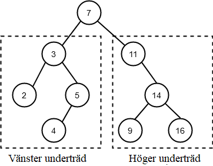

<text-box variant='learningObjectives' name='Inlärningsmål'>

Efter den här delen

- Kommer du att känna till binära träd och några rekursiva algoritmer som används för att bearbeta dem

</text-box>


De verkliga fördelarna med rekursion blir uppenbara när vi stöter på problem där iterativa lösningar är svåra att skriva. Låt oss ta en titt på binära träd, till exempel. Ett binärt träd är en förgrenad struktur där vi har noder och vid varje nod förgrenar sig strukturen, som mest, i två underordnade grenar med egna noder. Ett binärt träd skulle då kunna se ut så här (datavetenskap betraktas ofta som en gren av naturvetenskapen, men vår förståelse av träd är lite upp och ner, som du kommer att märka):


Binära träd bör åtminstone teoretiskt sett vara lätta att hantera rekursivt: om vi vill utföra någon operation på varje nod i trädet behöver vår algoritm helt enkelt

1. Behandla den aktuella noden
2. Anropa sig själv på barnnoden till vänster
3. Anropa sig själv på barnnoden till höger



Som du kan se på bilden ovan är både de vänstra och högra "underträden" fullfjädrade binära träd i sig, och den enda nod som lämnas utanför de rekursiva anropen är den överordnade noden, som bearbetas i steg 1 innan funktionen anropas rekursivt. På så sätt kan vi vara säkra på att varje nod har besökts exakt en gång när funktionen är klar.

En iterativ version av en binär trädtraversering skulle vara mycket mer komplicerad, eftersom vi på något sätt skulle behöva hålla reda på alla noder som vi redan har besökt. Samma principer gäller för alla beräkningsbara trädstrukturer, inte bara binära.

Ett binärt träd är också lätt att modellera i Python-kod. Vi behöver bara skriva en klassdefinition för en enda nod. Den har ett värdeattribut och attribut för de vänstra och högra underordnade noderna:

```python

class Nod:
    """ Klassen representerar en enkel nod i ett binärt träd """
    def __init__(self, varde, vanster_barn:'Nod' = None, hoger_barn:'Nod' = None):
        self.varde = varde
        self.vanster_barn = vanster_barn
        self.hoger_barn = hoger_barn
```

Låt oss anta att vi vill modellera följande träd:


Vi kunde uppnå detta med följande kod:

```python
if __name__ == "__main__":
    trad = Nod(2)

    trad.vanster_barn = Nod(3)
    trad.vanster_barn.vanster_barn = Nod(5)
    trad.vanster_barn.hoger_barn = Nod(8)

    trad.hoger_barn = Nod(4)
    trad.hoger_barn.hoger_barn = Nod(11)

```

## Algoritmer för rekursiva binära träd

Låt oss först ta en titt på en algoritm som skriver ut alla noder i ett binärt träd en efter en. I de följande exemplen kommer vi att arbeta med det binära träd som definieras ovan.

Argumentet till utskriftsfunktionen är rotnoden i det binära trädet. Detta är noden högst upp i vår illustration ovan. Alla andra noder är barn till den här noden:

```python

def skriv_ut_noder(rot: Nod):
    print(rot.varde)

    if rot.vanster_barn is not None:
        skriv_ut_noder(rot.vanster_barn)

    if rot.hoger_barn is not None:
        skriv_ut_noder(rot.hoger_barn)

```

Funktionen skriver ut värdet på den nod som skickas som argument och anropar sedan sig själv på de vänstra och högra underordnade noderna, förutsatt att noderna är definierade. Det här är en mycket enkel algoritm, men den går på ett effektivt och tillförlitligt sätt igenom alla noder i trädet, oavsett trädets storlek. Avgörande är att ingen nod besöks två gånger. Varje värde skrivs bara ut en gång.

Om vi skickar rotnoden `trad` i det binära trädet som illustreras ovan som ett argument till funktionen, skriver den ut

<sample-output>

2
3
5
8
4
11

</sample-output>

Som du kan se av ordningen på noderna i utskriften rör sig algoritmen först längs trädets "vänstra ben" ner till botten, och därifrån går den igenom de andra noderna i ordning.

På samma sätt kan vi skriva en algoritm för att beräkna summan av alla de värden som finns lagrade i trädets noder:

```python

def nodernas_summa(rot: Nod):
    summa = rot.varde

    if rot.vanster_barn is not None:
        summa += nodernas_summa(rot.vanster_barn)

    if rot.hoger_barn is not None:
        summa += nodernas_summa(rot.hoger_barn)

    return summa

```

Variabeln `summa` initieras till att vara lika med värdet för den aktuella noden. Värdet i variabeln ökas sedan genom rekursiva anrop till nodens summor i det vänstra och högra underordnade trädet (först kontrolleras naturligtvis att de finns). Detta resultat returneras sedan.

<programming-exercise name='Största noden' tmcname='osa11-16_storsta_nod'>

Skapa funktionen `storsta_nod(rot: Nod)`, som tar rotnoden av ett binärt träd som argument.

Funktionen returnerar värdet på den nod som har det största värdet i trädet. Trädet ska genomkorsas rekursivt.

Tips: funktionen `nodernas_summa` i exemplet ovan kan vara användbart.

Exempel på hur funktionen ska fungera:

```python

if __name__ == "__main__":
    trad = Nod(2)

    trad.vanster_barn = Nod(3)
    trad.vanster_barn.vanster_barn = Nod(5)
    trad.vanster_barn.hoger_barn = Nod(8)

    trad.hoger_barn = Nod(4)
    trad.hoger_barn.hoger_barn = Nod(11)

    print(storsta_nod(trad))

```

<sample-output>

11

</sample-output>

</programming-exercise>

## Sorterat binärt träd

Ett binärt träd är särskilt användbart när noderna är sorterade på ett visst sätt. Det gör att det går snabbt och effektivt att hitta noder i trädet.

Låt oss ta en titt på ett träd som är sorterat på följande sätt: det vänstra barnet till varje nod är mindre än själva noden och det högra barnet är på motsvarande sätt större.


Nu kan vi skriva en rekursiv algoritm för att söka efter noder. Idén är mycket lik den binära sökningen från föregående avsnitt: om den aktuella noden är den nod vi letar efter, returnera `True`. Annars fortsätter vi rekursivt med antingen det vänstra eller det högra underordnade trädet. Om noden inte är definierad returneras `False`.

```python

def sok_nod(rot: Nod, varde):
    if rot is None:
        return False

    if varde == rot.varde:
        return True

    if varde > rot.varde:
        return sok_nod(rot.hoger_barn, varde)

    return sok_nod(rot.vanster_barn, varde)

```

<programming-exercise name='Chefer och underordnade' tmcname='osa11-17_chefer_och_underordnade'>

Klassen `Arbetare` modellerar en arbetare på ett företag:

```python
class Arbetare:
    def __init__(self, namn: str):
        self.namn = namn
        self.underordnade = []

    def tillsatt_underordnad(self, arbetare: 'Arbetare'):
        self.underordnade.append(arbetare)
```

Skapa funktionen `rakna_underordnade(arbetare: Arbetare)`, som rekursivt räknar mängden underordnade som en arbetare har.

Exempel på funktionen i användning:

```python
if __name__ == "__main__":
    a1 = Arbetare("Sussi")
    a2 = Arbetare("Erik")
    a3 = Arbetare("Matte")
    a4 = Arbetare("Emilia")
    a5 = Arbetare("Anton")
    a6 = Arbetare("Kjell")
    a1.tillsatt_underordnad(a4)
    a1.tillsatt_underordnad(a6)
    a4.tillsatt_underordnad(a2)
    a4.tillsatt_underordnad(a3)
    a4.tillsatt_underordnad(a5)
    print(rakna_underordnade(a1))
    print(rakna_underordnade(a4))
    print(rakna_underordnade(a5))
```

<sample-output>

5
3
0

</sample-output>

</programming-exercise>

## Besök till tiden innan rekursion

Låt oss avsluta denna del av materialet med en lite större övning som koncentrerar sig på objektorienterade programmeringsprinciper. Vi rekommenderar inte att du använder rekursion i denna serie av uppgifter, men tekniker för list comprehension kommer att vara användbara.

<programming-exercise name='Uppgiftsbok' tmcname='osa11-18_uppgiftsbok'>

I den här övningen kommer du skriva två olika klasser, vilka i sin tur kommer att vara ryggraden för övningen som följer denna, i vilken du kommer att skapa en interaktiv applikation.

## Uppgift

Förverkliga klassen `Uppgift`, som modellerar en uppgift i ett mjukvaruföretags lista av uppgifter. Uppgifterna har
- en beskrivning
- en beräkning av mängden timmar uppgiften tar
- namnet på programmeraren som har fått uppgiften
- ett fält som håller koll på ifall uppgiften är gjord
- en unik id

Klassen fungerar enligt följande:

```python
a1 = Uppgift("koda hello world", "Erik", 3)
print(a1.id, a1.beskrivning, a1.programmerare, a1.arbetsmangd)
print(a1)
print(a1.ar_fardig())
a1.markera_fardig()
print(a1)
print(a1.ar_fardig())
a2 = Uppgift("koda webbutik", "Anton", 10)
a3 = Uppgift("koda mobilapp för räknande av arbetsmängd", "Erik", 25)
print(a2)
print(a3)
```

<sample-output>

1 koda hello world Erik 3
1: koda hello world (3 timmar), programmerare Erik INTE FÄRDIG
False
1: koda hello world (3 timmar), programmerare Erik FÄRDIG
True
2: koda webbutik (10 timmar), programmerare Anton INTE FÄRDIG
3: koda mobilapp för räknande av arbetsmängd (25 timmar), programmerare Erik INTE FÄRDIG

</sample-output>

Klarifikationer:
- uppgiftens läge (färdig eller inte färdig) kan kollas med funktionen `ar_fardig(self)`, som returnerar ett booleskt värde
- uppgiften är inte färdig när den skapas
- uppgiften markeras som färdig genom att anropa på metoden `markera_fardig(self)`
- uppgifternas id är ett löpande nummer som börjar med 1. Id av första uppgiften är 1, andra uppgiften 2 osv.

**Tips:** id kan implementeras med en [klassvariabel](https://rage.github.io/ohjelmointi-24-sv/osa-9/5-klassattribut).

## Uppgiftsbok

Skapa nu en klass med namnet `Uppgiftsbok`, som samlar ihop alla uppgifter som delegerats av mjukvaruföretaget. Uppgifterna ska modelleras med klassen `Uppgift` som du just gjorde.

Basversionen av Uppgiftsboken används enligt följande:

```python
bestallningar = Uppgiftsbok()
bestallningar.tillsatt_bestallning("koda webbutik", "Anton", 10)
bestallningar.tillsatt_bestallning("koda mobilapp för räknande av arbetsmängd", "Erik", 25)
bestallningar.tillsatt_bestallning("koda app för övande av matematik", "Anton", 100)

for bestallning in bestallningar.alla_bestallningar():
    print(bestallning)

print()

for programmerare in bestallningar.kodare():
    print(programmerare)
```

<sample-output>

1: koda webbutik (10 timmar), programmerare Anton INTE FÄRDIG
2: koda mobilapp för räknande av arbetsmängd (25 timmar), programmerare Erik INTE FÄRDIG
3: koda app för övande av matematik (100 timmar), programmerare Anton INTE FÄRDIG

Anton
Erik

</sample-output>

I detta skede borde din `Uppgiftsbok` erbjuda tre metoder:
- `tillsatt_bestallning(self, beskrivning, programmerare, arbetsmangd)`, som lägger till en ny uppgift till Uppgiftsboken. En Uppgiftsbok förvarar uppgifterna internt som `Uppgift`-objekt. OBS: metoden ska ta exakt de argument som nämns eller så fungerar inte de automatiserade testerna korrekt.
- `alla_bestallningar(self)` returnerar en lista på alla uppgifter som lagras i en Uppgiftsbok
- `kodare(self)` returnerar en lista på namnen av alla kodare som har uppgifter lagrade i Uppgiftsboken. Listan ska innehålla varje programmerare endast en gång.

**Tips:** En enkel metod för att göra sig av med multipler är att ursprungligen hantera listan som en [mängd](https://docs.python.org/3.8/library/stdtypes.html#set) (eng: set). En mängd är en samling av saker där varje unikt föremål endast förekommer en gång. En `set` kan sedan konverteras tillbaks till en lista, och vi kan då vara säkra på att varje föremål nu är unikt:

```python
lista = [1,1,3,6,4,1,3]
lista2 = list(set(lista))
print(lista)
print(lista2)
```

<sample-output>

[1, 1, 3, 6, 4, 1, 3]
[1, 3, 4, 6]

</sample-output>

## Några fler funktioner för Uppgiftsboken

Skapa tre till metoder till din `Uppgiftsbok`-klass.

Metoden `markera_fardig(self, id: int)` får som argument uppgiftens id och markerar den relevanta uppgiften som färdig:

```python
bestallningar = Uppgiftsbok()
bestallningar.tillsatt_bestallning("koda webbutik", "Anton", 10)
bestallningar.tillsatt_bestallning("koda mobilapp för räknande av arbetsmängd", "Erik", 25)
bestallningar.tillsatt_bestallning("koda app för övande av matematik", "Anton", 100)

bestallningar.markera_fardig(1)
bestallningar.markera_fardig(2)

for bestallning in bestallningar.alla_bestallningar():
    print(bestallning)
```

<sample-output>

1: koda webbutik (10 timmar), programmerare Anton FÄRDIG
2: koda mobilapp för räknande av arbetsmängd (25 timmar), programmerare Erik FÄRDIG
3: koda app för övande av matematik (100 timmar), programmerare Anton INTE FÄRDIG

</sample-output>

Ifall det inte finns någon uppgift med det givna id:t, ska metoden åstadkomma ett `ValueError`-undantag. Ifall du behöver en påminnelse om att åstadkomma undantag kan du kolla in [modul 6](https://rage.github.io/ohjelmointi-24-sv/osa-6/3-fel).

Metoderna `fardiga_bestallningar(self)` och `ofardiga_bestallningar(self)` fungerar som förväntat: båda returnerar en lista innehållande de relevanta uppgifterna från Uppgiftsboken.

## Projektets sista detaljer

Vi skapar en sista metod `programmerarens_status(self, programmerare: str)` till `Uppgiftsbok`-klassen, vilken returnar en _tupel_. Tupeln ska innehålla antalet färdiga och ofärdiga uppgifter en programmerare har tilldelats samt den uppskattade mängden timmar i båda kategorierna.

```python
bestallningar = Uppgiftsbok()
bestallningar.tillsatt_bestallning("koda webbutik", "Anton", 10)
bestallningar.tillsatt_bestallning("koda mobilapp för räknande av arbetsmängd", "Anton", 25)
bestallningar.tillsatt_bestallning("koda app för övande av matematik", "Anton", 100)
bestallningar.tillsatt_bestallning("koda nya facebook", "Erik", 1000)

bestallningar.markera_fardig(1)
bestallningar.markera_fardig(2)

status = bestallningar.programmerarens_status("Anton")
print(status)
```

<sample-output>

(2, 1, 35, 100)

</sample-output>

Det första föremålet i tupeln är antalet _färdiga_ uppgifter, medan det andra föremålet är antalet _ofärdiga_ uppgifter. Det tredje och fjärde föremålet är summan av uppskattningarna av arbetsmängden för de färdiga respektive ofärdiga uppgifterna.

Ifall det inte finns någon programmerare med det angivna namnet, ska metoden åstadkomma ett `ValueError`-undantag.


</programming-exercise>

<programming-exercise name='Uppgiftsboksapplikation' tmcname='osa11-19_uppgiftsboksapplikation'>

I den här övningen ska du skapa en interaktiv applikation för att administrera de uppgifter som beställts från ett programvaruföretag. Implementeringen är helt upp till dig, men du kan använda byggstenarna från föregående övning i din applikation. Exemplen i [det sista avsnittet av modul 10](https://rage.github.io/ohjelmointi-24-sv/osa-10/4-storre-applikation) kan också vara till hjälp.

## Utan felhantering

Applikationen ska fungera _exakt_ enligt följande:

<sample-output>

instruktioner:
0 avsluta
1 tillsätt beställning
2 lista färdiga
3 lista ofärdiga
4 markera uppgift färdig
5 programmerare
6 programmerarens status

instruktion: **1**
beskrivning: **koda nya facebook**
programmerare och uppskattad arbetsmängd: **jonas 1000**
tillsatt!

instruktion: **1**
beskrivning: **koda mobilapp för räknande av arbetsmängd**
programmerare och uppskattad arbetsmängd: **erik 25**
tillsatt!

instruktion: **1**
beskrivning: **program för att öva musikteori**
programmerare och uppskattad arbetsmängd: **nina 12**
tillsatt!

instruktion: **1**
beskrivning: **koda nya twitter**
programmerare och uppskattad arbetsmängd: **jonas 55**
tillsatt!

instruktion: **2**
inga färdiga uppgifter

instruktion: **3**
1: koda nya facebook (1000 timmar), programmerare jonas INTE FÄRDIG
2: koda mobilapp för räknande av arbetsmängd (25 timmar), programmerare erik INTE FÄRDIG
3: ohjelma musiikin teorian  harjoitteluun (12 timmar), programmerare nina INTE FÄRDIG
4: koda nya twitter (55 timmar), programmerare jonas INTE FÄRDIG

instruktion: **4**
id: **2**
markerad som färdig

instruktion: **4**
id: **4**
markerad som färdig

instruktion: **2**
2: koda mobilapp för räknande av arbetsmängd (25 timmar), programmerare erik FÄRDIG
4: koda nya twitter (55 timmar), programmerare jonas FÄRDIG

instruktion: **3**
1: koda nya facebook (1000 timmar), programmerare jonas INTE FÄRDIG
3: program för att öva musikteori (12 timmar), programmerare nina INTE FÄRDIG

instruktion: **5**
jonas
erik
nina

instruktion: **6**
programmerare: **jonas**
uppgifter: färdiga 1 ofärdiga 1, timmar: gjorda 55 ogjorda 1000

</sample-output>

Den första övningspoängen ges för en fungerande applikation när alla användarinmatningar är felfria.

## Hantering av inamtningsfel

För att få den andra övningspoängen för denna övning förväntas din applikation återhämta sig från felaktig användarinmatning. All inmatning som inte följer det angivna formatet ska ge ett felmeddelande _felaktig inmatning_ och resultera i ännu en upprepning av loopen med begäran om en ny instruktion:

<sample-output>

instruktion: **1**
beskrivning: **koda mobilapp för räknande av arbetsmängd**
programmerare och uppskattad arbetsmängd: **erik xxx**
felaktig inmatning

instruktion: **1**
beskrivning: **koda mobilapp för räknande av arbetsmängd**
programmerare och uppskattad arbetsmängd: **erik**
felaktig inmatning

instruktion: **4**
id: **1000000**
felaktig inmatning

instruktion: **4**
id: **XXXX**
felaktig inmatning

instruktion: **6**
programmerare: **okändprogrammerare**
felaktig inmatning

</sample-output>

</programming-exercise>

Svara slutligen på en snabb enkät:

<quiz id="3435ec4c-3236-59f6-82c1-664967213776"></quiz>
