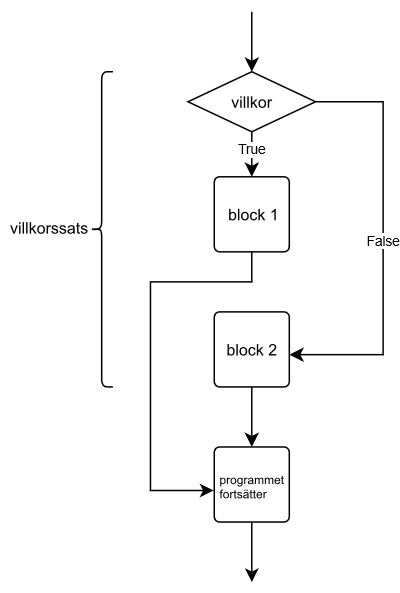
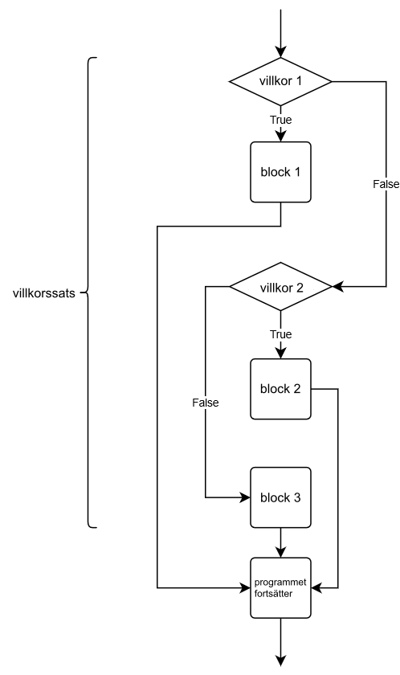

<text-box variant='learningObjectives' name='Lärandemål'>

Efter den här delen

* kan du skapa grenar inom if-satser
* förstår du skillnaden mellan `if`, `elif` och `else`
* kan du använda restoperatorn `%` i Boolean-uttryck.

</text-box>

Vi tar nu en titt på ett program som ber användaren att ge en siffra och därefter skriver ut ett meddelande vars innehåll beror på om siffran är negativ, positiv eller lika med noll:

```python
siffra = int(input("Ge ett tal: "))

if siffra < 0:
    print("Talet är negativt")

if siffra >= 0:
    print("Talet är positivt eller noll")
```

Det här verkar något klumpigt och det finns en del upprepning. Vi vill ju bara köra ett av if-blocken eftersom numret alltid är antingen under noll, eller noll eller över. Det vill säga bara ett av villkoren `siffra < 0` och `siffra >= 0` är samtidigt sant. Därför är den fösta if-satsen den enda som behövs – om villkoret är sant är siffran negativ, annars är siffran noll eller över.

I stället för att skapa två if-satser kan vi skapa en gren som körs då alla villkor är osanna. Det här kallas else-sats.

Så här kan vi skriva om det föregående exemplet:

```python
siffra = int(input("Ge ett tal: "))

if siffra < 0:
    print("Talet är negativt")
else:
    print("Talet är positivt eller noll")
```

När vi bygger upp en if-else-sats kommer exakt en av grenarna att köras. Se följande bild:



Obs! Det kan aldrig finnas en else-gren före en if-gren. En if-gren och en else-gren bildar en if-else-sats.

Följande exempel kollar om den siffra användaren anger är jämnt eller inte. Det här kan restoperatorn `%` användas för. Restoperatorn anger resten när två heltal divideras. När ett tal divideras med två är det jämnt då resten är noll. Annars är talet inte jämnt.

```python
siffra = int(input("Ge ett tal: "))

if siffra % 2 == 0:
    print("Talet är jämnt")
else:
    print("Talet är ojämnt")
```

<sample-output>

Ge ett tal: **5**
Talet är ojämnt

</sample-output>

Ett annat exempel där strängar jämförs:

```python
korrekt = "katt"
losenord = input("Ange lösenord: ")

if losenord == korrekt:
    print("Välkommen")
else:
    print("Tillträde förbjudet")
```

Så här kan det se ut när koden körs:

<sample-output>

Ange lösenord: **katt**
Välkommen

</sample-output>

<sample-output>

Ange lösenord: **koltrast**
Tillträde förbjudet

</sample-output>


<in-browser-programming-exercise name="Myndig eller inte?" tmcname="osa02-04_myndig" height="400px">

Skapa ett program som ber användaren ge sin ålder. Programmet berättar om användaren är myndig (> 18 år) eller inte.

Exempel:

<sample-output>

Hur gammal är du? **12**
Du är inte myndig!

</sample-output>


<sample-output>

Hur gammal är du? **32**
Du är myndig!

</sample-output>

</in-browser-programming-exercise>

## Flera grenar med elif-satser

Ofta finns det fler än två alternativ som ett program måste ta i beaktande. Till exempel resultatet av en fotbollsmatch kan se ut på tre sätt: hemmalaget vinner, bortalaget vinner eller oavgjort.

En if-sats kan bestå av elif-grenar – "else if". Till den här grenen kommer man om villkoret i någon av de tidigare grenarna inte uppfylls.



Vi kollar på ett program som bestämmer vem som vunnit en match:

```python
mal_hem = int(input("Hemmalagets mål: "))
mal_borta = int(input("Bortalagets mål: "))

if mal_hem > mal_borta:
    print("Hemmalaget vann!")
elif mal_borta > mal_hem:
    print("Bortalaget vann!")
else:
    print("Oavgjort!")
```

Programmet kan ge tre olika resultat baserat på de värden som ges:

<sample-output>

Hemmalagets mål: **4**
Bortalagets mål: **2**
Hemmalaget vann!

</sample-output>

<sample-output>

Hemmalagets mål: **0**
Bortalagets mål: **6**
Bortalaget vann!

</sample-output>

<sample-output>

Hemmalagets mål: **3**
Bortalagets mål: **3**
Oavgjort!

</sample-output>

I exemplet ovan finns tre grenar varav exakt en körs. En if-sats kan dock bestå av fler än en elif-gren. Dessutom är en else-gren inte obligatorisk.

Det här är också en helt korrekt if-sats:

```python
print("Julkalender")
datum = input("Vilken dag är det? ")

if datum == "24/12":
    print("Det är julafton")
elif datum == "25/12":
    print("Det är juldag")
elif datum == "26/12":
    print("Det är annandag jul")

print("Tack och hej.")
```

<sample-output>

Julkalender
Vilken dag är det? **25/12**
Det är juldag
Tack och hej.

</sample-output>

Märk att det föregående exemplet saknar else-gren. Om användaren ger ett datum som inte uppfyller villkoret på någon av if- eller elif-grenarna, kommer ingen av grenarna att köras.

<sample-output>

Julkalender
Vilken dag är det? **1/1**
Tack och hej.

</sample-output>

<in-browser-programming-exercise name="Större eller lika med" tmcname="osa02-05_storre_lika_med"  height="400px">

Skapa ett program som ber användaren ge två heltal. Programmet ska skriva ut det större av de givna talen. Om talen är de samma, observerar programmet även det här.

Exempel:

<sample-output>

Ge tal ett: **5**
Ge tal två: **3**
Det större talet: 5

</sample-output>

<sample-output>

Ge tal ett: **5**
Ge tal två: **8**
Det större talet: 8

</sample-output>

<sample-output>

Ge tal ett: **5**
Ge tal två: **5**
Talen är lika stora!

</sample-output>

</in-browser-programming-exercise>


<in-browser-programming-exercise name="Äldre" tmcname="osa02-06_aldre" height="550px">

Skapa ett program som frågar efter namnen och åldrarna hos två personer. Programmet ska skirva ut namnet på den äldre personen.

Exempel:

<sample-output>

Person 1:
Namn: **Thomas**
Ålder: **26**
Person 2:
Namn: **Tilde**
Ålder: **27**
Tilde är äldre

</sample-output>

<sample-output>

Person 1:
Namn: **Amadeus**
Ålder: **1**
Person 2:
Namn: **Vilma**
Ålder: **1**
Amadeus och Vilma är lika gamla

</sample-output>

</in-browser-programming-exercise>

<in-browser-programming-exercise name="Sist i alfabetet" tmcname="osa02-07_sist_i_alfabetet"  height="500px">

Förutom med siffror, kan man också jämföra storleken på strängar i Python. Strängen `a` är mindre än strängen `b` om strängen `a` kommer före i alfabetet än strängen `b`. Observera att det här gäller då

* man jämför bokstäver med samma storlek (små/STORA)
* strängarna innehåller enbart tecknen a-z eller A-Z.

Skapa ett program som ber användaren ge två ord. Programmet skriver ut det av orden som kommer senare i alfabetet.

Du kan anta att orden endast innehåller små bokstäver.

Exempel:

<sample-output>

Ge ord 1: **antik**
Ge ord 2: **kusudama**
kusudama kommer senare i alfabetet

</sample-output>

<sample-output>

Ge ord 1: **vhs**
Ge ord 2: **dvd**
vhs kommer senare i alfabetet

</sample-output>

<sample-output>

Ge ord 1: **python**
Ge ord 2: **python**
Du gav samma ord två gånger.

</sample-output>

</in-browser-programming-exercise>

<quiz id="908fdd39-c6bc-5365-9731-442a7877a47d"></quiz>
