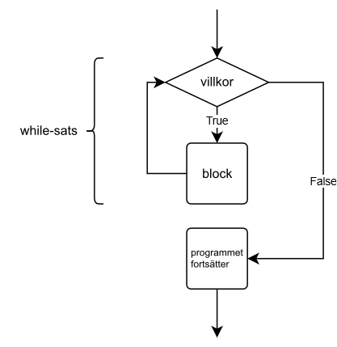
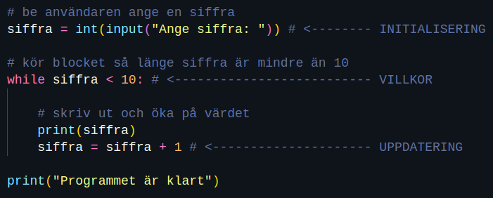

<text-box variant='learningObjectives' name='Lärandemål'>

Efter den här delen

* kan du skapa en loop med ett villkor
* vet du vad vilka roller initiering, villkoret och att uppdatering av variabler har i en loop
* kan du skapa loopar med olika typer av villkor.

</text-box>

## Osallistu tutkimukseen - vastaa kyselyyn

Alla olevan linkin takaa löytyy Hannu Pesosen väitöskirjatutkimukseen liittyvä kysely. Kurssin suorittaminen ei edellytä kyselyyn vastaamista, mutta yliopistoissa tutkimus on luonnollisesti tärkeässä osassa myös opetuksen kehittämisessä.

Jos sinulta siis löytyy hetki aikaa, niin [vastaa kyselyyn](https://link.webropolsurveys.com/S/EB89556E704FA59B).

Kyselyyn ei ole pakko antaa henkilötietoja (esimerkiksi nimeä), vaikka niitä ensimmäisellä sivulla kysytäänkin.


<!--vastaava teksti löytyy osioista 3-1, 5-1 ja 6-1, tsekkaa kaikki jos muokkaat tätä-->
<text-box variant='hint' name='Om uppgifterna i den här kursen'>

Att bli en skicklig programmerare kräver mycket övning. Man måste utveckla en problemlösningsförmåga och ha en förmåga att intuition komma fram till korrekta lösningar. Därför finns det massor av övningar av olika typer i den här kursen. Vissa övningar är enklare och baserar sig mera eller mindre direkt på materialet medan andra uppgifter är svårare och kräver tillämpande av kunskaper som man lärt sig under kursen.

En del uppgifter kan kännas svåra, men det är inte något att oroa sig över. Ingen av uppgifterna är obligatorisk och du behöver bara 25 % av poängen från varje modul för att klara den här kursen. Du kan läsa mera på kursens bedömningssida.

Uppgifterna är inte i svårighetsordning. Varje del introducerar vanligtvis några nya saker inom programmering och i samband finns relaterade uppgifter – både enklare och svårare. Om du stöter på en uppgift som känns oöverkomlig ska du fortsätta till nästa uppgift. Du kan alltid senare återkomma till tidigare uppgifter.

En uppgift som känns för svår just nu kommer sannolikt att vara ganska enkel om en månad.

</text-box>

I den förra delen bekantade vi oss med `while True` -loopen som ett medel att upprepa delar av kod. Så som loopen är uppbyggd är villkoret alltid `True`, alltså sant. Vi måste då avsluta loopen manuellt vid något skede för att undvika en oändlig loop. Exempelvis:

```python
# skriv ut siffror tills värdet på variabeln a är 5
a = 1
while True:
    print(a)
    a += 1
    if a == 5:
        break
```

<sample-output>

1
2
3
4

</sample-output>

Men förstås behöver villkoret inte alltid vara True, utan det kan vara vilket som helst Boolean-uttryck. while-satsens struktur ser ut så här:

```python
while <villkor>:
    <block>
```

Idén är att koden körs om och om igen – villkoret kollas för varje iteration. Om villkoret vid något skede inte är sant kommer programmet att fortsätta med koden som kommer efter while-blocket.



I den följande loopen har vi villkoret `nummer < 10`. Blocket inom loopen kommer bara att köras då variabeln nummer är mindre än tio.

```python
nummer = int(input("Ge ett tal: "))

while nummer < 10:
    print(nummer)
    nummer += 1

print("Programmet är klart.")
```

Utskriften skulle kunna se ut så här:

<sample-output>

Ge ett tal: **4**
4
5
6
7
8
9
Programmet är klart.

</sample-output>

Med den här strukturen kommer villkoret att kollas före blocket inom loopen körs. Det är möjligt att det här blocket inte kommer att köras en enda gång. Så här till exempel:

<sample-output>

Ge ett tal: **12**
Programmet är klart.

</sample-output>

Tolv är inte mindre än tio, så programmet skriver inte ut någon siffra.

## Initialisering, villkor och uppdatering

För att skapa en loop behövs ofta tre olika steg: initialisering, ett villkor och uppdatering av variabler.

Initialisering syftar till att ge startvärden till de variabler som används i loopens villkor. Det här görs före man kommer till loopen. Villkoret bestämmer hur länge loopen körs. Det skrivs i början av loopen. För varje iteration ska variablerna som används i villkoret uppdateras, så att loopen steg för steg närmar sitt slut. Här presenterar vi stegen i ett exempel:



Om någon av de här tre komponenterna fattas kommer loopen antagligen inte att fungera korrekt. Ett vanligt misstag är att låta bli att uppdatera variabler:

```python
nummer = 1

while nummer < 10:
    print(nummer)

print("Programmet är klart.")
```

Här kommer värdet på variabeln `nummer` aldrig att ändras. Programmet är fast i en oändlig loop. Samma kod upprepas tills användaren avslutar programmet, till exempel med tangentkombinationen Control + C:

<sample-output>

1
1
1
1
1
(det här fortsätter i all oändlighet...)

</sample-output>

<in-browser-programming-exercise name="Skriv ut siffror" tmcname="osa03-00_tulosta_luvut">

Skapa ett program som i en loop skriver ut varannat tal från två till trettio. Varje tal skrivs ut på en ny rad.

Så här ser utskriften ut:

<sample-output>
2
4
6
8
o.s.v. ...
</sample-output>

</in-browser-programming-exercise>


<in-browser-programming-exercise name="Nedräkning" tmcname="osa03-01_lahtolaskenta">

Korrigera uppgiftens program...

```python
print("Klara?")
nummer = int(input("Ge ett tal: "))
while nummer = 0:
print(nummer)
print("Gå!")
```

...så att det fungerar på följande sätt:

<sample-output>

Klara?
Ge ett tal: **5**
5
4
3
2
1
Gå!

</sample-output>

Använd inte en `while True` -loop!

</in-browser-programming-exercise>

## Skriva villkor

Alla Boolean-uttryck och kombinationer av dem kan användas som villkor i en loop. Till exempel följande program skriver ut var tredje nummer förutsatt att det är mindre än 100 och inte dividerbart med fem:

```python
nummer = int(input("Ge ett tal: "))

while nummer < 100 and nummer % 5 != 0:
    print(nummer)
    nummer += 3
```

Här följer två exempel på utskriften från programmet:

<sample-output>

Ge ett tal: **28**
28
31
34
37

</sample-output>

<sample-output>

Ge ett tal: **96**
96
99

</sample-output>

När man ger programmet värdet 28 kommer loopen att avslutas med numret 37, eftersom nästa siffra är 40 – och är dividerbart med fem. När man ger värdet 96 kommer loopen att avsluta med numret 99 eftersom nästa siffra är 102 – som inte är mindre än 100.

När du skriver en loop är det viktigt att se till att loopen alltid kommer att avslutas vid något skede. Det här programmet avslutas – eller inte – beroende på det värde som ges:

```python
nummer = int(input("Ge ett tal: "))

while nummer != 10:
    print(nummer)
    nummer += 2
```

Om man ger ett jämnt tal som är lika med tio eller mindre, kommer loopen att avslutas:

<sample-output>

Ge ett tal: **4**
4
6
8

</sample-output>

I övriga fall kommer loopen att fortsätta oändligt eftersom det inte då finns något sätt för variabeln att vara lika med tio. Till exempel tre och tolv är värden som skulle förorsaka en oändlig loop.

<in-browser-programming-exercise name="Siffror" tmcname="osa03-02_luvut">

Skapa ett program som skriver ut alla tal under den siffra som användaren angett. Börja från ett.

<sample-output>

Fram till siffran: **5**
1
2
3
4

</sample-output>

Använd inte `True` som villkor i while-loopen!

</in-browser-programming-exercise>

## Tips för debuggning

Föreställ att du håller på att skapa ett lite mera komplicerat program, som det i den följande uppgiften – _Potenser av två_. Så här skulle man kunna starta:

```python
stanna = int(input("Fram till siffran"))
nummer = 1
while nummer == stanna:
   # kod
```

Nu börjar programmet med att läsa in den data användaren ger och fortsätter till en loop med ett villkor.

Det är sannolikt att koden inte kommer att fungera på önskat sätt från början. Den kan behöva testas tio- eller till och med hundratals gånger före den fungerar korrekt.

Den här kodsnutten frågar alltid efter indata från användaren vilket gör testandet långsamt och arbetsdrygt. Varje gång programmet testas måste ett värde anges.

Ett sätt att bli av med problemet är att hårdkoda ett värde i koden medan den testas:

```python
# vi hårdkodar värdet här tills vidare
stanna = 8 # int(input("Fram till siffran"))
nummer = 1
while nummer == stanna:
   # kod
```

När programmet fungerar med det hårdkodade värdet, kan man enkelt testa med andra hårdkodade värden. När allt fungerar korrekt kan man testa på programmet så att användaren anger värdet.

Det här tricket fungerar väl med flera av de tester som används i betygsättningen av den här kursens uppgifter. Om testet berättar att något är fel med till exempel värdet 42 så kan värdet tillfälligt hårdkodas i programmet medan du letar efter buggen:

```python
# testet meddelade att koden inte fungerade korrekt då indatat är 42
stanna = 42 # int(input("Fram till siffran"))
nummer = 1
while nummer == stanna:
   # kod
```

Debuggning med hjälp av `print`-satsen nämndes några gånger under förra modulen i den här kursen. De program som du skapar kommer att bli mer invecklade i och med att kursen framskrider. Då kommer mängden debuggning som du behöver göra också antagligen att öka i samma proportion. Vanliga orsaker till buggar finns ofta i de villkor som avslutar loopar – de fungerar eventuellt korrekt för vissa värden, medan andra värden orsakar problem. Alltid är det inte heller lätt att observera det här.

Därför är det nu dags att använda dig av `print`-satser för att debugga – om du inte redan har gjort det. Du hittar instruktioner i den första och fjärde delen av den föregående modulen.

Vid sidan om `print`-satser finns även andra verktyg som kan använda för debuggning. Ett av dem är visualiseringsverktyget på Python Tutor -webbsidan. Verktyget låter dig köra din kod rad för rad och visar också de värden som är lagrade i variabler vid varje steg.

Koden – med några problem – från den förra delen visualiseras med Python Tutor i följande bild:


Den röda pilen visar var programmet körs för tillfället. Verktyget visar vad som har skrivits ut fram till pilen och visar också vilka värden varje variabel har i varje steg.

Det enda du behöver för att köra visualiseringsverktyget är att kopiera och klistra in din kod i verktygets kodfönster. Verktyget har en del begränsningar jämfört med den Python-version som används under den här kursen. Om du stöter på konstiga felmeddelanden kan det löna sig att använda någon annan metod för att debugga.

De som har sysslat med programmering en längre tid använder sällan visualiseringsverktyg men för en nybörjare kan verktyget verkligen vara till hjälp. Det är osannolikt att man av en slump får något program att fungera. Det är nödvändigt att man som programmerare förstår vilka värden ens programkod skapar vid ett visst skede medan programmet körs. Om de värden som lagras i variabler inte är sådana som man förväntar sig, finns det högst sannolikt en bugg i programmet.

Visualiseringsverktyget och `print`-satser är båda bra sätt för en programmerare att med egna ögon se att programmet gör exakt det som det ska göra.

<in-browser-programming-exercise name="Potenser av två" tmcname="osa03-03_kahden_potenssit">

Skapa ett program som först skriver ut siffran ett och därefter föregående siffra multiplicerat med två.

Programmet avslutas då man skrivit ut det tal som är högst lika stort som det värde användaren angett. Man skriver inte alltså ut något tal som är större än det användaren angett!

<sample-output>

Fram till siffran: **8**
1
2
4
8

</sample-output>

<sample-output>

Fram till siffran: **20**
1
2
4
8
16

</sample-output>

<sample-output>

Fram till siffran: **100**
1
2
4
8
16
32
64

</sample-output>

Använd inte villkoret `True` i while-satsen!

Hur räknar man potenser av två? Den första potensen av två är 1. Den nästa potensen får man genom att multiplicera 1 med 2, resultatet är 2. Den nästa potensen får man på samma sätt: `2 * 2 = 4`. Därefter `4 * 2 = 8` o.s.v.

</in-browser-programming-exercise>

<in-browser-programming-exercise name="n:te potensen" tmcname="osa03-04_luvun_n_potenssit">

Ändra på det föregående programmet så att programmet räknar den n:te potensen. Användaren anger värdet på `n` (i föregående programmet var värdet alltid 2).

<sample-output>

Fram till siffran: **27**
Upphöjt till: **3**
1
3
9
27

</sample-output>

<sample-output>

Fram till siffran: **1234567**
Upphöjt till: **10**
1
10
100
1000
10000
100000
1000000

</sample-output>

Använd inte villkoret `True` i while-satsen i den här uppgiften!

</in-browser-programming-exercise>

<in-browser-programming-exercise name="Summa av varandra följande tal, version 1" tmcname="osa03-04a_perakkaisten_summa_helpompi">

Skapa ett program som räknar summan av varanda följande tal `1 + 2 + 3 + ...`, tills värdet är minst lika stort som det tal användaren angett.

Så här fungerar programmet:

<sample-output>

Fram till siffran: **2**
3

</sample-output>

<sample-output>

Fram till siffran: **10**
10

</sample-output>

<sample-output>

Fram till siffran: **18**
21

</sample-output>

Du kan anta att det tal anvädaren anger är två eller större.

</in-browser-programming-exercise>

## Bilda strängar

Under kursens första vecka lärde vi oss att det är möjligt att bilda strängar av kortare strängar med hjälp av `+`-operatorn. Till exempel detta är valid Python-kod:

```python
ord = "Ris"
ord = ord + ", sås"
ord = ord + " och Python"

print(ord)
```

<sample-output>

Ris, sås och Python

</sample-output>

`+=`-operatorn låter oss skriva ovanstående lite mer kompakt:

```python
ord = "Ris"
ord += ", sås"
ord += " och Python"

print(ord)
```

Det här gäller också f-strängar som kan vara nyttiga då värden lagrade i strängar behövs som delar av en resulterande sträng. Det här skulle till exempel fungera:

```python
kurs = "Introkurs i programmering"
vitsord = 4

text = "Du fick "
text += f"vitsordet {vitsord} "
text += f"i kursen {kurs}"

print(text)
```

<sample-output>

Du fick vitsordet 4 i kursen Introkurs i programmering

</sample-output>

I det förra exemplet räknade du summan av varandra påföljande siffror genom att alltid öka på värdet i loopen.

Samma fungerar också för strängar – du kan lägga till nya delar i en sträng inom en loop. Den här tekniken kan vara till nytta i följande uppgift.

<in-browser-programming-exercise name="Summa av varandra följande tal, version 2" tmcname="osa03-05_perakkaisten_summa">

Skapa en mer avancerad version av det föregående programmet. Nu ska programmet visa hur man kom till det resultat som man kommit fram till:

<sample-output>

Fram till siffran: **2**
Räknade 1 + 2 = 3

</sample-output>

<sample-output>

Fram till siffran: **10**
Räknade 1 + 2 + 3 + 4 = 10

</sample-output>

<sample-output>

Fram till siffran: **18**
Räknade 1 + 2 + 3 + 4 + 5 + 6 = 21

</sample-output>

Du kan anta att den siffra användaren anger är två eller större.

</in-browser-programming-exercise>

<quiz id="742577d3-7a6c-5249-a0b8-10bbcaeea044"></quiz>
