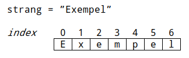
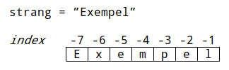
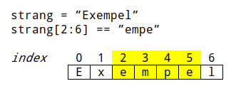
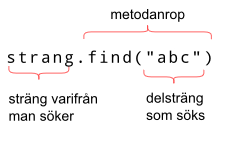

<text-box variant='learningObjectives' name='Lärandemål'>

Efter den här delen

* kan du använda operatorerna `+` och `*` med strängar
* vet du hur man tar reda på längden hos en sträng
* vet du vad strängindexering betyder
* kan du hitta en delsträng i en sträng.

</text-box>

## Strängoperationer

Strängar kan kombineras med `+`-operatorn:

```python
start = "exe"
slut = "mpel"
ord = start+slut
print(ord)
```

<sample-output>

exempel

</sample-output>

Operatorn `*` kan också användas med strängar då den andra operanden är ett heltal. Strängoperanden kommer då att upprepas det antal gånger som specificeras av heltalet. Till exempel följande skulle fungera:

```python
ord = "pegas"
print(ord*3)
```

<sample-output>

pegaspegaspegas

</sample-output>

Med hjälp av att kombinera strängoperationer med en loop kan vi skriva ett program som ritar en pyramid:

```python
n = 10 # våningar i pyramiden
rad = "*"

while n > 0:
    print(" " * n + rad)
    rad += "**"
    n -= 1
```

Så här ser utskriften ut:

```x
          *
         ***
        *****
       *******
      *********
     ***********
    *************
   ***************
  *****************
 *******************
```

Kommandot `print` inom loopen skriver ut en rad som börjar med `n` mellanslag följt av värdet som är lagrat i variabeln `rad`. Sedan läggs två stjärnor till i slutet av variabeln `rad` och variabeln `n`:s värde subtraheras med ett.

<in-browser-programming-exercise name="Flera strängar" tmcname="osa03-05a_monistetut_jonot">

Skapa ett program som ber användaren ange en sträng samt en siffra. Programmet ska sedan skriva ut strängen så många gången som siffran anger, enligt följande exempel:

<sample-output>

Ange sträng: **origami**
Ange antal: **2**
origamiorigami

</sample-output>

</in-browser-programming-exercise>

## Längden på en sträng och dess index

Funktionen `len` returnerar antalet tecken i en sträng som ett heltal. Till exempel `len("hej")` returnerar 3 eftersom det finns tre tecken i strängen `hej`.

Följande program ber användaren att ge en sträng och skriver sedan ut ned med "understrykning". Programmet skriver alltså ut en andra rad som innehåller så många streck (`-`) som det finns tecken i den givna strängen:

```python
strang = input("Ange sträng: ")
print(strang)
print("-"*len(strang))
```

<sample-output>

Ange sträng: **Hejsan svejsan!**

<pre>
Hejsan svejsan!
---------------
</pre>

</sample-output>

Strängens längd innehåller alla tecken i strängen – också mellanslag. Till exempel längden på strängen `hej igen` är 8.

<in-browser-programming-exercise name="Den längre strängen" tmcname="osa03-05b_pidempi_jono">

Skapa ett program som ber användaren ange två strängar. Programmet ska skriva ut den längre av de angivna strängarna. Om båda är lika långa skrivs meddelandet "Strängarna är lika långa" ut.

Exempel:

<sample-output>

Ange sträng 1: **nja**
Ange sträng 2: **betongsäck**
betongsäck är längre

</sample-output>

<sample-output>

Ange sträng 1: **sommartider hej hej**
Ange sträng 2: **sol, vind o vatten**
sommartider hej hej är längre

</sample-output>

<sample-output>

Ange sträng 1: **glasgolv**
Ange sträng 2: **vildsvin**
Strängarna är lika långa

</sample-output>

</in-browser-programming-exercise>

Eftersom strängar i grunden är sekvenser av tecken kan också vilken som helst specifik bokstav i en sträng hämtas. Operatorn `[]` hittar tecknet vid ett specifikt index som ges mellan parenteserna.

Indexet syftar till ett ställe i strängen och börjar från talet noll. Det första tecknet i en sträng har indexet 0 medan nästa tecken har indexet 1 och så vidare.



Det här programmet…

```python

strang = input("Ange sträng: ")
print(strang[0])
print(strang[1])
print(strang[3])

```

…skulle skriva ut följande:

<sample-output>

Ange sträng: **pegas**
p
e
a

</sample-output>

Eftersom det första tecknet i en sträng har indexet noll, har det sista tecknet indexet längd (`len`) - 1. Följande program skriver ut det första och sista tecknet i en sträng:

```python
strang = input("Ange sträng: ")
print("Första: " + strang[0])
print("Sista: " + strang[len(strang) - 1])
```

<sample-output>

Ange sträng: **test!**
Första: t
Sista: !

</sample-output>

Det här programmet går igenom varje tecken i en sträng – från det första till det sista:

```python
strang = input("Ange sträng: ")
plats = 0
while plats < len(strang):
    print(strang[plats])
    plats += 1
```

<sample-output>

Ange sträng: **test**
t
e
s
t

</sample-output>

Man kan också använda negativa index för att komma åt tecknen i en sträng från börjande från det sista tecknet.

Det sista tecknet i en sträng har alltså indexet -1, det näst sista indexet -2 och så vidare. Du kan tänka att `str[-1]` är en genväg för `str[len(str) – 1]`.



Ovanstående exempel kan förenklas med negativ indexering.

```python
strang = input("Ange sträng: ")
print("Första: " + strang[0])
print("Sista: " + strang[-1])
```

<sample-output>

Ange sträng: **test!**
Första: t
Sista: !

</sample-output>

## IndexError: string index out of range

Om du har testat på exemplen ovan har du kanske stött på felmeddelandet `IndexError`. Det här felet uppstår då du försöker använda ett index som inte finns i en sträng.

```python
strang = input("Ange sträng: ")
print("Tionde tecknet: " + strang[9])
```

<sample-output>

Ange sträng: **introkursen i programmering**
Tionde tecknet: e

</sample-output>

<sample-output>

Ange sträng: **python**

Traceback (most recent call last):
  File "<stdin>", line 1, in <module>
IndexError: string index out of range

</sample-output>

Ibland orsakas indexeringsfel av en bugg i koden. Det är till exempel relativt vanligt att man försöker indexera för långt då man försöker komma åt det sista tecknet i en sträng:

```python
strang = input("Ange sträng: ")
print("Sista tecknet: " + strang[len(strang)])
```

Eftersom strängindexeringen börjar med noll kommer det sista tecknet att ha indexet `len(str) - 1`.

Det finns situationer där programmet borde förbereda sig för fel orsakade av indata från användaren:

```python
strang = input("Ange sträng: ")
if len(strang) > 0:
    print("Första tecknet: " + strang[0])
else:
    print("Strängen är tom, alltså finns det inget första tecken")
```

I exemplet ovan skulle en sträng med längden noll ha orsakat problem om programmeraren inte skulle ha lagt till en längdkontroll i koden. En sträng med längden noll är en tom sträng. I det här fallet kan vi orsaka en sådan med att helt enkelt trycka på tangenten Enter utan att skriva något annat.

<in-browser-programming-exercise name="Omvänt" tmcname="osa03-05c_lopusta_alkuun">

Skapa ett program som ber användaren ange en sträng. Programmet ska skriva ut tecknen i omvänd ordning på varsin rad.

Exempel:

<sample-output>

Ange sträng: **geting**
g
n
i
t
e
g

</sample-output>

</in-browser-programming-exercise>

<in-browser-programming-exercise name="Andra och näst sista" tmcname="osa03-06_toinen_ja_toiseksi_viimeinen">

Skapa ett program som ger användaren mata in ett ord. Programmet ska därefter berätta om ordets andra och näst sista bokstäver är de samma.

<sample-output>

Ange ett ord: **python**
Den andra och den näst sista bokstaven skiljer sig från varandra

</sample-output>

<sample-output>

Ange ett ord: **pascal**
Den andra och den näst sista bokstaven är a

</sample-output>

</in-browser-programming-exercise>

<in-browser-programming-exercise name="Speciellt streck" tmcname="osa03-09_risuaitaviiva">

Skapa ett program som ritar ut ett streck bestående så många nummertecken (`#`) som användaren anger.

<sample-output>

Bredd: **3**
<pre>
###
</pre>

</sample-output>

<sample-output>

Bredd: **8**
<pre>
########
</pre>

</sample-output>

</in-browser-programming-exercise>

<in-browser-programming-exercise name="Fyrkant" tmcname="osa03-10_risuaitanelio">

Utveckla det föregående programmet så att användaren också kan definiera höjden på figuren.

<sample-output>

Bredd: **10**
Höjd: **3**
##########
##########
##########

</sample-output>

</in-browser-programming-exercise>

<in-browser-programming-exercise name="Understrykning" tmcname="osa03-11_alleviivaus">

Skapa ett program som ber användaren om strängar. Programmet skriver ut strängarna med understrykning enligt exemplet. Programmet avslutas då användaren ger en tom sträng, dvs. en sträng med längden noll.

<sample-output>

Ange sträng: **Hejsan svejsan!**
<pre>
Hejsan svejsan!
---------------
</pre>
Ange sträng: **Clara steg upp på en tremetersstege**
<pre>
Clara steg upp på en tremetersstege
-----------------------------------
</pre>
Ange sträng: **a**
<pre>
a
-
</pre>
Ange sträng:

</sample-output>

</in-browser-programming-exercise>

<in-browser-programming-exercise name="Högerjusterat" tmcname="osa03-12_tasaus_oikeaan">

Skapa ett program som ber användaren ange en sträng. Programmet ska sedan skriva ut strängen så att utskriften är exakt 20 tecken. Om strängen är kortare ska det finnas ett passligt antal asterisker (`*`) i början av strängen.

Du kan anta att strängen består av högst 20 tecken.

<sample-output>

Ord: **python**
<pre>
**************python
</pre>

</sample-output>

<sample-output>

Ord: **ganskalångsträng**
<pre>
****ganskalångsträng
</pre>

</sample-output>

<sample-output>

Ord: **sssuperlångstränggg**
<pre>
*sssuperlångstränggg
</pre>

</sample-output>


</in-browser-programming-exercise>

<in-browser-programming-exercise name="Ordlåda" tmcname="osa03-13_sanalaatikko">

Skapa ett program som ber användaren ge ett ord. Programmet ska skriva ut ordet i mitten av en ram som består av asterisker. Bredden av ramen är 30 tecken. Du kan anta att ordet som anges ryms i ramen.

Om ordets längd är ojämnt, kan du skriva ut det på valfritt mittställe.

<sample-output>

Ord: **aj!**
<pre>
******************************
*            aj!             *
******************************
</pre>

</sample-output>

<sample-output>

Ord: **python**
<pre>
******************************
*           python           *
******************************
</pre>

</sample-output>

</in-browser-programming-exercise>


## Delsträngar

En delsträng av en sträng är en sekvens av tecken som formar en del av den ursprungliga delen. Till exempel strängen `exempel` innehåller delsträngarna `exem`, `mpe`, `el` med flera. I Python kallas extrahering av delsträngar slicing.

Om du vet vad det inledande och avslutande indexet för en delsträng är, kan du extrahera (slice) delsträngen med notationen `[a:b]`. Då kommer delsträngen att börja vid index `a` och ta slut vid det sista tecknet före indexet `b` – det vill säga inklusive den första bokstaven men exklusive den sista. Du kan tänka att indexen är streck ritade på den vänstra sidan av det indexerade tecknet – som vi illustrerar nedan:



Låt oss kika lite mer på extraherade (sliced) strängar:

```python
strang = "glassbil"

print(strang[0:3])
print(strang[4:7])

# om inledande index fattas, är det 0
print(strang[:3])

# om avslutande index fattas, är det lika med strängens längd
print(strang[4:])
```

<sample-output>

gla
sbi
gla
sbil

</sample-output>

<text-box variant='hint' name='Halvöppna intervall'>

I Python är intervallet `[a:b]` i halvöppet då vi behandlar strängar. Det här innebär att tecknet i det inledande indexet `a` inkluderas i intervallet medan tecknet i det avslutande indexet `b` lämnas bort. Varför så?

Det finns ingen tydlig orsak till detta. Det är helt enkelt en vana som har sitt ursprung i andra programmeringsspråk.

Halvöppna intervall kan kännas jobbiga men i praktiken har de sina nyttiga sidor. Du kan till exempel enkelt räkna längden på en delsträng med `b - a`. Å andra sidan måste du komma ihåg att tecknet i slutet vid indexet `b` inte kommer att inkluderas i delsträngen.

</text-box>

<in-browser-programming-exercise name="Delsträngar 1" tmcname="osa03-07_osajonot1">

Skapa ett program som ber användaren ange en sträng. Därefter skriver programmet ut alla delsträngar börjande med det första tecket, i storleksordning.

Exempel:

<sample-output>

Ange sträng: **test**
t
te
tes
test

</sample-output>

</in-browser-programming-exercise>

<in-browser-programming-exercise name="Delsträngar 2" tmcname="osa03-08_osajonot2">

Skapa ett program som ber användaren om en sträng. Därefter skriver man ut alla delsträngar som slutar med det sista tecknet, i storleksordning.

Exempel:

<sample-output>

Ange sträng: **test**
t
st
est
test

</sample-output>

</in-browser-programming-exercise>

## Söka efter delsträngar

Operatorn `in` berättar oss om en sträng innehåller en specifik delsträng. Boolean-uttrycket `a in b` är sant om `b` innehåller delsträngen `a`.

Till exempel den här kodsnutten…

```python
strang = "test"

print("t" in strang)
print("x" in strang)
print("est" in strang)
print("ets" in strang)
```

…skriver ut följande:

<sample-output>

True
False
True
False

</sample-output>

Programmet nedan låter användaren söka efter delsträngar i en sträng som är hårdkodad i programmet:

```python
strang = "eu-val"

while True:
    delstrang = input("Vad söker du efter? ")
    if delstrang in strang:
        print("Hittades")
    else:
        print("Hittades inte")
```

<sample-output>

Vad söker du efter? **eu**
Hittades
Vad söker du efter? **euval**
Hittades inte
Vad söker du efter? **u-v**
Hittades
...

</sample-output>

<in-browser-programming-exercise name="Hittas vokaler?" tmcname="osa03-13b_loytyvatko_vokaalit">

Skapa ett program som ber användaren ange en sträng. Programmet ska därefter meddela om vokalerna a, e eller o hittas i strängen.

Du kan anta att strängen är angiven i gemener.

Exempel:

<sample-output>

Ange sträng: **hej på dig**
a hittas inte
e hittas
o hittas inte

</sample-output>

<sample-output>

Ange sträng: **morjens**
a hittas inte
e hittas
o hittas

</sample-output>


</in-browser-programming-exercise>

Operatorn `in` returnerar ett Boolean-värde. Det berättar oss alltså bara att en delsträng existerar i en sträng, men baserat på den informationen vet vi inte var delsträngen befinner sig. Däremot kan metoden `find` hos strängar användas för det här syftet. Som argument ger man delsträngen som söks efter. Tillbaka får vi ett värde som indikerar det första indexet där delsträngen hittades – eller `-1` om delsträngen inte hittas i strängen.

Så här fungerar det:



Några exempel där vi använder `find`:

```python
strang = "test"

print(strang.find("t"))
print(strang.find("x"))
print(strang.find("est"))
print(strang.find("ets"))
```

<sample-output>

0
-1
1
-1

</sample-output>

Ovanstående delsträngsexempel gjort med `find`:

```python
strang = "led-lampa"

while True:
    delstrang = input("Vad söker du efter? ")
    plats = strang.find(delstrang)
    if plats >= 0:
        print(f"Hittades på platsen {plats}")
    else:
        print("Hittades inte")
```

<sample-output>

Vad söker du efter? **ed**
Hittades på platsen 1
Vad söker du efter? **abc**
Hittades inte
Vad söker du efter? **ampa**
Hittades på platsen 5
...

</sample-output>

<text-box variant='hint' name='Metoder'>

Vi använde ovan metoden `find` hos strängar. Metoder fungerar ganska lika jämfört med funktioner som vi såg på i den föregående modulen. Skillnaden mellan dem är att metoder alltid är kopplade till det objekt som de kallas på. Objektet är den entitet som namnges före metoden som kallas. I det här fallet är objektet strängen där metoden söker efter delsträngen som ges som argument till metoden.

</text-box>

<in-browser-programming-exercise name="Hitta första delsträngen" tmcname="osa03-13c_osajonon_haku">

Skapa ett program som ber användaren ange en sträng samt ett tecken. Programmet ska skriva ut den första delsträngen på tre tecken som börjar med det tecknet användaren angett. Du kan anta att strängen består av minst tre tecken.

<sample-output>

Ord: **algeriet**
Tecken: **a**
alg

</sample-output>

<sample-output>

Ord: **insändare**
Tecken: **n**
nsä

</sample-output>

<sample-output>

Ord: **vindpust**
Tecken: **x**

</sample-output>

<sample-output>

Ord: **python**
Tecken: **n**

</sample-output>

</in-browser-programming-exercise>

<in-browser-programming-exercise name="Hitta alla delsträngar" tmcname="osa03-14_osajonojen_haku">

Utveckla ditt föregående program, så att programmet skriver ut varje delsträng på tre tecken och som börjar med det angivna tecknet. Du kan anta att den angivna strängen består av minst tre tecken.

<sample-output>

Ord: **ljudlös**
Tecken: **l**
lju
lös

</sample-output>

<sample-output>

Ord: **nemi**
Tecken: **n**
nem

</sample-output>

Tips: Följande exempel kan ge dig inspiration för uppgiften.

```python
ord = input("Ord: ")
while True:
    if len(ord) == 0:
        break
    print(ord)
    ord = ord[2:]
```

<sample-output>

Ord: **solgass**
solgass
olgass
lgass
gass
ass
ss
s

</sample-output>

</in-browser-programming-exercise>

<in-browser-programming-exercise name="Andra förekomsten" tmcname="osa03-15_toinen_esiintyma">

Skapa ett program som söker efter det andra av en given delsträng i en sträng. Om delsträngen inte hittas två gånger eller ens en gång, ska programmet meddela om detta.

I den här kontexten kan delsträngar inte vara överlappande. I strängen `aaaa` hittas delsträngen `aa` för den andra gången vid index 2.

Exempel:

<sample-output>

Ange sträng: **abcabc**
Ange delsträng: **ab**
Delsträngens andra förekomst är vid index 3.

</sample-output>

<sample-output>

Ange sträng: **laserpenna**
Ange delsträng: **a**
Delsträngens andra förekomst är vid index 9.

</sample-output>

<sample-output>

Ange sträng: **dynga**
Ange delsträng: **dy**
Delsträngen förekommer inte två gånger.

</sample-output>

</in-browser-programming-exercise>

<quiz id="e292f94e-9004-5e1b-9149-83a4e810c770"></quiz>
