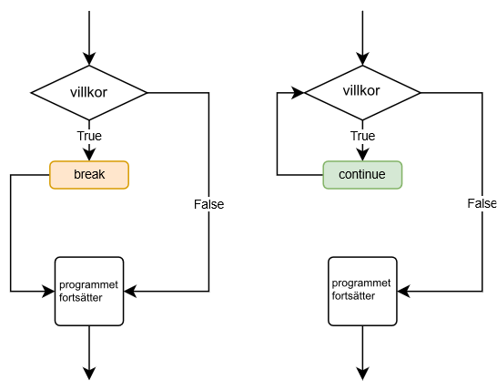

<text-box variant='learningObjectives' name='Oppimistavoitteet'>

Efter den här delen

* vet du när `break`-kommandot behövs för att avsluta en loop
* kan du använda `continue`-kommandot för att fortsätta till nästa iteration
* förstår du hur kapslade loopar fungerar.

</text-box>

## `break`-kommandot

Du har redan bekantat dig med `break`-kommandot. Det kan användas för att direkt avsluta en loop. Ett exempel på ett användningsområde för `break`-kommandot är då man ber användaren om någon information och loopen ska avslutas när ett visst värde ges.

Samma funktionalitet kan skapas utan `break`-kommandot med ett passligt villkor. De här två programmen ber användaren ge siffor som adderas ihop tills användaren skriver siffran -1.

```python
# 1. versio break-komennon avulla

summa = 0

while True:
    luku = int(input("Anna luku, -1 lopettaa: "))
    if luku == -1:
        break
    summa += luku

print (f"Summa on {summa}")
```

```python
# 2. versio ilman break-komentoa

summa = 0
luku = 0

while luku != -1:
    luku = int(input("Anna luku, -1 lopettaa: "))
    if luku != -1:
        summa += luku

print (f"Summa on {summa}")
```

Båda programmen skriver ut samma saker med samma indata, exempelvis:

<sample-output>

Anna luku, -1 lopettaa: **2**
Anna luku, -1 lopettaa: **4**
Anna luku, -1 lopettaa: **5**
Anna luku, -1 lopettaa: **3**
Anna luku, -1 lopettaa: **-1**
Summa on 14

</sample-output>

Båda programmen är alltså identiska till deras funktion men den första metoden är ofta enklare eftersom villkoret `nummer == 1` endast finns på ett ställe och variabeln `nummer` behöver inte initieras utanför loopen.

`break`-kommandot kan kombineras med ett passligt villkor. Till exempel följande loop upprepas så länge summan av siffrorna är högst 100, men avslutas också då man ger siffran -1.

Så här kan det se ut när programmet körs:

```python
summa = 0

while summa <= 100:
    luku = int(input("Anna luku, -1 lopettaa: "))
    if luku == -1:
        break
    summa += luku

print (f"Summa on {summa}")
```

Mahdollisia suorituksia:

<sample-output>

Anna luku, -1 lopettaa: **15**
Anna luku, -1 lopettaa: **8**
Anna luku, -1 lopettaa: **21**
Anna luku, -1 lopettaa: **-1**
Summa on 44

</sample-output>

<sample-output>

Anna luku, -1 lopettaa: **15**
Anna luku, -1 lopettaa: **8**
Anna luku, -1 lopettaa: **21**
Anna luku, -1 lopettaa: **45**
Anna luku, -1 lopettaa: **17**
Summa on 106

</sample-output>

I det första exemplet avslutas loopen eftersom användaren ger siffran -1. I det andra exemplet avslutas loopen eftersom summan blir större än 100.

Som alltid inom programmering finns det flera sätt att uppnå samma resultat. Följande program fungerar på identiskt sätt jämfört med de två exemplen ovan:

```python
summa = 0

while True:
    luku = int(input("Anna luku, -1 lopettaa: "))
    if luku == -1:
        break
    summa += luku
    if summa > 100:
        break

print (f"Summa on {summa}")
```
## `continue`-kommandot

Ett annat sätt att påverka hur en loop körs är `continue`-kommandot. Det får loopen att hoppa till början, där villkoret för loopen finns. Loopen fortsätter köra normalt därifrån börjandes från att kolla villkoret:



Till exempel följande program adderar siffor som användaren ger, men bara då den givna siffran är mindre än tio. Om siffran är tio eller större, hoppar man till början av loopen utan att addera siffran.

```python
summa = 0

while True:
    luku = int(input("Anna luku, -1 lopettaa: "))
    if luku == -1:
        break
    if luku >= 10:
        continue
    summa += luku

print (f"Summa on {summa}")
```

<sample-output>

Anna luku, -1 lopettaa: **4**
Anna luku, -1 lopettaa: **7**
Anna luku, -1 lopettaa: **99**
Anna luku, -1 lopettaa: **5**
Anna luku, -1 lopettaa: **-1**
Summa on 16

</sample-output>

## Kapslade loopar

Precis som med if-satser kan loopar placeras inom andra loopar. Till exempel följande program använder sig av en loop för att fråga efter en siffra från användaren. Inom den här loopen finns en annan loop som räknar ner från det givna talet till ett:

```python
while True:
    luku = int(input("Anna luku: "))
    if luku == -1:
        break
    while luku > 0:
        print(luku)
        luku -= 1
```

<sample-output>

Anna luku: **4**
4
3
2
1
Anna luku: **3**
3
2
1
Anna luku: **6**
6
5
4
3
2
1
Anna luku: **-1**

</Sample-output>

I kapslade loopar är det bra att märka att `break` och `continue` endast påverkar den innersta loopen de är i. Föregående exemplet skulle kunna skrivas så här:

```python
while True:
    luku = int(input("Anna luku: "))
    if luku == -1:
        break
    while True:
        if luku <= 0:
            break
        print(luku)
        luku -= 1
```

Här avslutar det andra `break`-kommandot endast den inre loopen som används för att skriva ut siffrorna.

## Hjälpvariabler med loopar

Vi har redan använt oss av hjälpvariabler – som ökar eller minskar för varje iteration av en loop – flera gånger, så följande program borde till sin struktur se ganska bekant ut. Programmet skriver ut alla jämna tal från noll fram till det tal som användaren angett:

```python
raja = int(input("Anna luku: "))
i = 0
while i < raja:
    print(i)
    i += 2
```

<sample-output>

Anna luku: **8**
0
2
4
6

</sample-output>

Hjälpvariabeln `i` har tilldelats värdet 0 före loopen, som ökar på talet med två för varje iteration.

När man använder kapslade loopar kan det uppstå ett behov för en ny hjälpvariabel för den inre loopen. Följande program skriver ut en "sifferpyramid" baserat på den siffra som användaren angett:

```python
luku = int(input("Anna luku: "))
while luku > 0:
    i = 0
    while i < luku:
        print(f"{i} ", end="")
        i += 1
    print()
    luku -= 1
```

<sample-output>

Anna luku: **5**
0 1 2 3 4
0 1 2 3
0 1 2
0 1
0

</sample-output>

I programmet använder den yttre loopen hjälpvariabeln `nummer` som minskar med ett tills det når till noll. Hjälpvariabeln `i` tilldelas värdet 0 före man fortsätter till den inre loopen – varje gång den yttre loopen upprepas.

Den inre loopen använder sig av hjälpvariabeln `i` som ökar med talet 1 för varje iteration av den inre loopen. Den inre loopen fortsätter tills `i` är lika med `nummer`, och skriver ut varje värde hos `i` med mellanslag emellan. När loopen avslutas skapar `print`-kommandot i den yttre loopen en ny rad.

I och med att värdet på nummer minskar för varje iteration av den yttre loopen, kommer antalet iterationer hos den inre loopen att minska. Vid varje upprepning blir sifferraden kortare, vilket bildar "pyramiden".

Kapslade loopar kan vara svårtolkade på en första titt, men det är viktigt att förstå hur de fungerar. Du kan använda dig av Python Tutors visualiseringsverktyg för att bättre förstå hur ovanstående exempel fungerar. Kopiera koden ovan till kodfönstret och följ hur utskriften formar sig och hur hjälpvariablernas värden ändras medan programmet körs.

<in-browser-programming-exercise name="Kertotaulut" tmcname="osa03-15b_kertotaulut">

Tee ohjelma, joka kysyy käyttäjältä positiivisen kokonaisluvun. Ohjelma tulostaa esimerkkitulostuksen mukaisesti kertolaskuja lukuun asti:

Esimerkkisuorituksia:

<sample-output>

Anna luku: 2
1 x 1 = 1
1 x 2 = 2
2 x 1 = 2
2 x 2 = 4

</sample-output>

<sample-output>

Anna luku: 3
1 x 1 = 1
1 x 2 = 2
1 x 3 = 3
2 x 1 = 2
2 x 2 = 4
2 x 3 = 6
3 x 1 = 3
3 x 2 = 6
3 x 3 = 9

</sample-output>

</in-browser-programming-exercise>


<in-browser-programming-exercise name="Sanojen ensimmäiset kirjaimet" tmcname="osa03-16_sanojen_ensimmaiset_kirjaimet">

Tee ohjelma, joka kysyy käyttäjältä lauseen. Ohjelma tulostaa jokaisen sanan ensimmäisen kirjaimen ruudulle omille riveilleen.

Esimerkkisuoritus:

<sample-output>

Anna lause: **Vesihiisi sihisi hississä**
V
s
h

</sample-output>

</in-browser-programming-exercise>

<in-browser-programming-exercise name="Kertomat" tmcname="osa03-17_kertomat">

Tee ohjelma, joka kysyy käyttäjältä kokonaisluvun. Jos käyttäjä syöttää negatiivisen luvun tai nollan, ohjelman suoritus päättyy. Muuten ohjelma tulostaa luvun kertoman.

Kertoma lasketaan kertomalla keskenään luku ja kaikki sitä pienemmät positiiviset kokonaisluvut. Esim. luvun 5 kertoma on 1 * 2 * 3 * 4 * 5 = 120.

Esimerkkisuorituksia:

<sample-output>

Anna luku: **3**
Luvun 3 kertoma on 6
Anna luku: **4**
Luvun 4 kertoma on 24
Anna luku: **-1**
Kiitos ja moi!

</sample-output>

<sample-output>

Anna luku: **1**
Luvun 1 kertoma on 1
Anna luku: **0**
Kiitos ja moi!

</sample-output>

</in-browser-programming-exercise>

<in-browser-programming-exercise name="Parit ympäri" tmcname="osa03-18_parit_ympari">

Tee ohjelma, joka tulostaa luvut 1:stä käyttäjän antamaan lukuun. Luvut on kuitenkin käännetty pareittain ympäri.

<sample-output>

Anna luku: **5**
2
1
4
3
5

</sample-output>

<sample-output>

Anna luku: **6**
2
1
4
3
6
5

</sample-output>

</in-browser-programming-exercise>

<in-browser-programming-exercise name="Vuorotellen" tmcname="osa03-19_vuorotellen">

Tee ohjelma, joka kysyy käyttäjältä luvun ja tulostaa sitten lukuja vuorotellen seuraavien esimerkkien mukaisesti.

<sample-output>

Anna luku: **5**
1
5
2
4
3

</sample-output>

<sample-output>

Anna luku: **6**
1
6
2
5
3
4

</sample-output>

</in-browser-programming-exercise>

<quiz id="c7b69cde-08a4-5de2-9d23-3315903be6ec"></quiz>
