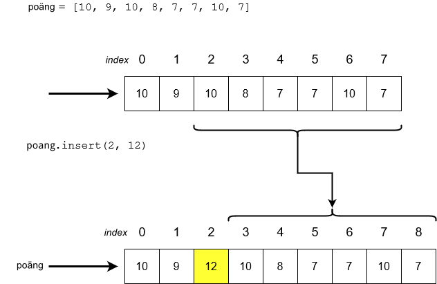

<text-box variant='learningObjectives' name='Lärandemål'>

Efter den här delen

* vet du vad listor i Python är
* vet du hur du kommer åt ett visst element i en lista
* kan du lägga till och ta bort element ur en lista
* känner du till inbyggda funktioner och metoder för listor.

</text-box>

Hittills har vi lagrat data med hjälp av enkla variabler i våra program, så att varje värde har lagrats i en egen variabel. Det här har sina begränsningar – det kan bli arbetsdrygt att tilldela variabler för allt då det finns mycket data att behandla.

I Python är en lista en samling av värden som finns lagrade under samma variabelnamn. Listans värden kallas element och skrivs innanför hakparenteser. 

Följande instruktion skapar en ny tom lista…

```python
lista = []
```

…medan det här instruktionen skapar en lista med fem element:

```python
lista = [7, 2, 2, 5, 2]
```

## Komma åt element i en lista

Elementen i en lista är indexerade på samma sätt som tecken i en sträng. Indexeringen börjar från noll och det sista indexet är listans längd minus ett:


Vi kommer åt ett givet element i listan på samma sätt som för ett specifikt tecken i en sträng, det vill säga med hakparenteser:

```python
lista = [7, 2, 2, 5, 2]

print(lista[0])
print(lista[1])
print(lista[3])

print("Summan av de två första:", lista[0] + lista[1])
```

<sample-output>

7
2
5
Summan av de två första: 9

</sample-output>

Vi kan också enkelt skriva ut hela listans innehåll:

```python
lista = [7, 2, 2, 5, 2]
print(lista)
```

<sample-output>

[7, 2, 2, 5, 2]

</sample-output>

Till skillnad från strängar är listor föränderliga, vilket betyder att deras innehåll kan ändra. Vi kan inte byta ut ett tecken i en sträng till en annan, men vi kan tilldela ett nytt värde till ett element i en lista. Vi gör det på samma sätt som vi kan tilldela ett nytt värde till en variabel:

```python
lista = [7, 2, 2, 5, 2]
print(lista)
lista[1] = 3
print(lista)
```

<sample-output>

[7, 2, 2, 5, 2]
[7, 3, 2, 5, 2]

</sample-output>

Funktionen `len` returnerar antalet element i en lista:

```python
lista = [7, 2, 2, 5, 2]
print(len(lista))
```

<sample-output>

5

</sample-output>


<programming-exercise name='Ändra på elementens värden' tmcname='osa04-07a_andra_varden'>

Skapa ett program som initierar en lista med värdena `[1, 2, 3, 4, 5]`. Programmet ber därefter användaren ange ett index och ett nytt värde som programmet ska lagra på den positionen, varefter listan skrivs ut på nytt. Programmet avslutas då använder anger -1 som index.

Exempel:

<sample-output>

Ange index: **0**
Ange värde: **10**
[10, 2, 3, 4, 5]
Ange index: **2**
Ange värde: **250**
[10, 2, 250, 4, 5]
Ange index: **4**
Ange värde: **-45**
[10, 2, 250, 4, -45]
Ange index: **-1**

</sample-output>

Obs! Placera inte kod i `if __name__ == "__main__"` -blocket i någon av dessa uppgifter, om du inte ombeds göra det.

</programming-exercise>

## Lägga till element i en lista

Metoden `append` lägger till element i slutet av en lista. Metoden fungerar så här:

```python
siffror = []
siffror.append(5)
siffror.append(10)
siffror.append(3)
print(siffror)
```

<sample-output>

[5, 10, 3]

</sample-output>

Följande exempel använder sig av två listor:

```python
siffror = []
skonummer = []

siffror.append(5)
siffror.append(10)
siffror.append(3)

skonummer.append(37)
skonummer.append(44)
skonummer.append(40)
skonummer.append(28)

print("Siffror:")
print(siffror)

print("Skonummer:")
print(skonummer)
```

Elementet läggs till i slutet av den lista som metoden anropas på:

<sample-output>

Siffror:
[5, 10, 3]
Skonummer:
[37, 44, 40, 28]

</sample-output>

<programming-exercise name='Lägg till element i en lista' tmcname='osa04-07b_nya_element'>

Skapa ett program som ber användaren att först mata in ett antal och därefter att mata in så många tal. Talen som matas in ska läggas till i en lista i den givna ordningen.

Listan ska till slut skrivas ut:

<sample-output>

Hur många siffror: **3**
Ge siffra 1: **10**
Ge siffra 2: **250**
Ge siffra 3: **34**
[10, 250, 34]

</sample-output>

Obs! Placera inte kod i `if __name__ == "__main__"` -blocket i någon av dessa uppgifter, om du inte ombeds göra det.

</programming-exercise>

## Lägga till ett element på ett specifikt ställe

Om du vill specificera på vilket ställe i en lista ett värde ska läggas till, kan du använda `insert`-metoden. Metoden lägger till ett element på ett specifikt index. Alla element vid det här eller senare index flyttar ett index framåt, "mot höger":



Till exempel skriver det här programmet…

```python
tal = [1, 2, 3, 4, 5, 6]
tal.insert(0, 10)
print(tal)
tal.insert(2, 20)
print(tal)
```

… ut följande:

<sample-output>

[10, 1, 2, 3, 4, 5, 6]
[10, 1, 20, 2, 3, 4, 5, 6]

</sample-output>

## Ta bort element från en lista

Det finns två sätt för att ta bort ett element från en lista:

* om man vet indexet för elementet kan man använda `pop`-metoden
* om man vet innehållet i elementet kan man använda `remove`-metoden.

`pop`-metoden tar indexet för det element som ska avlägsnas som argument. Följande program tar därmed bort elementen på indexen 2 och 3 i listan. När element avlägsnas inifrån en lista ändras naturligt nog indexen för de resterande elementen:

```python
lista = [1, 2, 3, 4, 5, 6]

lista.pop(2)
print(lista)
lista.pop(3)
print(lista)
```

<sample-output>

[1, 2, 4, 5, 6]
[1, 2, 4, 6]

</sample-output>

Det är bra att minnas att `pop`-metoden också returnerar det avlägsnade elementet:

```python
lista = [4, 2, 7, 2, 5]

siffra = lista.pop(2)
print(siffra)
print(lista)
```

<sample-output>

7
[4, 2, 2, 5]

</sample-output>

Till skillnad från `pop` tar `remove`-metoden värdet för det element som ska avlägsnas som argument. Till exempel följande program…

```python
lista = [1, 2, 3, 4, 5, 6]

lista.remove(2)
print(lista)
lista.remove(5)
print(lista)
```

…skriver ut detta:

<sample-output>

[1, 3, 4, 5, 6]
[1, 3, 4, 6]

</sample-output>

Metoden tar bort det första värdet som motsvarar det givna argumentet från listan – på samma sätt som funktionen find hos strängar returnerar den första delsträngen:

```python
lista = [1, 2, 1, 2]

lista.remove(1)
print(lista)
lista.remove(1)
print(lista)
```

<sample-output>

[2, 1, 2]
[2, 2]

</sample-output>

<programming-exercise name='Lägg till, ta bort' tmcname='osa04-07c_lagg_till_ta_bort'>

Skapa ett program som låter användaren lägga till eller avlägsna ett element i en lista. Varje tillägg/borttagning görs i slutet av listan. När ett element läggs till är dess värde alltid ett större än det föregående värdet (1 om inga element finns i listan).

Listans innehåll skrivs ut mellan varje tillägg eller borttagning. Här följer ett exempel:

<sample-output>

Listan är nu []
(l)ägg till, (a)vlägsna eller a(v)sluta: **l**
Listan är nu [1]
(l)ägg till, (a)vlägsna eller a(v)sluta: **l**
Listan är nu [1, 2]
(l)ägg till, (a)vlägsna eller a(v)sluta: **l**
Listan är nu [1, 2, 3]
(l)ägg till, (a)vlägsna eller a(v)sluta: **a**
Listan är nu [1, 2]
(l)ägg till, (a)vlägsna eller a(v)sluta: **l**
Listan är nu [1, 2, 3]
(l)ägg till, (a)vlägsna eller a(v)sluta: **v**
Hejdå!

</sample-output>

Du kan anta att man inte försöker avlägsna element då listan är tom.

Obs! Placera inte kod i `if __name__ == "__main__"` -blocket i någon av dessa uppgifter, om du inte ombeds göra det.

</programming-exercise>

Om det givna elementet inte hittas i listan, kommer remove-metoden att ge ett fel. På samma sätt som med strängar kan vi kolla om ett element finns i en lista med hjälp av `in`-operatorn:

```python
lista = [1, 3, 4]

if 1 in lista:
    print("Listan innehåller värdet 1")

if 2 in lista:
    print("Listan innehåller värdet 2")
```

<sample-output>

Listan innehåller värdet 1

</sample-output>

<programming-exercise name='Samma ord två gånger' tmcname='osa04-08_samma_tva_ganger'>

Skapa ett program som ber användaren mata in ord. När användaren anger ett ord som hen matat in tidigare, avslutas programmet och antalet ord skrivs ut.

<sample-output>

ord: **det**
ord: **var**
ord: **en**
ord: **gång**
ord: **en**
Du gav 4 olika ord

</sample-output>

Obs! Placera inte kod i `if __name__ == "__main__"` -blocket i någon av dessa uppgifter, om du inte ombeds göra det.

</programming-exercise>

## Ordna listor

Elementen i en lista kan ordnas från minsta till största med metoden `sort`.

```python
lista = [2,5,1,2,4]
lista.sort()
print(lista)
```

<sample-output>

[1, 2, 2, 4, 5]

</sample-output>

Notera att den här metoden modifierar själva listan "in-place". Vi vill dock inte alltid ändra på den ursprungliga listan, och då kan vi istället använda funktionen `sorted`. Den returnerar en sorterad lista:

```python
lista = [2,5,1,2,4]
print(sorted(lista))
```

<sample-output>

[1, 2, 2, 4, 5]

</sample-output>

Kom ihåg skillnaden mellan dessa: `sort` ändrar på ordningen i den ursprungliga listan medan `sorted` skapar en ny, sorterad kopia av listan. Med `sorted` kan vi därmed behålla den ursprungliga listan med dess ursprungliga ordning:

```python
ursprunglig = [2, 5, 1, 2, 4]
ordnad = sorted(ursprunglig)
print(ursprunglig)
print(ordnad)
```

<sample-output>

[2, 5, 1, 2, 4]
[1, 2, 2, 4, 5]

</sample-output>

<programming-exercise name='En lista, två varianter' tmcname='osa04-08b_en_lista_tva_varianter'>

Skapa ett program som ber användaren mata in tal, som läggs till i en lista. Efter varje tillägg skrivs listan ut på två sätt:

* elementen i den ordning de lagts till
* elementen i storleksordning från det minsta till det största

Programmet avslutas då användaren anger siffran 0.

Exempel:

<sample-output>

Ange siffra: **3**
Lista: [3]
Ordnat: [3]
Ange siffra: **1**
Lista: [3, 1]
Ordnat: [1, 3]
Ange siffra: **9**
Lista: [3, 1, 9]
Ordnat: [1, 3, 9]
Ange siffra: **5**
Lista: [3, 1, 9, 5]
Ordnat: [1, 3, 5, 9]
Ange siffra: **0**
Hejdå!

</sample-output>

Obs! Placera inte kod i `if __name__ == "__main__"` -blocket i någon av dessa uppgifter, om du inte ombeds göra det.

</programming-exercise>

## Maximi- och minimivärde samt summa

Funktionerna `max` och `min` returnerar det största respektive minsta värdet i en lista. Funktionen `sum` returnerar summan av listans värden.

```python
lista = [5, 2, 3, 1, 4]

storst = max(lista)
minst = min(lista)
summa = sum(lista)

print("Minst:", minst)
print("Störst:", storst)
print("Summa:", summa)
```

<sample-output>

Minst: 1
Störst: 5
Summa: 15

</sample-output>

## Metoder och funktioner

Det finns två sätt att behandla listor i Python, och det här kan ibland förorsaka huvudbry. Allt som oftast kommer du att använda metoder hos listor – till exempel `append` och `sort`. De används med punktoperatorn:

```python
lista = []

# metodanrop
lista.append(3)
lista.append(1)
lista.append(7)
lista.append(2)

# metodanrop
lista.sort()
```

En del funktioner kan ta listor som argument, hit hör till exempel de nyss presenterade funktionerna `max`, `min`, `len` och `sorted`:

```python
lista = [3, 2, 7, 1]

# funktionsanrop, lista som argument
storst = max(lista)
minst = min(lista)
langd = len(lista)

print("Minst:", minst)
print("Störst:", storst)
print("Listans längd:", langd)

# funktionsanrop, lista som argument, ordnad lista returneras
sorterad = sorted(lista)
print(sorterad)
```

<sample-output>

Minst: 1
Störst: 7
Listans längd: 4
[1, 2, 3, 7]

</sample-output>

## Lista som argument eller returvärde

Precis som för de inbyggda funktionerna ovan kan också våra egna funktioner både ta listor som argument och returnera listor som resultat. Följande funktion tar reda på det mellersta – median – värdet i en sorterad lista:

```python
def median(lista: list):
    ordnad = sorted(lista)
    mellersta = len(ordnad) // 2
    return ordnad[mellersta]
```

Funktionen skapar en sorterad version av listan som gavs som argument och returnerar det mittersta elementet. Lägg märke till att vi här använder heltalsdivisionsoperatorn `//`. Indexet i en lista måste vara ett heltal.

Funktionen fungerar på följande sätt:

```python
skonummer = [45, 44, 36, 39, 40]
print("Skonumrens median är", median(skonummer))

aldrar = [1, 56, 34, 22, 5, 77, 5]
print("Medianåldern är", median(aldrar))
```

<sample-output>

Skonumrens median är 40
Medianåldern är 22

</sample-output>

En funktion kan också returnera en lista. Följande funktion ber användaren mata in ett heltal, som sedan returneras som en lista:

```python
def las_in_siffror():
    siffror = []
    while True:
        indata = input("Ge siffra (tomt avslutar programmet): ")
        if len(indata) == 0:
            break
        siffror.append(int(indata))
    return siffror
```

Funktionen använder sig av hjälpvariabeln `siffror`, som är en lista. Alla siffror som användaren matar in läggs till i listan. När loopen avslutas returnerar funktionen listan (satsen `return siffror`).

När funktionen anropas så här…

```python
siffror = las_in_siffror()

print("Största siffran är", max(siffror))
print("Medianvärdet är", median(siffror))
```

…kan utskriften se ut på följande sätt:

<sample-output>

Ge siffra (tomt avslutar programmet): **5**
Ge siffra (tomt avslutar programmet): **-22**
Ge siffra (tomt avslutar programmet): **4**
Ge siffra (tomt avslutar programmet): **35**
Ge siffra (tomt avslutar programmet): **1**
Ge siffra (tomt avslutar programmet):
Största siffran är 35
Medianvärdet är 4

</sample-output>

Det här lilla exemplet demonstrerar ett av de viktigaste användningsområdena för funktioner: de hjälper dig att dela upp din kod i mindre helheter som är enkla att förstå. 

Samma funktionalitet kan förstås åstadkommas utan några som helst egna funktioner:

```python
siffror = []
while True:
    indata = input("Ge siffra (tomt avslutar programmet): ")
    if len(indata) == 0:
        break
    siffror.append(int(indata))

ordnad = sorted(siffror)
mellersta = len(ordnad) // 2
median = ordnad[mellersta]

print("Största siffran är", max(siffror))
print("Medianvärdet är", median)
```

Det kan vara svårare att komma åt logiken i den här versionen av programmet, eftersom det inte är enkelt att se vilka instruktioner som hör till vilken funktionalitet. Koden uppnår samma mål – ta emot data, beräkna medianvärde o.s.v. – men strukturen är mycket mindre tydlig.

Att dela upp din kod i flera funktioner kommer att förbättra läsbarheten och hjälper dig uppfatta logiska helheter. Det här är till nytta när du ska verifiera att programmet fungerar som det ska, eftersom varje funktion kan testas separat.

En annan viktig orsak till att använda funktioner är återanvändbarhet. Om du behöver samma funktionalitet på flera ställen i ditt program är det en bra idé att skapa en funktion och namnge den väl:

```python
print("Skonummer:")
skor = las_in_siffror()

print("Vikter:")
vikter = las_in_siffror()

print("Längder:")
langder = las_in_siffror()
```

<programming-exercise name='Listans längd' tmcname='osa04-09_listans_langd'>

Skapa funktionen `langd` som returnerar längden på den lista som getts som argument.

```python
lista = [1, 2, 3, 4, 5]
svar = langd(lista)
print("svar", svar)

# observera att du också kan anropa funktionen genom att direkt ge en lista som argument till funktionen
svar = langd([1, 1, 1, 1])
print("svar", svar)
```

<sample-output>

svar 5
svar 4

</sample-output>

</programming-exercise>

<programming-exercise name='Medeltal' tmcname='osa04-10_medeltal'>

Skapa funktionen `medeltal` som returnerar medelvärdet av värdena i en lista bestående av heltal som getts som argument till funktionen.

```python
lista = [1, 2, 3, 4, 5]
svar = medeltal(lista)
print("svar", svar)
```

<sample-output>

svar 3.0

</sample-output>

</programming-exercise>

<programming-exercise name='Variationsbredd' tmcname='osa04-11_variationsbredd'>

Skapa funktionen `variationsbredd` som returnerar differensen av det största och minsta värdet i en lista av heltal som getts som argument till funktionen.

```python
lista = [1, 2, 3, 4, 5]
svar = variationsbredd(lista)
print("svar", svar)
```

<sample-output>

svar 4

</sample-output>


</programming-exercise>

## Mer om att behandla listor

Det finns flera sätt till att använda listor i Python. Om du vill läsa mera är [Pythons dokumentation](https://docs.python.org/3/tutorial/datastructures.html#more-on-lists) ett bra ställe att börja med.

<quiz id="f0940a15-fbc4-57b4-b11b-49c63501c92a"></quiz>
