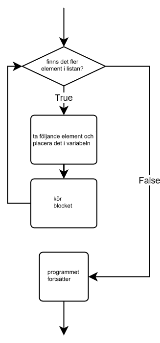

<text-box variant='learningObjectives' name='Oppimistavoitteet'>

Efter den här delen

* vet du vad som menas med iteration
* vet du hur `for`-loopen i Python fungerar
* kan du använda dig av en `for`-loop för att gå igenom listor och strängar.

</text-box>

Du kan använda en while-loop för att gå igenom elementen i en lista på samma sätt som vi använde oss av while-loopar för att gå igenom strängar. Det följande programmet skriver ut elementen i en lista på varsin rad:

```python
lista = [3, 2, 4, 5, 2]

kohta = 0
while kohta < len(lista):
    print(lista[kohta])
    kohta += 1
```

<sample-output>

3
2
4
5
2

</sample-output>

Det här fungerar helt bra, men det är ett komplicerat sätt att gå igenom en lista eftersom att det krävs en hjälpvariabel, `index`, för att minnas vid vilket element man är vid. Till all lycka erbjuder Python ett enklare sätt att gå igenom listor, strängar och liknande strukturer.

## `for`-loopen

När du vill gå igenom en färdig samling av element i Python, kan du använda dig av en `for`-loop. Loopen kan till exempel gå igenom alla element i en lista – från det första till det sista.

När man använder en while-loop, vet programmet inte på förhand hur många iterationer (”varv”) loopen kommer att gå igenom. Loopen kommer att fortsätta tills villkoret inte längre är sant eller loopen avslutas på ett annat sätt. I en `for`-loop vet man antalet iterationer på förhand.

Idén är att `for`-loopen går igenom elementen i samlingen ett för ett och utför samma sak för varje element. Programmeraren behöver inte fundera på vilket element som behandlas och när det görs. Syntaxen för `for`-loopen är den följande:

```python
for <muuttuja> in <rakenne>:
    <lohko>
```

`for`-loopen tar ett element i samlingen, tilldelar det till en variabel, kör kodblocket och fortsätter till nästa element. När alla element har behandlats kommer programmet att fortsätta köras från och med kodraden som följer loopen.



Följande program skriver ut alla element i en lista med hjälp av en `for`-loop:

```python
lista = [3, 2, 4, 5, 2]

for alkio in lista:
    print(alkio)
```

<sample-output>

3
2
4
5
2

</sample-output>

Jämfört med exemplet i början av den här delen är strukturen mycket enklare att förstå. En `for`-loop gör det enkelt att gå igenom elementen i en samling från början till slut.

Samma princip gäller också för strängar:

```python
nimi = input("Anna nimesi: ")

for merkki in nimi:
    print(merkki)
```

<sample-output>

Anna nimesi: **Pekka**
P
e
k
k
a

</sample-output>

<programming-exercise name='Tulostus tähdillä' tmcname='osa04-11a_tulostus_tahdilla'>

Tee ohjelma, joka pyytää käyttäjää syöttämään merkkijonon ja tulostaa sitten merkkijonon kirjaimet yksitellen allekkain.

Jokaisen kirjaimen jälkeen tulostetaan lisäksi tähti (*) omalle rivilleen.

Esimerkiksi:

<sample-output>

Anna merkkijono: **Python**
P
*
y
*
t
*
h
*
o
*
n
*

</sample-output>

**Huom:** tässä tehtävässä (eikä missään muussakaan tehtävissä missä _ei_ erikseen pyydetä funktioiden toteuttamista) mitään koodia __ei tule sijoittaa__
`if __name__ == "__main__"`-lohkoon!

</programming-exercise>

## Funktionen `range`

Man vet ofta hur många gånger man vill upprepa en viss kodsnutt. Det kan till exempel hända att du vill gå igenom siffrorna ett till hundra. Funktionen `range` kan användas i samband med en `for`-loop för att uppnå detta.

Det finns några olika sätt att använda `range`-funktionen. Det enklaste sättet är att använda ett argument, som då hänvisar till slutpunkten. Själva slutpunkten inkluderas inte, likt extrahering av delsträngar (slice). Det betyder alltså att anropet `range(n)` ger oss en loop som går igenom siffrorna `0` till `n - 1`:

```python
for i in range(5):
    print(i)
```

<sample-output>

0
1
2
3
4

</sample-output>

Med två argument kommer funktionen att returnera ett intervall mellan två siffror. Funktionen `range(a, b)` kommer att ge ett intervall som startar med `a` och slutar med `b - 1`.

```python
for i in range(3, 7):
    print(i)
```

<sample-output>

3
4
5
6

</sample-output>

Till sist: vi kan ge ett tredje argument som specificerar avståndet mellan värdena. Anropet `range(a, b, c)` kommer att ge ett intervall som börjar med `a` och slutar vid `b - 1`, och ökar med `c` för varje steg.

```python
for i in range(1, 9, 2):
    print(i)
```

<sample-output>

1
3
5
7

</sample-output>

Avståndet eller steget kan också vara negativt. Då kommer intervallet att vara ordnat i fallande ordning. Observera att de två första argumenten har bytt plats här:

```python
for i in range(6, 2, -1):
    print(i)
```

<sample-output>

6
5
4
3

</sample-output>

<programming-exercise name='Negatiivisesta positiiviseen' tmcname='osa04-11b_negatiivisesta_positiiviseen'>

Tee ohjelma, joka lukee käyttäjältä positiivisen kokonaisluvun N. Ohjelma tulostaa sen jälkeen luvut väliltä -N...N _nollaa lukuunottamatta_. Jokainen luku tulostetaan omalle rivilleen.

Esimerkiksi

<sample-output>

Anna luku: **4**
-4
-3
-2
-1
1
2
3
4

</sample-output>

**Huom:** tässä tehtävässä (eikä missään muussakaan tehtävissä missä _ei_ erikseen pyydetä funktioiden toteuttamista) mitään koodia __ei tule sijoittaa__
`if __name__ == "__main__"`-lohkoon!

</programming-exercise>

## Från intervall till lista

Funktionen `range` returnerar ett `range`-objekt som på flera sätt fungerar som en lista, men i verkligheten inte är det. Om du försöker skriva ut värdet som funktionen returnerar kommer du bara att se en beskrivning av `range`-objektet:

```python
luvut = range(2, 7)
print(luvut)
```

<sample-output>

range(2, 7)

</sample-output>

Funktionen `list` konverterar ett intervall till en lista. Listan kommer att innehålla de värden som finns i intervallet. I fortsättningskursen i Python som följer den här kursen kommer vi att gå djupare in på det här.

```python
luvut = list(range(2, 7))
print(luvut)
```

<sample-output>

[2, 3, 4, 5, 6]

</sample-output>

## En påminnelse om de automatiska testen

Tills nu har de övningar som krävt att du skriver en funktion haft färdiga mallar som sett ut på följande sätt:

```python
# tee ratkaisu tänne
# funktiota kannattaa testata kutsumalla sitä täällä seuraavasti
if __name__ == "__main__":
    lause = "olipa kerran kauan sitten ohjelmoija"
    print(eka_sana(lause))
    print(toka_sana(lause))
    print(vika_sana(lause))
```

Från och med nu kommer det inte längre att finnas påminnelser om att använda `if __name__ == ”__main__”` -blocket. De automatiska testen kommer fortsättningsvis ändå att kräva att de används, så du måste själv lägga till blocket i din kod när du testar dina funktioner inom programmets huvudfunktion.

Obs! Vissa övningar, som Palindrom i den här delen, förutsätter att du skriver kod som använder sig av den funktionen du gjort. Den här koden bör inte läggas i `if __name__ == ”__main__”` -blocket. De automatiska testen kör ingen kod inom dessa block, så din lösning kommer inte att vara fullständig om du placerar dina funktionsanrop där.

<programming-exercise name='Tähdet' tmcname='osa04-12_tahdet'>

Tee funktio `lista_tahtina`, joka saa parametriksi listan kokonaislukuja. Funktio tulostaa joukon tähtirivejä siten, että listalla olevat luvut kertovat kunkin rivin tähtimäärän.

Esim. kutsuttaessa `lista_tahtina([3, 7, 1, 1, 2])` tulostus on:

<sample-output>

<pre>
***
*******
*
*
**
</pre>

</sample-output>

<!-- **Huomaa** että tällä hetkellä Windowsissa on ongelmia joidenkin tehtävien testien suorittamisessa. Jos törmäät seuraavaan virheilmoitukseen


voit suorittaa testit lähettämällä ne palvelimelle valitsemalla testien suoritusnapin oikealla puolella olevasta symbolista avautuvasta TMC-valikosta _Submit solutions_.

Ongelman saa korjattua menemällä laajennuksen asennusvalikkoon ja muuttamalla "TMC Data" -kohdassa tehtävien sijainnin johonkin toiseen sijaintiin, jonka tiedostopolku on lyhempi, allaolevassa kuvassa nappi _change path_. Siirrossa saattaa kestää hetken, joten odotathan operaation päättymistä.


Ongelmaan pyritään saamaan parempi ratkaisu lähipäivinä. -->

</programming-exercise>

<programming-exercise name='Anagrammi' tmcname='osa04-13_anagrammi'>

Tee funktio `anagrammi` joka saa parametriksi kaksi merkkijonoa. Funktio palauttaa `True`, jos merkkijonot ovat anagrammeja eli ne muodostuvat täsmälleen samoista kirjaimista.

Esimerkiksi funktiota voisi käyttää näin:

```python
print(anagrammi("talo", "tola")) # True
print(anagrammi("talo", "lato")) # True
print(anagrammi("talo", "olat")) # True
print(anagrammi("tammi", "mitta")) # False
print(anagrammi("python", "java")) # False
```

Vihje: funktio `sorted` toimii myös merkkijonoille.

</programming-exercise>

<programming-exercise name='Palindromit' tmcname='osa04-14_palindromit'>

Tee funktio `palindromi`, joka saa parametriksi merkkijonon ja palauttaa `True`, jos merkkijono on palindromi (eli samansisältöinen luettuna alusta loppuun tai lopusta alkuun).

Tee myös funktiota hyödyntävä pääohjelma, joka kyselee käyttäjältä sanoja niin kauan, kunnes käyttäjä syöttää palindromin:

<sample-output>

Anna palindromi: **python**
ei ollut palindromi
Anna palindromi: **java**
ei ollut palindromi
Anna palindromi: **kauppias**
ei ollut palindromi
Anna palindromi: **saippuakauppias**
saippuakauppias on palindromi!

</sample-output>

**Huomaa**, että pääohjelmaa **ei tule kirjoittaa**
`if __name__ == "__main__":`-lohkon sisälle

</programming-exercise>

<programming-exercise name='Positiivisten summa' tmcname='osa04-15_positiivisten_summa'>

Tee funktio `positiivisten_summa`, joka saa parametriksi kokonaislukuja sisältävän listan.

Funktio palauttaa listan positiivisten lukujen summan.

```python
lista = [1, -2, 3, -4, 5]
vastaus = positiivisten_summa(lista)
print("vastaus", vastaus)
```

<sample-output>

vastaus 9

</sample-output>

</programming-exercise>

I dessa uppgifter kommer vi att använda listor som argument och return-värden. Det här såg vi på i den förra delen.

<programming-exercise name='Parilliset' tmcname='osa04-16_parilliset'>

Tee funktio `parilliset`, joka saa parametriksi kokonaislukuja sisältävän listan.

Funktio palauttaa uuden listan, jolla on parametrina olevan listan sisältämät parilliset luvut.

```python
lista = [1, 2, 3, 4, 5]
uusi_lista = parilliset(lista)
print("alkuperäinen", lista)
print("uusi", uusi_lista)
```

<sample-output>

alkuperäinen [1, 2, 3, 4, 5]
uusi [2, 4]

</sample-output>

</programming-exercise>

<programming-exercise name='Summalista' tmcname='osa04-17_summalista'>

Tee funktio `summa`, joka saa parametriksi kaksi kokonaislukuja sisältävää listaa. Molemmissa listoissa on sama määrä alkioita.

Funktio palauttaa uuden listan, jonka alkiot muodostuvat parametreina olevien listojen alkioiden summista.

Esim:

```python
a = [1, 2, 3]
b = [7, 8, 9]
print(summa(a, b)) # [8, 10, 12]
```

</programming-exercise>

<programming-exercise name='Uniikit' tmcname='osa04-18_uniikit'>

Tee funktio `uniikit`, joka saa parametriksi kokonaislukuja sisältävän listan.

Funktio palauttaa uuden listan, joka sisältää parametrina annetun listan luvut suuruusjärjestyksessä siten, että jokainen luku on listalla vain kerran.

```python
lista = [3, 2, 2, 1, 3, 3, 1]
print(uniikit(lista)) # [1, 2, 3]
```

</programming-exercise>

## Hitta det bästa eller sämsta värdet i en lista

En vanlig programmeringsuppgift är att hitta det bästa eller sämsta värdet i en lista enligt något visst kriterium. En enkel lösning är att använda en hjälpvariabel för att komma ihåg vilket av elementen tills vidare är det mest ”optimala”. Det här mest ”optimala” jämförs med varje element och när loopen är klar kommer hjälpvariabeln att innehålla det värdet man söker efter.

Här är ett utkast som inte ännu fungerar:

```python
paras = alkuarvo # sopiva alkuarvo riippuu tilanteesta
for alkio in lista:
    if alkio parempi kuin paras:
        paras = alkio

# paras on nyt tiedossa!
```

Detaljerna kring den slutliga koden beror på typen av elementen i listan och kriteriet för väljandet av det bästa (eller sämsta) elementet. Ibland kan du behöva fler än en hjälpvariabel.

Låt oss öva på den här metoden.

<programming-exercise name='Listan pisimmän pituus' tmcname='osa04-18a_listan_pimman_pituus'>

Tee funktio `pisimman_pituus`, joka saa parametriksi listan merkkijonoja. Funktio palauttaa tiedon mikä on listan pisimmän merkkijonon pituus.

```python
lista = ["eka", "toka", "kolmas", "seitsemäs"]

tulos = pisimman_pituus(lista)
print(tulos)
```

```python
lista = ["pekka", "emilia", "venla", "eero", "antti", "juhani"]

tulos = pisimman_pituus(lista)
print(tulos)
```

<sample-output>

9
6

</sample-output>

</programming-exercise>

<programming-exercise name='Listan lyhin' tmcname='osa04-18b_listan_lyhin'>

Tee funktio `lyhin`, joka saa parametriksi listan merkkijonoja. Funktio palauttaa listan lyhimmän merkkijonon. Jos samanpituisia on useita (testeissä näin ei ole), voi funktio palauttaa niistä minkä vaan. Funktio voi olettaa että listalla ei ole tyhjiä eli nollan pituisia merkkijonoja.


```python
lista = ["eka", "toka", "kolmas", "seitsemäs"]

tulos = lyhin(lista)
print(tulos)
```

```python
lista = ["pekka", "emilia", "johanna", "venla", "eero", "antti"]

tulos = lyhin(lista)
print(tulos)
```

<sample-output>

eka
eero

</sample-output>

</programming-exercise>

<programming-exercise name='Listan pisimmät' tmcname='osa04-19_listan_pisimmat'>

Tee funktio `pisimmat`, joka saa parametriksi listan merkkijonoja. Funktio palauttaa listan, joka sisältää parametrina annetun listan pisimmän merkkijonon. Jos pisimpiä merkkijonoja on useampia, funktio palauttaa ne kaikki listassa.

Merkkijonojen järjestyksen tuloslistassa tulee noudattaa merkkijonojen järjestystä alkuperäisessä listassa.

```python
lista = ["eka", "toka", "kolmas", "seitsemäs"]

tulos = pisimmat(lista)
print(tulos) # ['seitsemäs']
```

```python
lista = ["pekka", "emilia", "venla", "eero", "antti", "juhani"]

tulos = pisimmat(lista)
print(tulos) # ['emilia', 'juhani']
```

</programming-exercise>

<quiz id="ddf4bfa0-6a65-5efa-ba7d-e3e0cd3217fc"></quiz>
