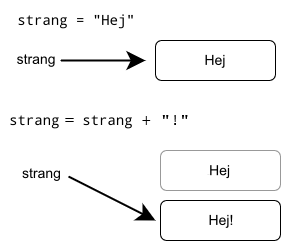
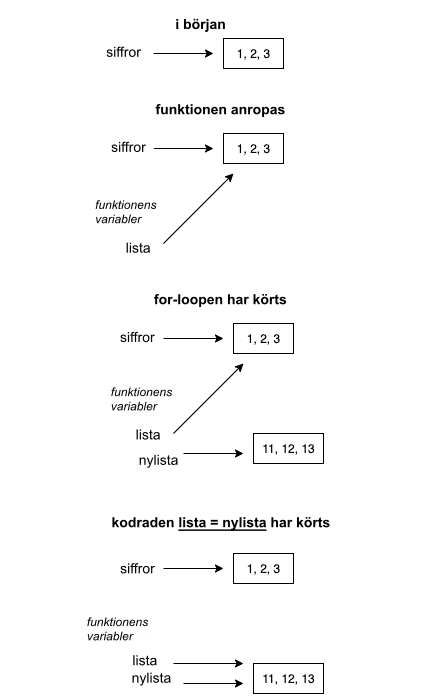

<text-box variant='learningObjectives' name='Oppimistavoitteet'>

Efter den här delen

* vet du vad som menas med en referens till en variabel
* vet du att det kan finnas flera referenser till ett och samma objekt
* kan du använda listor som parameter i funktioner
* förstår du vad som menas med sidoeffekt hos en funktion.

</text-box>

Hittills har vi tänkt att en variabel är en slags "låda" som innehåller variabelns värde. Från teknisk synvinkel stämmer detta inte i Python – variabler innehåller inte ett värde, utan en referens till ett objekt, som en siffra, sträng eller en lista.

I praktiken innebär det att man inte lagrar ett värde i en variabel, utan ett ställe varifrån variabelns värde hittas från.

En referens kan beskrivas som en pil från variabeln till dess riktiga värde:


Referensen berättar alltså var det riktiga värdet finns. Funktionen `id` berättar vart en variabel refererar:

```python
a = [1, 2, 3]
print(id(a))
b = "Det här är också en referens"
print(id(b))
```

<sample-output>

4538357072
4537788912

</sample-output>

Referensen, alltså variabelns id är ett heltal. Man kan tänka att talet är adressen för variabelns värde i datorns minne. Observera att om du kör koden ovan på din dator, kommer resultatet sannolikt vara olikt eftersom variablerna har olika referenser.

Som vi redan såg i förra delens exempel, visar Python Tutors visualiseringsverktyg referenser som "pilar" till det riktiga innehållet. Verktyget "lurar" ändå när det kommer till strängar, och visar dem som att strängens innehåll skulle vara lagrat i själva variabeln:


Så är det ändå inte i verkligheten – strängar behandlas också internt av Python på samma sätt som listor.

Flera av Pythons inbyggda datatyper – som `str` – är oföränderliga. Det betyder att värdet på objektet aldrig kan ändras. Däremot kan ett värde ersättas med ett nytt värde.



I Python finns också datatyper som är föränderliga. Till exempel innehållet på en lista kan förändras utan att man behöver skapa en ny lista:


Något förvånande är att också grundläggande datatyper för lagring av siffor och sanningsvärden, `int`, `float` och `bool`, är oföränderliga. Låt oss använda följande kod som exempel:

```python
siffra = 1
siffra = 2
siffra += 10
```

Det verkar som att koden ändrar på siffran, men från teknisk synvinkel är det inte så. Istället skapar varje kommando en ny siffra.

Utskriften från det här programmet är intressant:

```python
siffra = 1
print(id(siffra))
siffra += 10
print(id(siffra))
a = 1
print(id(a))
```

<sample-output>

4535856912
4535856944
4535856912

</sample-output>

I början refererar variabeln `siffra` till adressen `4535856912` och när variabelns värde förändras refererar variabeln till adressen `4535856944`. När variabeln `a` definieras och får värdet `1`, kommer variabeln att referera till samma ställe som variabeln `siffra` när dess värde var `1`.

Det verkar som att Python har lagrat siffran 1 till adressen `4535856912` och alltid då en variabels värde är `1`, refererar variabeln till det här specifika stället i "datorns minne".

Även om de grundläggande datatyperna `int`, `float` och `bool` är referenser behöver man som programmerare inte egentligen fundera på det.

## Flera referenser till en och samma lista

Vi undersöker som ett exempel att kopiera värdet på en variabel med en lista:

```python
a = [1, 2, 3]
b = a
b[0] = 10
```

Deklarationen `b = a` kopierar variabeln `a`:s värde till variabeln `b`. Det är ändå viktigt att observera att variabelns värde inte är en lista utan en referens till listan.

Deklarationen `b = a` kopierar alltså referensen, varpå det efter kopieringen finns två referenser till samma lista.


Listan kan behandlas med båda referenserna:

```python
lista = [1, 2, 3, 4]
lista2 = lista

lista[0] = 10
lista2[1] = 20

print(lista)
print(lista2)
```

<sample-output>

[10, 20, 3, 4]
[10, 20, 3, 4]

</sample-output>

Om en och samma lista har flera referenser kan den behandlas på samma sätt med vilken som helst av referenserna. Däremot återspeglas en förändring via en referens också till alla andra referenser.

Visualiseringsverktyget klargör igen vad som sker i programmet:


## Att kopiera en lista

Om du vill skapa en verklig kopia av en lista kan du skapa en ny lista och lägga till alla element från den ursprungliga listan till den nya listan:

```python
lista = [1, 2, 3, 3, 5]

kopia = []
for element in lista:
    kopia.append(element)

kopia[0] = 10
kopia.append(6)
print("lista", lista)
print("kopia", kopia)
```

<sample-output>

lista [1, 2, 3, 3, 5]
kopia [10, 2, 3, 3, 5, 6]

</sample-output>

Så ser det ut från visualiseringsverktyget:


Variabeln `ny_lista` refererar till en annan lista än `min_lista`.

Ett enklare sätt att kopiera en lista är att använda hakparenteser `[]`, som vi använt tidigare för att extrahera innehåll från strängar och listor. Notationen `[:]` väljer alla element i en samling. Därmed skapar det en kopia av en lista:

```python
lista = [1,2,3,4]
kopia = lista[:]

lista[0] = 10
kopia[1] = 20

print(lista)
print(kopia)
```

<sample-output>

[10, 2, 3, 4]
[1, 20, 3, 4]

</sample-output>

## En lista som parameter i en funktion

När en lista ges som parameter till en funktion, förmedlas referensen till listan. Det här innebär att funktionen kan ändra på listan som getts som parameter.

Till exempel följande funktion lägger till ett nytt element i en lista som getts som funktionens parameter:

```python
def lagg_till_element(lista: list):
    nytt_element = 10
    lista.append(nytt_element)

lista = [1,2,3]
print(lista)
lagg_till_element(lista)
print(lista)
```

<sample-output>
[1, 2, 3]
[1, 2, 3, 10]
</sample-output>

Märk att funktionen `lagg_till_element` inte returnerar något, utan ändrar på den lista som getts som funktionens parameter. Visualiseringsverktyget presenterar situationen så här:


Global frame syftar på huvudprogrammets variabler, och den blå lådan `lagg_till_element` på funktionens parametrar och variabler. Som visualiseringen visar, refererar funktionen till samma lista som huvudprogrammet, vilket betyder att ändringar som görs i listan inom funktionen också syns i huvudprogrammet.

Ett annat sätt är att skapa en ny lista och returnera den:

```python
def lagg_till_element(lista: list) -> list:
    nytt_element = 10
    kopia = lista[:]
    kopia.append(nytt_element)
    return kopia

siffror = [1, 2, 3]
siffror2 = lagg_till_element(siffror)

print("Ursprunglig lista:", siffror)
print("Ny lista:", siffror2)
```

<sample-output>

Ursprunglig lista: [1, 2, 3]
Ny lista: [1, 2, 3, 10]

</sample-output>

Om du inte är helt säker på vad som händer i en kodsnutt, kan det löna sig att utnyttja visualiseringsverktyget.

## Ändra på en lista som getts som argument

Det följande är ett försök på att skapa en funktion som ökar på varje element med tio:

```python
def oka_pa_alla(lista: list):
    ny_lista = []
    for element in lista:
        ny_lista.append(element + 10)
    lista = ny_lista

siffror = [1, 2, 3]
print("start:",siffror)
oka_pa_alla(siffror)
print("efter funktionen:", siffror)
```

<sample-output>

start: [1, 2, 3]
efter funktionen: [1, 2, 3]

</sample-output>


Av någon orsak fungerar funktionen inte. Varför så?

Funktionen tar emot en referens till en lista som argument. Det här är lagrat i variabeln `min_lista`. Tilldelningen `min_lista = ny_lista` tilldelar ett nytt värde till den samma variabeln. Variabeln `min_lista` hänvisar nu till den nya listan som skapades i funktionen, vilket betyder att referensen till den ursprungliga listan inte mera är tillgänglig inom funktionen. Tilldelningen har inte dock någon påverkan utanför funktionen.



Dessutom innehåller variabeln `ny_lista` nu de nya värdena, men de är inte tillgängliga utanför funktionen. Variabeln försvinner alltså när funktionen körts och programmet fortsätter tillbaka till huvudfunktionen. Variabeln siffror i huvudfunktionen hänvisar alltid till den ursprungliga listan.

Visualiseringsverktyget hjälper igen. När du går igenom stegen utförligt märker du att den ursprungliga listan inte påverkas på något sätt av funktionen:


Ett enkelt sätt att korrigera problemet är att kopiera över alla element från den nya listan till den gamla:

```python
def oka_pa_alla(lista: list):
    ny_lista = []
    for element in lista:
        ny_lista.append(element + 10)

    # vi kopierar de nya värdena till den gamla listan
    for i in range(len(lista)):
        lista[i] = ny_lista[i]
```

Eller lite enklare tack vare Python:

```python
>>> lista = [1, 2, 3, 4]
>>> lista[1:3] = [10, 20]
>>> lista
[1, 10, 20, 4]
```

I exemplet ovan ersätts en del av en lista med värden från en annan samling.

Som vi vet, kan vi också göra detta för en hel samling:

```python
>>> lista = [1, 2, 3, 4]
>>> lista[:] = [100, 99, 98, 97]
>>> lista
[100, 99, 98, 97]
```

Allt innehåll i den gamla listan ersätts. Inspirerat av det här har vi nu skapat en fungerande version av funktionen som ökar på elementens värden:

```python
def oka_pa_alla(lista: list):
    ny_lista = []
    for element in lista:
        ny_lista.append(element + 10)

    lista[:] = ny_lista
```

Egentligen finns det ingen orsak att skapa en ny lista inom funktionen. Vi kan helt enkelt tilldela värdena direkt till den ursprungliga listan:

```python
def oka_pa_alla(lista: list):
    for i in range(len(lista)):
        lista[i] += 10

```


<programming-exercise name='Alkiot tuplana' tmcname='osa05-06a_alkiot_tuplana'>

Skapa funktionen `elementen_fordubblade(siffror: list)` som får som argument en lista med siffror.

Funktionen ska returnera en ny lista där alla siffror är multiplicerade med två. Funktionen får inte ändra på den ursprungliga listan.

Exempel:

```python
if __name__ == "__main__":
    siffror = [2, 4, 5, 3, 11, -4]
    fordubblade = elementen_fordubblade(siffror)
    print("ursprunglig:", siffror)
    print("fördubblade:", fordubblade)
```
<sample-output>

ursprunglig: [2, 4, 5, 3, 11, -4]
fördubblade: [4, 8, 10, 6, 22, -8]

</sample-output>

</programming-exercise>


<programming-exercise name='Poista pienin' tmcname='osa05-06b_poista_pienin'>

Skapa funktionen `avlagsna_minsta(siffror: list)` som får som argument en lista med siffror.

Funktionen ska ta bort den minsta siffran från listan. Du kan anta att den minsta siffran endast förekommer en gång.

Funktionen ska inte returnera något, den ska endast ändra på listan som getts som argument!

Exempel:

```python
if __name__ == "__main__":
    siffror = [2, 4, 6, 1, 3, 5]
    avlagsna_minsta(siffror)
    print(siffror)
```
<sample-output>

[2, 4, 6, 3, 5]

</sample-output>

</programming-exercise>


<programming-exercise name='Sudoku: ruudukon tulostus ja luvun lisäys' tmcname='osa05-07_sudoku_osa5'>

I den här uppgiften skapar vi ännu två funktioner för ett sudoku: `skriv_ut` och `lagg_till`.

Funktionen `skriv_ut` får som argument en matris och skriver den ut enligt exemplet nedan.

Funktionen `lagg_till(sudoku: list, radnummer: int, kolumnnummer: int, siffra: int)` tar emot som argument en matris, två siffror som indikerar positionen och ett tal (1-9) som ska lagras.

```python
sudoku  = [
    [0, 0, 0, 0, 0, 0, 0, 0, 0],
    [0, 0, 0, 0, 0, 0, 0, 0, 0],
    [0, 0, 0, 0, 0, 0, 0, 0, 0],
    [0, 0, 0, 0, 0, 0, 0, 0, 0],
    [0, 0, 0, 0, 0, 0, 0, 0, 0],
    [0, 0, 0, 0, 0, 0, 0, 0, 0],
    [0, 0, 0, 0, 0, 0, 0, 0, 0],
    [0, 0, 0, 0, 0, 0, 0, 0, 0],
    [0, 0, 0, 0, 0, 0, 0, 0, 0]
]

skriv_ut(sudoku)
lagg_till(sudoku, 0, 0, 2)
lagg_till(sudoku, 1, 2, 7)
lagg_till(sudoku, 5, 7, 3)
print()
print("Tre siffror tillagda:")
print()
skriv_ut(sudoku)
```

<sample-output>

<pre>
_ _ _  _ _ _  _ _ _
_ _ _  _ _ _  _ _ _
_ _ _  _ _ _  _ _ _

_ _ _  _ _ _  _ _ _
_ _ _  _ _ _  _ _ _
_ _ _  _ _ _  _ _ _

_ _ _  _ _ _  _ _ _
_ _ _  _ _ _  _ _ _
_ _ _  _ _ _  _ _ _

Tre siffror tillagda:

2 _ _  _ _ _  _ _ _
_ _ 7  _ _ _  _ _ _
_ _ _  _ _ _  _ _ _

_ _ _  _ _ _  _ _ _
_ _ _  _ _ _  _ _ _
_ _ _  _ _ _  _ 3 _

_ _ _  _ _ _  _ _ _
_ _ _  _ _ _  _ _ _
_ _ _  _ _ _  _ _ _

</pre>

</sample-output>

Tips: Du kan dra nytta av att `print`-kommandot kan användas så att radbyten inte görs:

```python
print("tecken ", end="")
print("utan mellanrum", end="")
```

<sample-output>

tecken utan mellanrum

</sample-output>

En radbrytning kan åstadkommas så här:

```python
print()
```

</programming-exercise>

<programming-exercise name='Sudoku: luvun lisäys ruudukon kopioon' tmcname='osa05-08_sudoku_osa6'>

I den här uppgiften skapar vi en lite annorlunda version av funktionen som lägger till nya tal i ett sudoku.

Funktionen `kopiera_och_lagg_till(sudoku: list, radnummer: int, kolumnnummer: int, siffra: int)` får som argument en matris, två siffror som indikerar en position samt en siffra (1-9) som ska lagras. Funktionen ska returnera en kopia av matrisen som gavs som argument, med den angivna siffran lagrad på korrekt ställe. Funktionen får inte ändra på matrisen som getts som argument.

Här utnyttjar vi funktionen `skriv_ut` från den föregående uppgiften:

```python
sudoku  = [
    [0, 0, 0, 0, 0, 0, 0, 0, 0],
    [0, 0, 0, 0, 0, 0, 0, 0, 0],
    [0, 0, 0, 0, 0, 0, 0, 0, 0],
    [0, 0, 0, 0, 0, 0, 0, 0, 0],
    [0, 0, 0, 0, 0, 0, 0, 0, 0],
    [0, 0, 0, 0, 0, 0, 0, 0, 0],
    [0, 0, 0, 0, 0, 0, 0, 0, 0],
    [0, 0, 0, 0, 0, 0, 0, 0, 0],
    [0, 0, 0, 0, 0, 0, 0, 0, 0]
]

kopia = kopiera_och_lagg_till(sudoku, 0, 0, 2)
print("Ursprunglig:")
skriv_ut(sudoku)
print()
print("Kopia:")
skriv_ut(kopia)
```

<sample-output>

<pre>
Ursprunglig:
_ _ _  _ _ _  _ _ _
_ _ _  _ _ _  _ _ _
_ _ _  _ _ _  _ _ _

_ _ _  _ _ _  _ _ _
_ _ _  _ _ _  _ _ _
_ _ _  _ _ _  _ _ _

_ _ _  _ _ _  _ _ _
_ _ _  _ _ _  _ _ _
_ _ _  _ _ _  _ _ _

Kopia:
2 _ _  _ _ _  _ _ _
_ _ _  _ _ _  _ _ _
_ _ _  _ _ _  _ _ _

_ _ _  _ _ _  _ _ _
_ _ _  _ _ _  _ _ _
_ _ _  _ _ _  _ _ _

_ _ _  _ _ _  _ _ _
_ _ _  _ _ _  _ _ _
_ _ _  _ _ _  _ _ _

</pre>

</sample-output>

Tips: I den här uppgiften måste man vara noga med vad allt som behöver kopieras och vart man slutligen lagrar värdet som getts till funktionen. Visualiseringsverktyget kan hjälpa. P.g.a. storleken av sudokut kan vyn dock vara mer råddig än vanligtvis.

</programming-exercise>

<programming-exercise name='Ristinolla' tmcname='osa05-09_ristinolla'>

Tre i rad spelas med ett 3 x 3 -rutnät, där spelarna turvis markerar ett kryss eller en ring. Spelaren som får tre markeringar i rad, vågrätt, lodrätt eller diagonalt, vinner. Om ingendera av spelarna får det, är spelet oavgjort.

Skapa funktionen `tur(brade: list, x: int, y: int, markering: str)` där den givna markeringen görs på stället som indikeras av koordinaterna (0-2).

Observera att `x` indikerar kolumn och `y` rad.

Spelbrädet består av följande strängar:

* `""`: tom ruta
* `"X"`: markeing, spelare 1
* `"O"`: markeing, spelare 2

Funktionen returnerar `True` om markeringen lyckades (stället var tomt på brädet), och `False` om stället var reserverat eller koordinaterna inte var i intervallet 0-2.

Exempel:

```python
brade = [["", "", ""], ["", "", ""], ["", "", ""]]
print(tur(brade, 2, 0, "X"))
print(brade)
```

<sample-output>

True
[['', '', 'X'], ['', '', ''], ['', '', '']]

</sample-output>

</programming-exercise>

<programming-exercise name='Matriisin kääntö' tmcname='osa05-10_matriisin_kaanto'>

Skapa funktionen `transponera(matris: lista)` som får som argument en matris. Funktionen ska transponera matrisen, alltså byta om rader till kolumner och tvärtom.

Du kan anta att matrisen har lika många rader och kolumner.

Den här matrisen...

```python
1 2 3
4 5 6
7 8 9
```

...skulle se ut så här efter transponeringen:

```python
1 4 7
2 5 8
3 6 9
```

Funktionen ska inte returnera något. Den ska ändra på matrisen som den fått som argument.

</programming-exercise>

## Sidoeffekter hos funktioner

Om en funktion tar emot en referens till en lista som argument, kan funktionen ändra på listan. Om programmeraren inte har tagit i beaktande att listan kan ändras på direkt, kan ändringar i listan förorsaka problem på andra håll i programmet.

Låt oss ta en titt på en funktion som borde hitta det näst minsta värdet i en lista:

```python
def nast_minst(lista: list) -> int:
    # i en ordnad lista finns det näst minsta elementet vid index 1
    lista.sort()
    return lista[1]

siffror = [1, 4, 2, 5, 3, 6, 4, 7]
print(nast_minst(siffror))
print(siffror)
```

<sample-output>
2
[1, 2, 3, 4, 4, 5, 6, 7]
</sample-output>

Funktionen hittar det näst minsta värdet, men dessutom ordnar funktionen listan. Om ordningen av elementen har betydelse på andra håll i programmet kommer det här funktionsanropet eventuellt att orsaka fel. Oplanerade modifikationer som görs hos objekt som ges som referens till en funktion kallas sidoeffekt.

Vi kan förhindra den här sidoeffekten genom att göra en liten ändring i funktionen:

```python
def nast_minst(lista: list) -> int:
    kopia = sorted(lista)
    return kopia[1]

siffror = [1, 4, 2, 5, 3, 6, 4, 7]
print(nast_minst(siffror))
print(siffror)
```

<sample-output>

2
[1, 4, 2, 5, 3, 6, 4, 7]

</sample-output>

Funktionen `sorted` returnerar en ny ordnad kopia av listan, så vi behöver inte mera "sabotera" den ursprungliga listan när vi söker efter det näst minsta värdet.

Det är en bra vana att undvika sidoeffekter i funktioner. Sidoeffekter kan göra det svårare att säkerställa att programmet fungerar som det ska i alla situationer.

Funktioner som saknar sidoeffekter kallas rena funktioner. Då man arbetar med funktionell programmering är rena funktioner speciellt viktiga. Vi dyker djupare i det här under fortsättningskursen i programmering.

<quiz id="c978cb03-cb95-52a3-b122-2cc9ddf8a552"></quiz>
