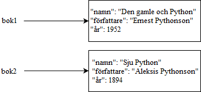

<text-box variant='learningObjectives' name='Inlärningsmål'>

Efter den här delen

- Kommer du veta vad ett objekt är i programmering
- Kommer du förstå vad som menas med oberoende hos individuella objekt
- Kommer du kunna skapa och komma åt objekt

</text-box>

Detta är första delen av den Avancerade Kursen inom Programmering. Materialet är designat för att bli använt med Visual Studio Code editeraren, liksom den föregående kursen Introduktion till Programming. Ifall du inte använt Visual Studio Code tidigare, så hittar du installeringsinstruktionerna [här](https://www.mooc.fi/fi/installation/vscode) och en introduktion till programmeringsomgivningen från förra kursen [här](https://programming-24.mooc.fi/part-4/1-vscode).

I introduktion till Programmering kursen så lade vi märke till att det ofta är logiskt att gruppera relaterad data tillsammans i våra program. Ifall vi till exemepl skulle förvara information om en bok skulle det vara logiskt att använda oss av en tupel eller en ordlista för att organisera datan till en enskild datastruktur.

Lösningen kunde se ut så här när man använder en tupel:

```python
namn = "Kodningsboken"
författare = "Peter Python"
ar = 1992

# Vi sammanställer dessa i en ordlista
bok = (namn, författare, ar)

# Vi skriver ut bokens namn
print(bok[0])
```

I ett fall som detta är fördelen med att använda en ordlista att vi kan använda strängar istället för indexar som nycklar. Alltså, kan vi ge deskriptiva namn till sakerna som förvaras datastrukturen:

```python
namn = "Kodningsboken"
forfattare = "Peter Python"
ar = 1992

# Yhdistetään yhdeksi sanakirjaksi
bok = {"namn": namn, "författare": forfattare, "år": ar}

# Vi skriver ut bokens namn
print(bok["namn"])
```

I båda fallen så skapar vi ett nytt _objekt_. Inom programmering har termen specifikt betydelsen av en oberoende helhet, i detta fall innehållande några bitar av data som på något vis är relaterade. Att vara oberoende betyder att ändringar till ett objekt inte påverkar andra objekt.

Ifall vi skulle skapa två strukturellt identiska representationer av böcker, användandes ordlistor och identiska nycklar, skulle ändringar som görs till en av dem inte påverka den andra:

```python
bok1 = {"namn": "Den gamle och Python", "författare": "Ernest Pythonson", "år": 1952}
bok2 = {"namn": "Sju Python", "författare": "Aleksis Python", "år": 1894}

print(bok1["namn"])
print(bok2["namn"])

bok1["namn"] = "Ett nytt namn"

print(bok1["namn"])
print(bok2["namn"])
```

<sample-output>

Den gamle och Python
Sju Python
Ett nytt namn
Sju Python

</sample-output>



<text-box variant="info" name="Python objekt">


Du kanske kommer ihåg från introduktion till programmering kursen att vilket som helst värde i Python internt är behandlat som ett objekt. Detta betyder att värdet lagrat i en variabel är en _referens till ett objekt_. Själva datan är lagrad inuti ett objekt i datorns minne. Ifall du ger ett värde till en ny variable med kommandot `a = 3`, är värdet som lagras i variabeln _inte_ 3, utan en _referens till ett objekt som innehåller värdet 3_.

De flesta andra programmeringsspråk (i varje fall de som stöder objekt-orienterad programmering) inkluderar vissa särskilt definierade _primitiva datatyper_. Dessa inkluderar ofta åtminstone [integer] nummer, flyttals nummer och boleska sanningsvärden. Primitiver är processerade direkt, vilket betyder att de är lagrade direkt i variabler, inte som referenser. Python har inga sådana primitiver, men att jobba med de grundläggade datatyperna i Python är i praktiken väldigt liknande. Objekt av dessa grundläggande datatyper (såsom nummer, boleska värden och strängar) är _oföränderliga_, vilket betyder att de inte kan ändras i minnet. Ifall värdet som lagras i en variabel med en grundläggande datatyp måste ändras så byts hela referensen ut, men själva objektet kvarstår i minnet.


</text-box>

## Objekt och metoder

Datan som lagras i ett objekt kan kommas åt genom olika _metoder_. En metod är en funktion som opererar på ett specifikt objekt som den är kopplad till. Sättet att åtskilja mellan metoder och andra funktioner ligger i hur de är kallade: först skriver man namnet på objektet som avses, sedan en punkt och till sist metodens namn, åtföljt av argument ifall sådana finns. Till exempel returnerar metoden `values` alla värden som är lagrade i ett objekt av typen ordlista eller `dict`:

```python
# detta skapar ett objekt av typen ordlista med namnet bok
bok = {"namn": "Den gamle och Python", "författare": "Ernest Pythonson", "år": 1952}

# Vi skriver ut alla värden
# Metodkallelsen values() skrivs efter namnet på variabeln
# Kom ihåg punktnotation!
for varde in bok.values():
    print(varde)
```

<sample-output>

Den gamel och Python
Ernest Pythonson
1952

</sample-output>

På samma sätt opererar en strängmetod på det strängobjekt som den kallas på. Några exempel av strängmetoder är `count` och `find`:

```python
namn = "Påhittige Per"

# Skriv ut mängden P som förekommer
print(namn.count("P"))

# Mängden P som hittas i en annan sträng
print("Påhittade Praktiska Prepositioner".count("P"))

# Indexen av delsträngen Per
print(namn.find("Per"))

# Denna sträng har ingen matchande delsträng
print("Helt annan sträng".find("Per"))
```

<sample-output>

2
3
10
-1

</sample-output>

Strängmetoder returnerar värden, men ändrar inte innehållet av en sträng. Liksom nämnt ovan är strängar i Python oföränderliga. Detta gäller däremot inte alla metoder; Pythonlistor är föränderliga, alltså kan listmetoder ändra innehållet av listan som de kallas på:

```python
lista = [1,2,3]

# Vi lägger till några element
lista.append(5)
lista.append(1)

print(lista)

# Vi tar bort ett element från början
lista.pop(0)

print(lista)
```

<sample-output>

[1, 2, 3, 5, 1]
[2, 3, 5, 1]

</sample-output>

<programming-exercise name='Minsta medeltalet' tmcname='osa08-01_minsta_medeltalet'>

Skapa funktionen `minsta_medeltalet(person1: dict, person2: dict, person3: dict)`, som får tre ordlistor som argument.

Varje ordlistsobjekt innehåller värden som refererar till följande nycklar:

* `"namn"`: tävlarens namn
* `"resultat1"`: tävlarens första resultat (heltal mellan 1...10)
* `"resultat2"`: tävlarens andra resultat (liksom ovan)
* `"resultat3"`: tävlarens tredje resultat (liksom ovan)

Funktionen ska beräkna genomsnittet av de tre resultaten för varje tävlande och sedan returnera den tävlande vars genomsnittliga resultat var det minsta. Returvärdet bör vara hela ordlistsobjektet som innehåller information om deltagaren.

Du kan anta att endast en tävlare har det minsta medeltalet.

Ett exempel på funktionen:

```python
person1 = {"namn": "Ella", "resultat1": 2, "resultat2": 3, "resultat3": 3}
person2 = {"namn": "Bella", "resultat1": 5, "resultat2": 1, "resultat3": 8}
person3 = {"namn": "Stella", "resultat1": 3, "resultat2": 1, "resultat3": 1}

print(minsta_medeltalet(person1, person2, person3))
```

<sample-output>

{'namn': 'Stella', 'resultat1': 3, 'resultat2': 1, 'resultat3': 1}

</sample-output>

</programming-exercise>

<programming-exercise name='Radernas summor' tmcname='osa08-02_radernas_summor '>

I Python är varje värde som lagras i en variabel en referens till ett objekt, så varje värde som lagras i en lista är också en referens till ett objekt. Detta gäller även vid modellering av en matrisdatastruktur: varje värde i listan på högsta nivån är en referens till en annan lista, som i sin tur innehåller referenser till de objekt som representerar elementen i matrisen.

Skapa funktionen `radernas_summor(matris: list)`, som tar en heltalsmatris som argument.

Funktionen ska lägga till ett nytt element på varje rad i matrisen. Detta element innehåller summan av de andra elementen på den raden. Funktionen har inget returvärde. Den bör modifiera matrisen i parametern.

Ett exempel på funktionen i användning:

```python
matris = [[1, 2], [3, 4]]
radernas_summor(matris)
print(matris)
```

<sample-output>

[[1, 2, 3], [3, 4, 7]]

</sample-output>

</programming-exercise>
