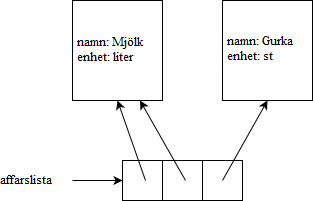

<text-box variant='learningObjectives' name='Inlärningsmål'>

Efter den här delen

- Kommer du att kunna använda olika datastrukturer för att hantera objekt
- Vet du hur objekt kan bli passerade som argument

</text-box>

Varje värde i Python är ett objekt. Alla objekt som du skapar baserat på en klass som du själv har definierat fungerar exakt på samma sätt som alla "vanliga" Python-objekt. Objekt kan till exempel lagras i en lista:

```python
from datetime import date

class SlutfordKurs:

    def __init__(self, kurs: str, studiepoang: int, slutforsdatum: date):
        self.kurs = kurs
        self.studiepoang = studiepoang
        self.slutforsdatum = slutforsdatum


if __name__ == "__main__":
    # Vi skapar några slutförda kurser och lägger dessa i en lista
    prestationer = []

    mat1 = SlutfordKurs("Matematik 1", 5, date(2020, 3, 11))
    prg1 = SlutfordKurs("Programmering 1", 6, date(2019, 12, 17))

    prestationer.append(mat1)
    prestationer.append(prg1)

    # Vi lägger några till rakt till listan
    prestationer.append(SlutfordKurs("Fysik 2", 4, date(2019, 11, 10)))
    prestationer.append(SlutfordKurs("Programmering 2", 5, date(2020, 5, 19)))

    # Vi går igenom alla slutförda kurser, skriver ut deras namn och räknar ihop den totala mängden studiepoäng
    studiepoang = 0
    for prestation in prestationer:
        print(prestation.kurs)
        studiepoang += prestation.studiepoang

    print("Studiepoäng totalt:", studiepoang)
```

<sample-output>

Matematik 1
Programmering 1
Fysik 2
Programmering 2
Studiepoäng totalt: 20

</sample-output>

<programming-exercise name='Snabbaste bilen' tmcname='osa09-01_snabbaste_bil'>

Uppgiftsbotten har en klass med namnet `Bil` som representerar en bil genom två attribut: `marke (str)` och `topphastighet (int)`.

Skapa funktionen `snabbaste_bil(bilar: list)`, som får en lista av `Bil`-objekt som argument.

Funktionen ska returnera märket på den snabbaste bilen. Du kan anta att det alltid kommer att finnas en enda bil med den högsta topphastigheten. Ändra inte listan som ges som argument, gör heller inte några ändringar i klassdefinitionen för `Bil`.

Du kan använda följande kod för att testa din funktion:

```python
if __name__ == "__main__":
    bil1 = Bil("Mersu", 195)
    bil2 = Bil("Lada", 110)
    bil3 = Bil("Ferrari", 280)
    bil4 = Bil("Trabant", 85)

    bilar = [bil1, bil2, bil3, bil4]
    print(snabbaste_bil(bilar))
```

<sample-output>

Ferrari

</sample-output>

</programming-exercise>

<programming-exercise name='Godkända prestationer' tmcname='osa09-02_godkanda_prestationer'>

I uppgiftsbotten hittas klassen `Provprestation`, som, liksom namnet anger, tar modell av en provtagares prestation i ett prov. Den har två attribut, `presterare (str)` och `poang (int)`.

Skapa funktionen `godkanda(prestationer: list, poanggrans: int)`, som får som parametrar en lista av provprestationer och ett heltal som representerar det minsta poängantalet för att bli godkänd.

Funktionen ska skapa och returnera en ny lista, som innehåller endast de prov som kom över poänggränsen i den ursprungliga listan. Ändra inte listan som ges som argument, ändra heller inte definitionen för klassen `Provprestation`.

Du kan använda följande kod för att testa funktionen:

```python
if __name__ == "__main__":
    s1 = Provprestation("Peter", 12)
    s2 = Provprestation("Pernilla", 19)
    s3 = Provprestation("Per", 15)
    s4 = Provprestation("Pia", 9)
    s5 = Provprestation("Petra", 17)

    klarade = godkanda([s1, s2, s3, s4, s5], 15)
    for godkand in klarade:
        print(klarade)
```

<sample-output>

Provprestation (presterare: Pernilla, poang: 19)
Provprestation (presterare: Per, poang: 15)
Provprestation (presterare: Petra, poang: 17)

</programming-exercise>

Du kanske minns att listor inte innehåller några objekt i sig själva. De innehåller referenser till objekt. Exakt samma objekt kan förekomma flera gånger i en och samma lista, och det kan refereras till flera gånger i listan eller utanför den. Låt oss ta en titt på ett exempel:

```python
class Produkt:
    def __init__(self, namn: int, enhet: str):
        self.namn = namn
        self.enhet = enhet


if __name__ == "__main__":
    affarslista = []
    mjolk = Produkt("Mjölk", "liter")

    affarslista.append(mjolk)
    affarslista.append(mjolk)
    affarslista.append(Produkt("Gurka", "st"))
```



Om det finns mer än en referens till samma objekt spelar det ingen roll vilken av referenserna som används:

```python
class Hund:
    def __init__(self, namn):
        self.namn = namn

    def __str__(self):
        return self.namn

hundar = []
molly = Hund("Molly")
hundar.append(molly)
hundar.append(molly)
hundar.append(Hund("Molly"))

print("Hundar i början:")
for hund in hundar:
    print(hund)

print("Hunden på index 0 får ett nytt namn:")
hundar[0].namn = "Rex"
for hund in hundar:
    print(hund)

print("Hunden på index 2 får ett nytt namn:")
hundar[2].namn = "Fifi"
for hund in hundar:
    print(hund)
```

<sample-output>

Koirat alussa:
Molly
Molly
Molly
Hunden på index 0 får ett nytt namn::
Rex
Rex
Molly
Hunden på index 2 får ett nytt namn:
Rex
Rex
Fifi

</sample-output>

Referenserna på index 0 och 1 i listan hänvisar till samma objekt. Var och en av referenserna kan användas för att komma åt objektet. Referensen på index 2 hänvisar till ett annat objekt, men med till synes samma innehåll. Om innehållet i det senare objektet ändras påverkas inte det andra.

Operatorn `is` används för att kontrollera om de två referenserna hänvisar till exakt samma objekt, medan operatorn `==` talar om för dig om innehållet i objekten är detsamma. Följande exempel gör förhoppningsvis skillnaden tydlig:


```python
lista1 = [1, 2, 3]
lista2 = [1, 2, 3]
lista3 = lista1

print(lista1 is lista2)
print(lista1 is lista3)
print(lista2 is lista3)

print()

print(lista1 == lista2)
print(lista1 == lista3)
print(lista2 == lista3)
```

<sample-output>

False
True
False

True
True
True

</sample-output>

Alla Python-objekt kan också lagras i en ordlista eller någon annan datastruktur. Detta gäller även objekt som är av en klass som du själv har definierat.

```python
class Studerande:
    def __init__(self, namn: str, sp: int):
        self.namn = namn
        self.sp = sp

if __name__ == "__main__":
    # Vi använder studerandenummer som nyckel och värdet som fås är ett objekt av typen Studerande
    studeranden = {}
    studeranden["12345"] = Studerande("Olle Studerande", 10)
    studeranden["54321"] = Studerande("Ove Studerande", 67)
```

[Visualiseringsverktyget](http://www.pythontutor.com/visualize.html#mode=edit) kan hjälpa dig att förstå exemplet ovan:


## Self eller inget self?

Hittills har vi bara snuddat vid ytan när det gäller att använda parameternamnet `self`. Låt oss titta närmare på när det bör eller inte bör användas.

Nedan har vi en enkel klass som låter oss skapa ett ordförråd-objekt som innehåller några ord:

```python
class Ordforrad:
    def __init__(self):
        self.ord = []

    def tillsatt_ord(self, ord: str):
        if not ord in self.ord:
            self.ord.append(ord)

    def utskrift(self):
        for ord in sorted(self.ord):
            print(ord)

ordforrad = Ordforrad()
ordforrad.tillsatt_ord("python")
ordforrad.tillsatt_ord("objekt")
ordforrad.tillsatt_ord("objekt-orienterad programmering")
ordforrad.tillsatt_ord("objekt")
ordforrad.tillsatt_ord("nörd")

ordforrad.utskrift()
```

<sample-output>

nörd
objekt
objekt-orienterad programmering
python

</sample-output>

Listan med ord lagras i ett attribut med namnet `self.ord`. I det här fallet är parameternamnet `self` obligatoriskt både i klassens konstruktormetod och i alla andra metoder som använder variabeln. Om `self` utelämnas kommer de olika metoderna inte att få tillgång till samma lista med ord.

Låt oss lägga till en ny metod i vår klassdefinition. Metoden `langsta_ord(self)` returnerar (ett av) de längsta orden i ordförrådet.

Följande är ett sätt att utföra denna uppgift, men vi kommer snart att se att det inte är ett särskilt bra sätt:

```python
class Ordforrad:
    def __init__(self):
        self.ord = []

    # ...

    def langsta_ord(self):
        # vi definierar två hjälpvariabler
        self.langsta = ""
        self.langsta_langd = 0

        for ord in self.ord:
            if len(ord) > self.langsta_langd:
                self.langsta_langd = len(ord)
                self.langsta = ord

        return self.langsta
```

Den här metoden använder två hjälpvariabler som deklareras med parameternamnet `self`. Kom ihåg att namnen på variablerna inte spelar någon roll i funktionell mening, så dessa variabler kan också namnges mer förvirrande som till exempel `hjalpare` och `hjalpare2`. Koden börjar se lite kryptisk ut:

```python
class Ordforrad:
    def __init__(self):
        self.ord = []

    # ...

    def langsta_ord(self):
        # vi definierar två hjälpvariabler
        self.hjalpare = ""
        self.hjalpare2 = 0

        for ord in self.ord:
            if len(ord) > self.hjalpare2:
                self.hjalpare2 = len(ord)
                self.hjalpare = ord

        return self.hjalpare
```

När en variabel deklareras med parameternamnet `self` blir den ett attribut till objektet. Detta innebär att variabeln kommer att existera så länge objektet existerar. Specifikt kommer variabeln att fortsätta existera även efter att metoden som deklarerar den har avslutat sin exekvering (engelska “Execution”). I exemplet ovan är detta helt onödigt, eftersom hjälpvariablerna endast är avsedda att användas inom metoden `longest_word(self)`. Så att deklarera hjälpvariabler med parameternamnet `self` är inte en särskilt bra idé här.

Förutom att variabler kan existera efter sitt "utgångsdatum" kan användning av `self` för att skapa nya attribut där de inte är nödvändiga orsaka svåra buggar i din kod. Särskilt generiskt namngivna attribut som `self.hjalpare`, som sedan används i flera olika metoder, kan orsaka oväntade beteenden som är svåra att spåra.

Om t.ex. en hjälpvariabel deklareras som ett attribut och tilldelas ett ursprungligt värde i konstruktorn, men variabeln sedan används i ett orelaterat sammanhang i en annan metod, blir resultatet ofta oförutsägbart:

```python
class Ordforrad:
    def __init__(self):
        self.ord = []
        # vi definierar hjälparvariabler
        self.hjalpare = ""
        self.hjalpare2 = ""
        self.hjalpare3 = ""
        self.hjalpare4 = ""

    # ...

    def langsta_ord(self):
        for ord in self.ord:
            # detta fungerar inte eftersom hjalpare2 har fel typ
            if len(ord) > self.hjalpare2:
                self.hjalpare2 = len(ord)
                self.hjalpare = ord

        return self.hjalpare
```

Man skulle kunna tro att detta skulle lösas genom att bara deklarera attributen där de används, utanför konstruktorn, men detta resulterar i en situation där de attribut som är tillgängliga via ett objekt är beroende av vilka metoder som har utförts. I föregående del såg vi att fördelen med att deklarera attribut i konstruktorn är att alla instanser av klassen då kommer att ha exakt samma attribut. Om så inte är fallet kan det lätt leda till fel om man använder olika instanser av klassen.

Sammanfattningsvis, om du behöver hjälpvariabler för användning inom en enda metod, är det korrekta sättet att göra det utan `self`. För att göra din kod lättare att förstå, använd också informativa variabelnamn:

```python
class Ordforrad:
    def __init__(self):
        self.ord = []

    # ...

    def langsta_ord(self):
        # detta är det korrekta sättet att definiera
        # hjälpvariabler för användning i en enda metod
        langsta = ""
        langsta_langd = 0

        for ord in self.ord:
            if len(ord) > langsta_langd:
                langsta_langd = len(ord)
                langsta = ord

        return langsta
```

I implementeringen ovan är hjälpvariablerna endast tillgängliga när metoden utförs. De värden som lagras i dem kan inte orsaka komplikationer i andra delar av programmet.

## Objekt som argument till funktioner

De objekt som skapas baserat på våra egna klasser är vanligtvis mutabla. Du kanske kommer ihåg att till exempel Python-listor är föränderliga: när de passeras som argument till funktioner kan deras innehåll ändras som ett resultat av exekveringen.

Låt oss titta på ett enkelt exempel där en funktion får en referens till ett objekt av typen `Studerande` som sitt argument. Funktionen ändrar sedan namnet på studenten. Både funktionen och huvudfunktionen som anropar den har åtkomst till samma objekt, så ändringen syns även i huvudfunktionen.

```python
class Studerande:
    def __init__(self, namn: str, studerandenummer: str):
        self.namn = namn
        self.studerandenummer = studerandenummer

    def __str__(self):
        return f"{self.namn} ({self.studerandenummer})"

# observera att typledtråden använder namnet på klassen definierad ovan
def andra_namn(studerande: Studerande):
    studerande.namn = "Olle Studerande"

# skapa ett Studerande-objekt
olle = Studerande("Olle Elev", "12345")

print(olle)
andra_namn(olle)
print(olle)
```

<sample-output>

Olle Elev (12345)
Olle Studerande (12345)

</sample-output>

Det är också möjligt att skapa objekt inom funktioner. Om en funktion returnerar en referens till det nyskapade objektet är det också åtkomligt inom huvudfunktionen:

```python
from random import randint, choice

class Studerande:
    def __init__(self, namn: str, studerandenummer: str):
        self.namn = namn
        self.studerandenummer = studerandenummer

    def __str__(self):
        return f"{self.namn} ({self.studerandenummer})"


# Denna funktion skapar och returnerar ett nytt Studerande-objekt.
# Den väljer slumpmässigt värden för namnet och studerandenumret.
def ny_studerande():
    fornamn = ["Atte","Peter","Minna","Maria"]
    efternamn = ["Virtanen", "Lahtinen", "Leinonen", "Pythonson"]

    # Slumpmässigt namn
    namn = choice(fornamn) + " " + choice(efternamn)

    # Slumpmässigt studerandenummer
    studerandenummer = str(randint(10000,99999))

    # Skapa och returnera ett Studerande-objekt
    return Studerande(namn, studerandenummer)

if __name__ == "__main__":
    # Kalla funktionen fem gånger och spara resultatet i en lista
    studeranden = []
    for i in range(5):
        studeranden.append(ny_studerande())

    # Skriv ut resultatet
    for studerande in studeranden:
        print(studerande)
```
Om du kör ovanstående kan det resultera i följande utskrift (OBS: eftersom slumpen är inblandad kommer resultaten sannolikt att bli annorlunda om du testar koden själv).

<sample-output>

Maria Lahtinen (36213)
Atte Virtanen (11859)
Maria Pythonen (77330)
Atte Pythonson (86451)
Minna Pythonson (86211)

</sample-output>

## Objekt som argument till metoder

På liknande sätt kan objekt fungera som argument till metoder. Låt oss ta en titt på ett exempel från en nöjespark:

```python
class Person:
    def __init__(self, namn: str, langd: int):
        self.namn = namn
        self.langd = langd

class Akattraktion:
    def __init__(self, namn: str, langdgrans: int):
        self.besokare = 0
        self.namn = namn
        self.langdgrans = langdgrans

    def ta_ombord(self, person: Person):
        if person.langd >= self.langdgrans:
            self.besokare += 1
            print(f"{person.namn} kom ombord")
        else:
            print(f"{person.namn} var för kort :(")

    def __str__(self):
        return f"{self.namn} ({self.besokare} besökare)"
```

Attraktionen innehåller en metod `motta_besökare`, som tar ett objekt av typen `Person` som argument. Om besökaren är tillräckligt lång släpps denne ombord och antalet besökare ökas. Klasserna kan testas på följande sätt:

```python
berg_och_dalbana = Akattraktion("Berg_och_dalbana", 120)
jakob = Person("Jakob", 172)
vilma = Person("Vilma", 105)

berg_och_dalbana.ta_ombord(jakob)
berg_och_dalbana.ta_ombord(vilma)

print(berg_och_dalbana)
```

<sample-output>

Jakob kom ombord
Venla var för kort :(
Berg_och_dalbana (1 besökare)

</sample-output>

<programming-exercise name='Bebiscenter' tmcname='osa09-03_bebiscenter'>

I uppgiftsbotten finns färdigt redan en klass `Person` såväl som en ram för klassen `BebisCenter`. Ett `BebisCenter`-objekt utför olika handlingar såsom mäter eller matar personer. I denna uppgift implementerar du resten av `BebisCenter`-klassen. Koden för klassen `Person` ska inte ändras överhuvudtaget!

## Vägning av person

I `BebisCenter`-klassens definitione finns en ram för funktionen `vagning`

```python
class BebisCenter:
    def vagning(self, person: Person):
        # returnera vikten av personen som passerades som argument
        return -1
```

Metoden tar ett `Person`-objekt som sitt argument. Den ska returnera personens vikt. Du kan komma åt en persons vikt genom attributet som definieras i `Person`-klassen. Vänligen fyll i resten av implementationen för metoden `vagning`.

Nedan finns ett exempel på en huvudfunktion där ett `BebisCenter` väger två olika `Person`-objekt:

```python
haga_barnvard = BebisCenter()

erik = Person("Erik", 1, 110, 7)
peter = Person("Peter", 33, 176, 85)

print(f"{erik.namn} väger {haga_barnvard.vagning(erik)} kg")
print(f"{peter.namn} väger {haga_barnvard.vagning(peter)} kg")
```

<sample-output>

Erik väger 7 kg
Peter väger 85 kg

</sample-output>

## Matning

Det är möjligt att ändra tillståndet för ett objekt som skickas som ett argument. Implementera metoden `mata(person: Person)` som ökar vikten på den person som skickas som argument med ett.

I följande exempel vägs två personer, och sedan matas en av dem tre gånger. Därefter vägs personerna igen:

```python
haga_barnvard = BabyCenter()

erik = Person("Erik", 1, 110, 7)
peter = Person("Peter", 33, 176, 85)

print(f"{erik.namn} väger {haga_barnvard.vagning(erik)} kg")
print(f"{peter.namn} väger {haga_barnvard.vagning(peter)} kg")
print()

haga_barnvard.mata(erik)
haga_barnvard.mata(erik)
haga_barnvard.mata(erik)

print(f"{erik.namn} väger {haga_barnvard.vagning(erik)} kg")
print(f"{peter.namn} väger {haga_barnvard.vagning(peter)} kg")
```

Utskriften borde visa att Eriks vikt har stigit med tre:

<sample-output>

Erik väger 7 kg
Peter väger 85 kg

Erik väger 10 kg
Peter väger 85 kg

</sample-output>

## Räknande av vägningar

Implementera metoden `vagningar`() som returnerar det totala antalet vägningar som ett `BabyCenter`-objekt har utfört. OBS: Du kommer att behöva ett nytt attribut för att hålla reda på antalet vägningar. Du kan använda följande kod för att testa din metod:

```python
haga_barnvard = BabyCenter()

erik = Person("Erik", 1, 110, 7)
peter = Person("Peter", 33, 176, 85)

print(f"Vägningar utförda {haga_barnvard.vagningar()}")

haga_barnvard.vagning(erik)
haga_barnvard.vagning(erik)

print(f"Vägningar utförda {haga_barnvard.vagningar()}")

haga_barnvard.vagning(erik)
haga_barnvard.vagning(erik)
haga_barnvard.vagning(erik)
haga_barnvard.vagning(erik)

print(f"Vägningar utförda {haga_barnvard.vagningar()}")
```

<sample-output>

Vägningar utförda 0
Vägningar utförda 2
Vägningar utförda 6

</sample-output>

</programming-exercise>

<programming-exercise name='Lunchkort och betalterminal' tmcname='osa09-04_lunchkort_och_betalterminal'>

I föregående del fanns en [övning](https://rage.github.io/ohjelmointi-24-sv/osa-8/5-fler-exempel) där du implementerade klassen `Lunchkort`. Kortet hade separata metoder för att äta en vanlig och en speciell lunch, samt en metod för att sätta in pengar på kortet.

Klassen `Lunchkort`, så som du ombads implementera den, har dock vissa problem. Kortet självt hade kunskap om priserna på de olika lunchalternativen och visste att subtrahera rätt mängd pengar från saldot baserat på dessa. Men tänk dig att priserna ändrades eller att nya varor infördes i systemet, men att flera kort redan var registrerade i systemet. Detta skulle innebära att alla befintliga kort skulle behöva ersättas med versioner med kunskap om de nya priserna.

En bättre lösning skulle vara att göra korten ”dumma”, okunniga om priserna på olika produkter. Syftet med kortet skulle vara att helt enkelt hålla reda på det tillgängliga saldot. Alla mer komplicerade funktioner bör rymmas inom en annan klass: betalterminalen.

## Ett simplare Lunchkort

Vi förverkligar först en dummare version av `Lunchkort`-klassen. Kortet borde endast ha funktioner för att få reda på det tillfälliga saldot, lägga till pengar på kortet och subtrahera pengar från saldot. Fyll i metoden `subtrahera_saldo(mangd)` enligt kommentarerna i övningsfältet:

```python
class Lunchkort:
    def __init__(self, saldo: float):
        self.saldo = saldo

    def tillsatt_pengar(self, mangd: float):
        self.saldo += mangd

    def subtrahera_saldo(self, mangd: float):
        pass
        # Metoden ska endast kunna subtrahera från saldot
        # ifall det finns tillräckligt med pengar på kortet
        # Lyckad betalning returnerar True, icke-lyckad False.
```

Huvudtestprogram:

```python
if __name__ == "__main__":
    kort = Lunchkort(10)
    print("Saldo", kort.saldo)
    resultat = kort.subtrahera_saldo(8)
    print("Betalningen lyckades:", resultat)
    print("Saldo", kort.saldo)
    resultat = kort.subtrahera_saldo(4)
    print("Betalningen lyckads:", resultat)
    print("Saldo", kort.saldo)
```

<sample-output>

Saldo 10
Betalningen lyckades: True
Saldo 2
Betalningen lyckades: False
Saldo 2

</sample-output>

## Betalningsterminalen och hanterandet av kontantbetalning

I studentkafeterian går det att betala med kontanter eller Lunchkort. En betalterminal används för att hantera både kontant- och korttransaktioner. Låt oss börja med kontanttransaktionerna.

Här har vi en ram för en `Betalterminal`-klass. Implementera metoderna enligt beskrivningen i kommentarerna:

```python
class Betalterminal:
    def __init__(self):
        # I kassan finns det ursprungligen 1000 euro i kontanter
        self.pengar = 1000
        self.formanliga = 0
        self.special = 0

    def at_formanligt(self, betalning: float):
        # En formånlig lunch kostar 2.50 euro
        # Öka värdet på pengarna som finns i terminalen med en förmånlig lunchs pris,
        # öka mängden förmånliga luncher och returnera rätt mängd växel.
        # Ifall betalningen inte är tillräckligt stor säljs ingen lunch och hela summan returneras

    def at_special(self, betalning: float):
        # En special lunch kostar 4.30 euro
        # Öka värdet på pengarna som finns i terminalen med en special lunchs pris,
        # öka mängden special luncher och returnera rätt mängd växel.
        # Ifall betalningen inte är tillräckligt stor säljs ingen lunch och hela summan returneras
```

Exempel på användning:

```python
exactum = Betalterminal()

vaxel = exactum.at_formanligt(10)
print("Mängden växel", vaxel)

vaxel = exactum.at_formanligt(5)
print("Mängden växel", vaxel)

vaxel = exactum.at_special(4.3)
print("Mängden växel", vaxel)

print("Pengar i kassan", exactum.pengar)
print("Förmånliga luncher sålda", exactum.formanliga)
print("Special luncher sålda", exactum.special)
```

<sample-output>

Mängden växel 7.5
Mängden växel 2.5
Mängden växel 0.0
Pengar i kassan 1009.3
Förmånliga luncher sålda 2
Special luncher sålda 1

</sample-output>

## Betalning med kort

Låt oss nu implementera korttransaktioner. Vi kommer att behöva metoder som tar ett `Lunchkort` som argument och minskar saldot på kortet med lunchens pris. Nedan hittar du ramar av dessa funktioner. Vänligen fyll i metoderna enligt beskrivningen i kommentarerna:

```python
class Betalterminal:
    # ...

    def at_formanligt_kort(self, kort: Lunchkort):
        # En förmånlig lunch kostar 2.50 euro.
        # Om kortet har tillräckligt med pengar, subtrahera lunchens pris och returnera True.
        # Annars returnera False


    def at_special_kort(self, kort: Lunchkort):
        # En special lunch kostar 4.30 euro.
        # Om kortet har tillräckligt med pengar, subtrahera lunchens pris och returnera True.
        # Annars returnera False
```

**OBS:** betalningar med Lunchkort ändrar inte på mängden pengar i terminalen. Luncher säljes däremot fortfarande så länge pengarna på saldot räcker till, alltså kom ihåg att öka mängden luncher som sålts.

Följande kod kan du använda för att testa din klass:

```python
exactum = Betalterminal()

vaxel = exactum.at_formanligt(10)
print("Mängden växel", vaxel)

kort = Lunchkort(7)

resultat = exactum.at_special_kort(kort)
print("Betalningen lyckades:", resultat)
resultat = exactum.at_special_kort(kort)
print("Betalningen lyckades:", resultat)
resultat = exactum.at_formanligt_kort(kort)
print("Betalningen lyckades:", resultat)

print("Pengar i kassan", exactum.pengar)
print("Förmånliga luncher sålda", exactum.formanliga)
print("special luncher sålda", exactum.special)
```

<sample-output>

Mängden växel 7.5
Betalningen lyckades: True
Betalningen lyckades: False
Betalningen lyckades: True
Pengar i kassan 1002.5
Förmånliga luncher sålda 2
special luncher sålda 1

</sample-output>

## Tillsättning av pengar på kortet

Slutligen lägger vi till en metod som gör att du kan sätta in pengar på kortet. Kortägaren betalar detta kontant, så att den insatta summan läggs till de pengar som finns tillgängliga i terminalen. Här är en ram för metoden:

```python
def tillsatt_pengar_kortet(self, kort: Lunchkort, summa: float):
    pass
```

Du kan använda följande kod för att testa din metod:

```python
exactum = Betalterminal()

antons_kort = Lunchkort(2)
print(f"Kortets saldo {antons_kort.saldo} euro")

resultat = exactum.at_special_kort(antons_kort)
print("Betalningen lyckades:", resultat)

exactum.tillsatt_pengar_kortet(antons_kort, 100)
print(f"Kortets saldo {antons_kort.saldo} euro")

resultat = exactum.at_special_kort(antons_kort)
print("Betalningen lyckades:", resultat)
print(f"Kortets saldo {antons_kort.saldo} euro")

print("Pengar i kassan", exactum.pengar)
print("Förmånliga luncher sålda", exactum.formanliga)
print("special luncher sålda", exactum.special)
```

<sample-output>

Kortets saldo 2 euro
Betalningen lyckades: False
Kortets saldo 102 euro
Betalningen lyckades: True
Kortets saldo 97.7 euro
Pengar i kassan 1100
Förmånliga luncher sålda 0
special luncher sålda 1

</sample-output>

</programming-exercise>

## En instans av samma klass som argument till en metod

Nedan har vi ytterligare en version av klassen `Person`:

```python
class Person:
    def __init__(self, namn: str, fodelsear: int):
        self.namn = namn
        self.fodelsear = fodelsear
```

Låt oss anta att vi vill skriva ett program som jämför åldern på objekt av typen Person. Vi kan skriva en separat funktion för detta ändamål:

```python
def aldre_an(person1: Person, person2: Person):
    if person1.fodelsear < person2.fodelsear:
        return True
    else:
        return False

muhammad = Person("Muhammad ibn Musa al-Khwarizmi", 780)
pascal = Person("Blaise Pascal", 1623)
grace = Person("Grace Hopper", 1906)

if aldre_an(muhammad, pascal):
    print(f"{muhammad} är äldre än {pascal}")
else:
    print(f"{muhammad} är inte äldre än {pascal}")

if aldre_an(grace, pascal):
    print(f"{grace} är äldre än {pascal}")
else:
    print(f"{grace} är inte äldre än {pascal}")
```

<sample-output>

Muhammad ibn Musa al-Khwarizmi är äldre än Blaise Pascal
Grace Hopper är inte äldre än Blaise Pascal

</sample-output>

En av principerna för objektorienterad programmering är att all funktionalitet som hanterar objekt av en viss typ ska inkluderas i klassdefinitionen, som metoder. I stället för en funktion kan vi alltså skriva en metod som gör det möjligt att jämföra åldern på ett Person-objekt med ett annat Person-objekt:

```python
class Person:
    def __init__(self, namn: str, fodelsear: int):
        self.namn = namn
        self.fodelsear = fodelsear

    # OBS! Typledtrådar måste vara inom citationstecken ifall parametern är av samma typ som klassen självt!
    def aldre_an(self, annat: "Person"):
        if self.fodelsear < annat.fodelsear:
            return True
        else:
            return False
```

Här kallas det objekt som metoden anropas på för `self`, medan det andra Person-objektet kallas för `annat`.

Kom ihåg att anrop av en metod skiljer sig från anrop av en funktion. En metod är kopplad till ett objekt med punktnotationen:

```python
muhammad = Person("Muhammad ibn Musa al-Khwarizmi", 780)
pascal = Person("Blaise Pascal", 1623)
grace = Person("Grace Hopper", 1906)

if muhammad.aldre_an(pascal):
    print(f"{muhammad.namn} är äldre än {pascal.namn}")
else:
    print(f"{muhammad.namn} är inte äldre än {pascal.namn}")

if grace.aldre_an(pascal):
    print(f"{grace.namn} är äldre än {pascal.namn}")
else:
    print(f"{grace.namn} är inte äldre än {pascal.namn}")
```

Till vänster om punkten finns själva objektet, som kallas `self` i metoddefinitionen. Inom parentes står argumentet till metoden, vilket är det objekt som kallas `annat`.

Utskriften från programmet är exakt densamma som med funktionsimplementeringen ovan.

Till sist, en ganska kosmetisk punkt: `if...else`-strukturen i metoden `aldre_an` är i stort sett onödig. Värdet på det booleska uttrycket i villkoret är redan exakt samma sanningsvärde som returneras. Metoden kan alltså förenklas:

```python
class Person:
    def __init__(self, namn: str, fodelsear: int):
        self.namn = namn
        self.fodelsear = fodelsear

    # OBS! Typledtrådar måste vara inom citationstecken ifall parametern är av samma typ som klassen självt!
    def aldre_an(self, annat: "Person"):
        return self.fodelsear < annat.fodelsear:
```

Liksom det framkommer av kommentarerna i exemplen ovan, så måste typledtråden omslutas av citattecken ifall parametern i en metoddefinition är av samma typ som klassen själv. Om citattecknen utelämnas uppstår ett fel, vilket du kommer att se om du försöker med följande:

```python
class Person:
    # ...

    # Detta fungerar inte, Person måste vara innanför citationstecken
    def aldre_an(self, annat: Person):
        return self.fodelsear < annat.fodelsear:
```

<programming-exercise name='Bostadsjämförelse' tmcname='osa09-05_bostadsjamforelse'>

Databasen hos en fastighetsmäklare innehåller register över tillgängliga fastigheter med objekt som definieras av följande klass:

```python
class Bostad:
    def __init__(self, rum: int, kvadratmeter: int, kvadratpris: int):
        self.rum = rum
        self.kvadratmeter = kvadratmeter
        self.kvadratpris = kvadratpris
```

Din uppgift är att implementera metoder som gör det möjligt att jämföra tillgängliga egenskaper.

## Är den större?

Skapa metoden `storre(self, jamforelse)`, som returnerar `True`, ifall `Bostad`-objektet är större än objektet det jämförs med.

Exempel på hur funktionen borde fungera:

```python
eira_etta = Bostad(1, 16, 5500)
berghall_tvaa = Bostad(2, 38, 4200)
jakobacka_trea = Bostad(3, 78, 2500)

print(eira_etta.storre(berghall_tvaa))
print(jakobacka_trea.storre(berghall_tvaa))
```

<sample-output>

False
True

</sample-output>

## Prisskillnad

Skapa metoden `prisskillnad(self, jamforelse)`, som returnerar skillnaden i pris mellan `Bostad`-objektet självt och det som det jämförs med. Prisskillnaden är det absoluta värdet av skillnaden mellan de två fastigheternas totalpriser. Det totala priset för en fastighet är dess kvadratmeterpris multiplicerat med antalet kvadratmeter i fastigheten.

Exempel på hur funktionen borde fungera:

```python
eira_etta = Bostad(1, 16, 5500)
berghall_tvaa = Bostad(2, 38, 4200)
jakobacka_trea = Bostad(3, 78, 2500)

print(eira_etta.prisskillnad(berghall_tvaa))
print(jakobacka_trea.prisskillnad(berghall_tvaa))
```

<sample-output>

71600
35400

</sample-output>

## Dyrare?

Skapa metoden `dyrare(self, jamforelse)` som returnerar `True`, ifall `Bostad`-objektet är dyrare än objektet som det jämförs med.

Exempel på hur funktionen borde fungera:

```python
eira_etta = Bostad(1, 16, 5500)
berghall_tvaa = Bostad(2, 38, 4200)
jakobacka_trea = Bostad(3, 78, 2500)

print(eira_etta.dyrare(berghall_tvaa))
print(jakobacka_trea.dyrare(berghall_tvaa))
```

<sample-output>

False
True

</sample-output>

</programming-exercise>
